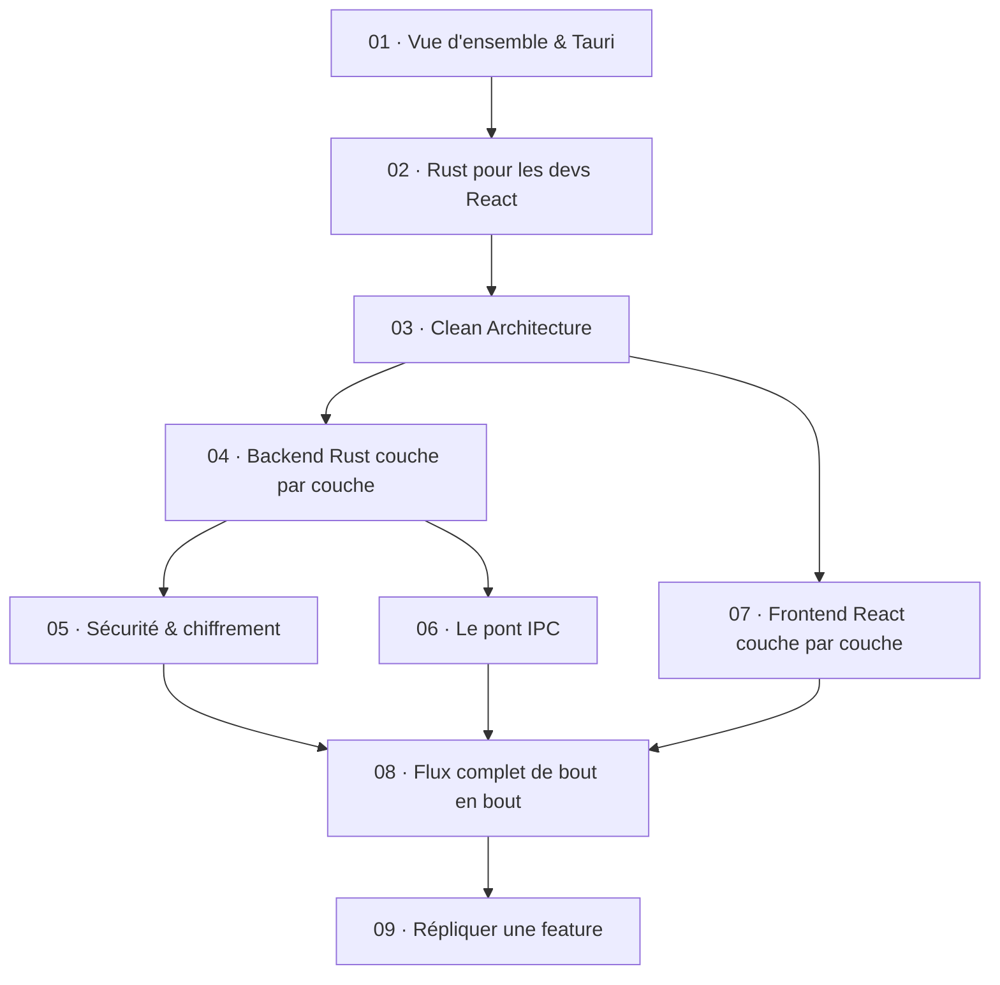

# Tutoriel BasicPresence — de Rust jusqu'au front React

Ce tutoriel explique **comment fonctionne cette codebase de bout en bout** — du cœur Rust
(Tauri) jusqu'à l'interface React — et **comment la répliquer** pour ajouter tes propres
fonctionnalités.

Il est écrit pour **un développeur qui maîtrise React/TypeScript mais débute en Rust** : aucun
prérequis Rust ou Tauri n'est attendu. Chaque concept Rust/Tauri est expliqué **la première fois
qu'il apparaît dans le vrai code**, avec une analogie React/TS quand c'est possible. Tous les
extraits de code cités sont **réels** (tirés du dépôt) et chaque chapitre est vérifié contre le
code source.

> 📌 Ce tutoriel **explique l'existant** ; il ne remplace pas la référence d'architecture
> [Claude.md](../../Claude.md), ni les notes de sécurité [documentation/auth.md](../auth.md) et de
> persistance [documentation/turso.md](../turso.md). Il les rend lisibles et progressifs.

---

## Comment lire ce tutoriel

Les chapitres sont conçus pour être lus **dans l'ordre** : chacun s'appuie sur les précédents
(chaque chapitre rappelle ses prérequis en haut). Le fil narratif va du général au concret, puis
de la théorie à la pratique :

1. **Comprendre le terrain** → chapitres 01–03 (Tauri, Rust, architecture).
2. **Lire le code réel** → chapitres 04–07 (backend Rust, sécurité, pont IPC, frontend React).
3. **Tout relier puis reproduire** → chapitres 08–09 (flux complet, puis recette pour créer une feature).

### Parcours rapides (si tu es pressé)

- **« Je veux juste comprendre comment React parle à Rust »** → 01, puis 06 (le pont IPC), puis 08 (le flux complet).
- **« Je connais déjà Tauri, montre-moi l'architecture »** → 03, puis 04 et 07.
- **« Je dois ajouter une fonctionnalité dès maintenant »** → 03 (les principes), 09 (la recette), en piochant dans 04/06/07 au besoin.
- **« La sécurité m'inquiète »** → 05 (Argon2id, envelope encryption, les deux bases), puis 08 pour le flux de login.

---

## Les chapitres

| # | Chapitre | Ce que tu y apprends |
| --- | --- | --- |
| **01** | [Vue d'ensemble & Tauri](./01-vue-densemble-et-tauri.md) | Ce qu'est Tauri v2, le modèle **Core/Shell**, pourquoi Rust + React, le but du projet et son cycle de démarrage. |
| **02** | [Rust pour les devs React](./02-rust-pour-les-devs-react.md) | Les concepts Rust **réellement présents** dans le code — modules, ownership, `Result`/`?`, `Option`, traits, `Arc<dyn Trait>`, `async`, `zeroize` — expliqués avec des analogies TS. |
| **03** | [Clean Architecture](./03-clean-architecture.md) | La **règle de dépendance**, l'inversion par traits/interfaces, le **composition root** — le même schéma côté Rust **et** côté React. |
| **04** | [Backend Rust couche par couche](./04-backend-rust-couche-par-couche.md) | Visite guidée **domain → application → infrastructure → presentation** + l'injection de dépendances dans `lib.rs`. |
| **05** | [Sécurité & chiffrement](./05-securite-et-chiffrement.md) | **Argon2id**, **envelope encryption** (DEK/KEK), les **deux bases** (claire + chiffrée), la session 15 min, l'anti-bruteforce, l'effacement mémoire. |
| **06** | [Le pont IPC](./06-le-pont-ipc.md) | Comment un `invoke(...)` JS atterrit dans un `#[tauri::command]` Rust et revient : serde, DTOs camelCase, contrat d'erreur, CSP & permissions. |
| **07** | [Frontend React couche par couche](./07-frontend-react-couche-par-couche.md) | L'organisation **feature-first** : `core/` + `domain`/`data`/`presentation`, providers, hooks, mappers, repositories. |
| **08** | [Flux complet de bout en bout](./08-flux-complet-de-bout-en-bout.md) | Deux traces numérotées — **`register`** puis **`login`** — du clic React jusqu'à la base Rust et retour (diagrammes de séquence). |
| **09** | [Répliquer une feature](./09-repliquer-une-feature.md) | La **recette pas-à-pas** (modèle : la feature `profile`) pour créer une feature de zéro des deux côtés, avec checklist copiable. |

---

## Mémo de vocabulaire : Rust ↔ React

Le même découpage Clean Architecture existe des deux côtés. Ce tableau est ton décodeur quand tu
passes d'un monde à l'autre (détaillé au [chapitre 03](./03-clean-architecture.md)).

| Concept | Côté Rust (`src-tauri/`) | Côté React (`src/`) |
| --- | --- | --- |
| « Interface » / contrat abstrait | un **trait** (`AccountRepository`) | une **interface** TS (`AuthRepository`) |
| Implémentation concrète d'un contrat | `LibsqlAccountRepository` (infrastructure) | `TauriAuthRepository` (data) |
| Dépendance injectée derrière un contrat | `Arc<dyn Trait>` | l'instance passée à `makeXxxUseCase(repo)` |
| Cas d'usage métier | `…UseCase` (application) | factory `makeXxxUseCase` (domain) |
| Objet de transfert (forme sérialisée) | **DTO** `#[derive(Serialize)]` camelCase | **DTO** TS (`…Dto`) |
| Traduction DTO ↔ entité | `From<Entity> for Dto` / `row_to_…` | les **mappers** (`toUser`, `toAuthSession`) |
| Point de câblage des dépendances | **composition root** `build_state()` dans `lib.rs` | le **Provider** (`AuthProvider`, `ProfileProvider`) |
| Frontière exposée | les `#[tauri::command]` (presentation) | `src/core/ipc.ts` (seul à parler à `@tauri-apps/api`) |
| Gestionnaire de paquets | **Cargo** (`Cargo.toml`) | **pnpm** (`package.json`) |

---

## Pour aller plus loin

- [Claude.md](../../Claude.md) — la référence d'architecture concise (conventions, règles à ne pas enfreindre, feuille de route).
- [documentation/auth.md](../auth.md) — le détail du modèle de sécurité et ses limites connues.
- [documentation/turso.md](../turso.md) — la persistance libSQL/Turso et le compromis chiffrement-vs-synchro (Phase 2).
- [README.md](../../README.md) — installation, prérequis système, lancement et build.

---

➡️ Commence par le [Chapitre 01 — Vue d'ensemble & Tauri](./01-vue-densemble-et-tauri.md).
