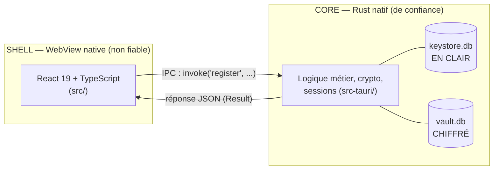
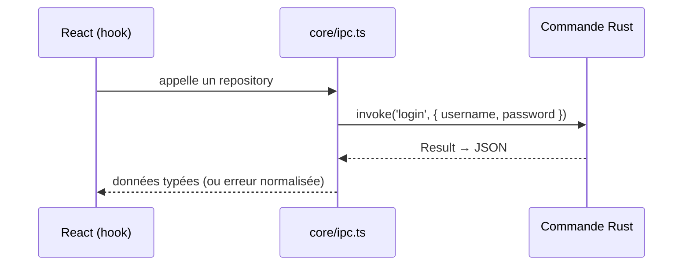
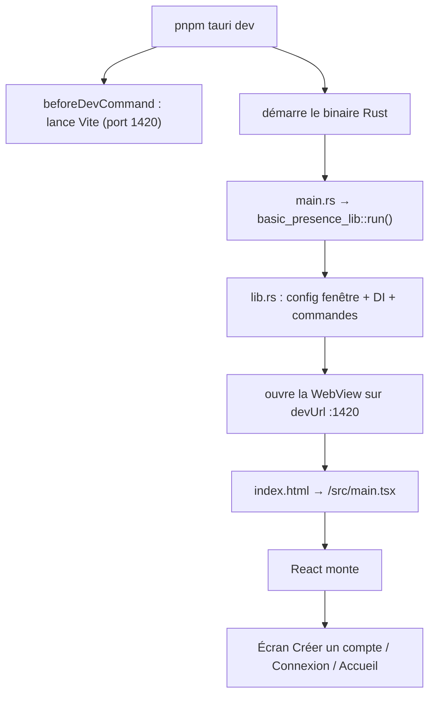

# Chapitre 01 — Vue d'ensemble & Tauri

## Ce que tu vas apprendre

- Ce qu'est **Tauri v2** et en quoi il diffère d'Electron (WebView native + cœur Rust, binaire léger).
- Le modèle **Core / Shell** : pourquoi la WebView ne touche jamais directement au système.
- Les **deux mondes** du projet — `src-tauri/` (Rust, le Core) et `src/` (React, le Shell) — et comment ils se parlent (IPC, survol).
- Le **but métier** de BasicPresence et pourquoi il est *offline-first* et chiffré au repos.
- Le **cycle de démarrage** de l'app, de `pnpm tauri dev` jusqu'à l'écran React.
- La **carte des dossiers** et le **plan** des chapitres suivants.

> 🧭 **Prérequis** : aucun. C'est le premier chapitre. Tu dois juste savoir lire du React/TypeScript ; on n'attend de toi **aucune** expérience Rust ou Tauri — c'est tout l'objet de ce tutoriel.

---

## 1. Le problème : une app desktop, des données très sensibles

**BasicPresence** est une application **desktop** (elle s'installe sur un poste, ce n'est pas un site web) qui sert à :

- suivre la **présence** des personnes (au bureau ou en remote),
- noter leur **mode de déplacement**,
- en déduire les **émissions de CO₂** de chacune.

Ces données sont jugées **très confidentielles**. Deux conséquences concrètes, présentes dès le README :

- **Offline-first** : tout est stocké **localement** sur le poste, rien ne part vers un serveur en v1. (Une synchro cloud est *prévue* pour la Phase 2, mais ce n'est pas le sujet de la v1.)
- **Chiffré au repos**, niveau « bancaire » : sur le disque, les données métier sont illisibles. La base ne se **déchiffre** qu'après saisie du **mot de passe**. Tant que personne ne s'est connecté, le fichier n'est qu'un bloc d'octets inintelligible.

> En React/web tu aurais réflexe « API + base distante + JWT ». Ici c'est l'inverse : **pas de serveur**, la base vit sur la machine et la sécurité repose sur le **chiffrement local** dérivé du mot de passe. Ce renversement explique presque toutes les décisions techniques du projet.

Le détail du chiffrement est au [chapitre 05](./05-securite-et-chiffrement.md). Pour l'instant retiens juste : *données locales + chiffrées + déverrouillées par mot de passe*.

---

## 2. Pourquoi Tauri (et pas Electron)

Pour faire une app desktop avec une UI web (React), deux grandes options existent : **Electron** et **Tauri**. BasicPresence utilise **Tauri v2**.

L'idée commune aux deux : afficher une interface web dans une fenêtre native, pilotée par un langage « système ». La différence est dans le **comment**.

| Aspect | Electron | **Tauri v2** (ce projet) |
| --- | --- | --- |
| Moteur d'affichage | **Chromium embarqué** (livré dans l'app) | **WebView native de l'OS** (WebView2 sur Windows, WebKitGTK sous Linux, WKWebView sur macOS) |
| Langage du « backend » | Node.js (JavaScript) | **Rust** (compilé, natif) |
| Poids du binaire | lourd (Chromium ≈ 100+ Mo) | **léger** (pas de navigateur embarqué) |
| Sécurité par défaut | permissive | **moindre privilège** (permissions explicites) |

Concrètement, Tauri **ne fournit pas** son propre moteur Chromium : il **réutilise** le composant WebView déjà installé sur le système d'exploitation. C'est pourquoi, sous Linux, il faut installer `webkit2gtk` (cf. les prérequis du README) — c'est la WebView que Tauri va piloter.

> ⚠️ Conséquence directe pour ce projet : sous Linux + carte NVIDIA, WebKitGTK peut afficher une fenêtre blanche (« Failed to create GBM buffer… »). Ce **n'est pas** un bug de l'app, c'est WebKitGTK. Le README fournit deux scripts de contournement, `pnpm dev:wayland` et `pnpm dev:x11`, qui désactivent un mode de rendu graphique problématique. Garde-les sous le coude si l'écran reste blanc.

---

## 3. Le modèle Core / Shell

C'est **le** concept mental à intégrer avant tout le reste. Tauri sépare l'app en deux moitiés étanches :

- Le **Shell** = la **WebView** = ton **React/TypeScript**. C'est l'**interface**. Elle dessine des boutons et des écrans, mais elle est traitée comme **non fiable** : par construction, elle n'a **aucun** accès direct au système (pas d'accès brut au disque, à la crypto, à la base de données).
- Le **Core** = le **cœur Rust** = `src-tauri/`. C'est lui qui détient les **capacités système** : lire/écrire des fichiers, chiffrer, ouvrir la base. Lui seul manipule les secrets.

La règle d'or, citée telle quelle dans le `Claude.md` du projet :

> Tauri suit un modèle **Core-Shell** : le *Core* Rust ne doit jamais exposer d'accès système direct au *Shell* (la WebView). Tout passe par des commandes validées.

Autrement dit : le Shell **demande**, le Core **décide et exécute**. Le Shell ne peut faire que ce que le Core veut bien lui exposer, sous forme de **commandes** explicitement déclarées et validées.

> Si tu connais Electron : c'est l'équivalent de la séparation **renderer process** (l'UI web) / **main process** (Node.js qui a les droits système), avec le `contextBridge` / `ipcRenderer` au milieu. Tauri pousse la séparation plus loin et la rend **plus stricte par défaut** : rien n'est exposé tant que tu ne l'as pas explicitement autorisé (permissions de moindre privilège dans `src-tauri/capabilities/`).



Sur ce schéma, **la seule flèche** qui traverse la frontière, c'est l'**IPC**. Le Shell ne touche jamais aux deux bases directement : il passe par des commandes que le Core expose. (Pourquoi *deux* bases, une claire et une chiffrée ? C'est le modèle « envelope encryption », détaillé au [chapitre 05](./05-securite-et-chiffrement.md).)

---

## 4. Les deux mondes : `src/` et `src-tauri/`

Le dépôt est physiquement coupé en deux dossiers qui correspondent exactement au Shell et au Core.

```
BasicPresenceTauri/
├── src/                 # SHELL — Frontend React (TypeScript)
├── src-tauri/           # CORE  — Backend Rust + config Tauri
│   ├── tauri.conf.json  #   configuration de l'app (fenêtre, build, sécurité)
│   ├── Cargo.toml       #   dépendances Rust (≈ package.json côté Rust)
│   ├── capabilities/    #   permissions Tauri (moindre privilège)
│   ├── migrations/      #   SQL embarqué (keystore/ + vault/)
│   └── src/             #   code Rust : main.rs, lib.rs, domain/…
├── package.json         # dépendances + scripts du frontend (et `tauri`)
└── index.html           # page hôte chargée par la WebView
```

Deux fichiers de dépendances cohabitent, un par monde :

- [package.json](../../package.json) → l'univers **Node/React** (React 19, Vite, `@tauri-apps/api`, etc.).
- [src-tauri/Cargo.toml](../../src-tauri/Cargo.toml) → l'univers **Rust**. C'est l'équivalent du `package.json` pour Rust : il liste les *crates* (les « paquets » Rust).

> Vocabulaire Rust à retenir dès maintenant : un **crate** ≈ un package npm. Le **`Cargo.toml`** ≈ ton `package.json`. **Cargo** ≈ `npm`/`pnpm` (il télécharge, compile, teste). On y reviendra au [chapitre 02](./02-rust-pour-les-devs-react.md).

Voici un extrait de `Cargo.toml` qui dit déjà beaucoup sur le projet :

[src-tauri/Cargo.toml](../../src-tauri/Cargo.toml)

```toml
[dependencies]
tauri = { version = "2", features = [] }
# Persistance offline-first chiffrée (moteur libSQL / Turso), 100% locale en v1
libsql = { version = "0.9", features = ["encryption"] }
# Hachage de mot de passe & dérivation de clé (Argon2id)
argon2 = "0.5"
# Envelope encryption du DEK (AEAD authentifié, nonce 192 bits)
chacha20poly1305 = "0.10"
```

On voit directement les trois piliers du Core : **Tauri** (le framework desktop), **libsql** avec la feature `encryption` (la base locale chiffrée), et **Argon2id** + **XChaCha20-Poly1305** (la crypto qui protège le mot de passe et la clé du coffre). Tout ça vit côté Rust, jamais côté React.

> Note sur les `features = [...]`. En Rust, une *feature* est une option de compilation d'un crate (≈ un *flag* qui active une partie optionnelle du code). `libsql` avec la feature `"encryption"` compile le support du chiffrement de la base ; sans ce flag, le code de chiffrement ne serait même pas inclus.

---

## 5. Comment les deux mondes se parlent : l'IPC (survol)

La frontière Core/Shell se franchit par l'**IPC** (*Inter-Process Communication*). Le principe, en une phrase :

> Côté React, on appelle `invoke('nom_de_commande', { ...arguments })` ; côté Rust, une fonction annotée `#[tauri::command]` reçoit ces arguments, fait le travail, et renvoie un résultat **sérialisé en JSON**.

C'est volontairement un **survol** ici — le mécanisme complet (sérialisation `serde`, DTOs, mapping d'erreurs, permissions/CSP) est l'objet du [chapitre 06](./06-le-pont-ipc.md). Trois points suffisent pour cette vue d'ensemble :

1. **Les commandes sont une liste fermée.** Le Shell ne peut appeler **que** les commandes que le Core déclare. Dans ce projet, ce sont :
   `account_exists`, `register`, `login`, `check_session`, `logout`, puis pour les profils `create_profile`, `list_profiles`, `update_profile`, `delete_profile`, `set_active_profile`. (On les retrouvera enregistrées dans `lib.rs`.)
2. **Un seul fichier React parle à Tauri.** Côté frontend, **seul** `src/core/ipc.ts` a le droit d'importer `@tauri-apps/api` et donc d'appeler `invoke`. Tout le reste du React passe par des *repositories* qui délèguent à ce fichier. Cette règle est même **vérifiée par ESLint** (`no-restricted-imports`). C'est l'analogue côté front du modèle Core/Shell : une **seule porte** vers l'extérieur.
3. **L'annotation Rust `#[tauri::command]`.** Le `#[...]` est un **attribut** (≈ un décorateur en TS, comme `@Component`). `#[tauri::command]` transforme une fonction Rust ordinaire en commande appelable depuis le Shell. On verra concrètement ces fonctions aux chapitres 04, 06 et 08.



---

## 6. Le cycle de démarrage de l'app

Que se passe-t-il, dans l'ordre, quand tu tapes `pnpm tauri dev` ? Suivons la chaîne fichier par fichier.

**a. Tauri lit sa config.** Le fichier maître est [src-tauri/tauri.conf.json](../../src-tauri/tauri.conf.json). Trois clés nous intéressent pour le démarrage :

[src-tauri/tauri.conf.json](../../src-tauri/tauri.conf.json)

```json
"build": {
  "beforeDevCommand": "pnpm dev",
  "devUrl": "http://localhost:1420",
  "beforeBuildCommand": "pnpm build",
  "frontendDist": "../dist"
}
```

- `beforeDevCommand: "pnpm dev"` → avant d'ouvrir la fenêtre, Tauri lance **Vite** (le serveur de dev du front). C'est exactement le `pnpm dev` du [package.json](../../package.json) (`"dev": "vite"`).
- `devUrl: "http://localhost:1420"` → en mode dev, la WebView va charger l'UI depuis ce serveur Vite local (port **1420**), avec le hot-reload.
- `frontendDist: "../dist"` → en mode **build** (production), il n'y a plus de serveur : Tauri embarque les fichiers statiques produits par `pnpm build` (`tsc && vite build` → dossier `dist/`).

> En clair : en **dev**, la WebView pointe vers un serveur Vite (`localhost:1420`) ; en **prod**, elle charge des fichiers compilés embarqués dans le binaire. Même UI, deux sources.

**b. Le binaire Rust démarre.** Le point d'entrée du programme Rust est volontairement minuscule :

[src-tauri/src/main.rs](../../src-tauri/src/main.rs)

```rust
fn main() {
    basic_presence_lib::run()
}
```

`main()` ≈ le point d'entrée de ton programme (comme une fonction tout en haut qui s'exécute au lancement). Ici il ne fait **qu'une** chose : appeler `run()`. Toute la vraie configuration (création de la fenêtre, branchement des bases, enregistrement des commandes, injection de dépendances) vit dans `lib.rs` — c'est le **composition root** du Core, détaillé au [chapitre 04](./04-backend-rust-couche-par-couche.md).

> Pourquoi `basic_presence_lib::` et pas juste `run()` ? Parce que le code utile est dans une **bibliothèque** (`lib.rs`), séparée du **binaire** (`main.rs`). Le `Cargo.toml` nomme cette lib `basic_presence_lib`. Le `::` est l'opérateur de chemin de module (≈ `import { run } from "basic_presence_lib"` en TS). On détaillera les modules au [chapitre 02](./02-rust-pour-les-devs-react.md).

**c. La WebView charge la page hôte.** Côté Shell, tout part de [index.html](../../index.html) :

[index.html](../../index.html)

```html
<body>
  <div id="root"></div>
  <script type="module" src="/src/main.tsx"></script>
</body>
```

C'est une page HTML classique (comme n'importe quel projet Vite + React) : un `<div id="root">` vide et un script qui charge `main.tsx`.

**d. React se monte.** Enfin, [src/main.tsx](../../src/main.tsx) prend la main :

[src/main.tsx](../../src/main.tsx)

```tsx
ReactDOM.createRoot(document.getElementById("root") as HTMLElement).render(
  <React.StrictMode>
    <AuthProvider>
      <App />
    </AuthProvider>
  </React.StrictMode>,
);
```

C'est du React 19 standard : on monte `<App />` dans le `#root`. Note l'`<AuthProvider>` qui enveloppe tout : c'est lui qui gère l'état d'authentification (créer un compte / se connecter / session). On le reverra au [chapitre 07](./07-frontend-react-couche-par-couche.md). À ce stade, l'app affiche l'écran **« Créer un compte »** au premier lancement, puis **Connexion**, puis **Accueil**.

Le flux complet de démarrage :



---

## 7. La stack en un coup d'œil

| Couche | Technologies (versions du projet) |
| --- | --- |
| **Frontend (Shell)** | React 19, TypeScript strict, Vite 7, i18next, Radix UI + shadcn (style *new-york*), Tailwind v4 |
| **Pont (IPC)** | `@tauri-apps/api` (centralisé dans `src/core/ipc.ts`) |
| **Framework desktop** | Tauri v2 |
| **Backend (Core)** | Rust (édition 2021) |
| **Persistance** | libSQL 0.9 (feature `encryption`), 100 % locale et chiffrée en v1 |
| **Crypto** | Argon2id (hash + dérivation de clé), XChaCha20-Poly1305 (envelope), zeroize (effacement mémoire) |
| **Tests** | `cargo test` (Rust) · Vitest + Testing Library (front) |
| **Outillage** | **pnpm**, ESLint 9 (flat config), Prettier, `cargo fmt` / `clippy` |

---

## 8. Commandes utiles

Tu vas surtout utiliser ces commandes pendant tout le tutoriel. Le gestionnaire de paquets front est **pnpm**.

```bash
# Lancer l'app complète (Vite + fenêtre Tauri, hot-reload)
pnpm tauri dev

# Sous Linux + NVIDIA, si écran blanc :
pnpm dev:wayland       # ou : pnpm dev:x11

# Build de production (front + binaire natif + installeurs)
pnpm tauri build

# Frontend seul
pnpm dev               # serveur Vite
pnpm typecheck         # tsc --noEmit
pnpm lint              # ESLint
pnpm test              # Vitest

# Backend Rust (depuis src-tauri/)
cargo check                    # vérification rapide
cargo test                     # tests unitaires + intégration
cargo clippy -- -D warnings    # lint Rust, zéro warning toléré
cargo fmt                      # formatage
```

> Réflexe « avant commit » du projet : `pnpm typecheck && pnpm lint && pnpm test`, puis dans `src-tauri/` : `cargo fmt && cargo clippy -- -D warnings && cargo test`.

---

## 9. Où va-t-on ? Le plan du tutoriel

Tu viens de voir l'image macro. Voici comment on creuse, chapitre par chapitre :

| # | Chapitre | Ce qu'on y fait |
| --- | --- | --- |
| 02 | [Rust pour les devs React](./02-rust-pour-les-devs-react.md) | Les concepts Rust du projet (traits, `Result`, `?`, `Arc<dyn T>`…) expliqués avec des analogies TS |
| 03 | [Clean Architecture](./03-clean-architecture.md) | Règle de dépendance, inversion par traits/interfaces, composition root |
| 04 | [Backend Rust couche par couche](./04-backend-rust-couche-par-couche.md) | domain / application / infrastructure / presentation + la DI dans `lib.rs` |
| 05 | [Sécurité & chiffrement](./05-securite-et-chiffrement.md) | Argon2id, envelope encryption, les 2 bases, session, anti-bruteforce, zeroize |
| 06 | [Le pont IPC](./06-le-pont-ipc.md) | `invoke` ↔ `#[tauri::command]`, serde, DTOs, mapping d'erreurs, permissions/CSP |
| 07 | [Frontend React couche par couche](./07-frontend-react-couche-par-couche.md) | `core/` + une feature (domain / data / presentation) |
| 08 | [Flux complet de bout en bout](./08-flux-complet-de-bout-en-bout.md) | Trace de `register` puis `login`, du clic React jusqu'à la DB Rust et retour |
| 09 | [Répliquer une feature](./09-repliquer-une-feature.md) | Recette pas-à-pas pour ajouter une feature de zéro des deux côtés |

---

## Étape suivante

Avant de plonger dans l'architecture, il faut un minimum de vocabulaire Rust — pas pour devenir expert, juste pour **lire** le code du Core sans être perdu. C'est exactement l'objet du prochain chapitre.

➡️ [Chapitre 02 — Rust pour les devs React](./02-rust-pour-les-devs-react.md)
