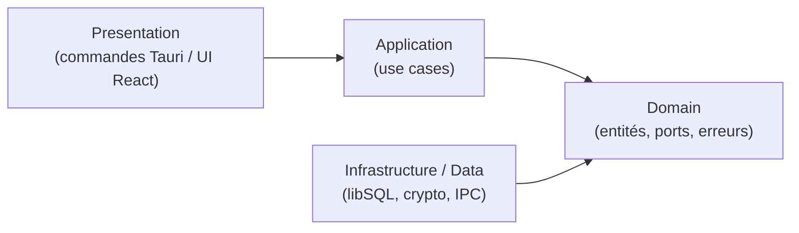
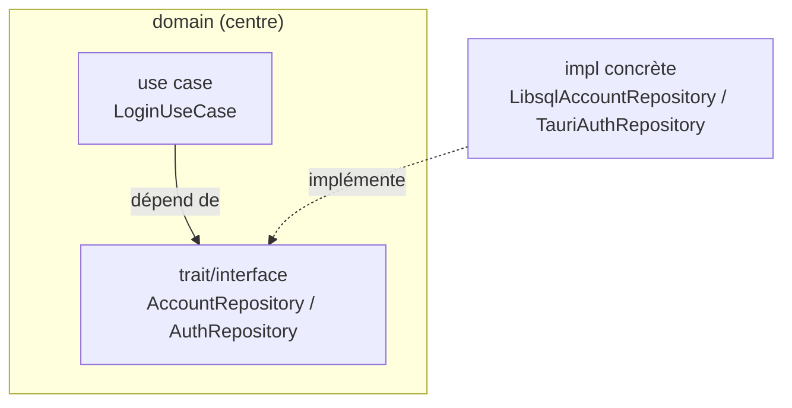
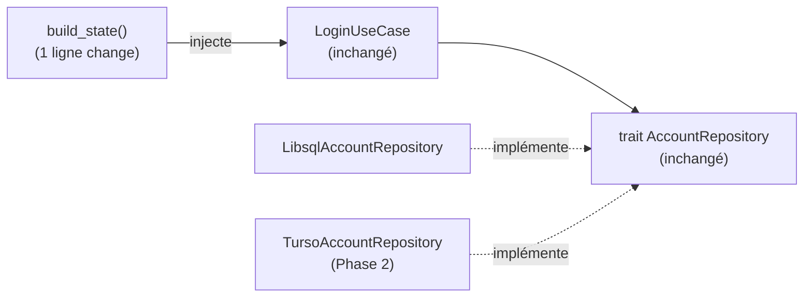

# 03 — Clean Architecture

## Ce que tu vas apprendre

- La **règle de dépendance** : pourquoi toutes les flèches pointent vers l'intérieur, vers le `domain`.
- Le rôle de chaque **couche** côté Rust ET côté React (et le miroir parfait entre les deux).
- L'**inversion de dépendance** : un même pattern « port abstrait + implémentation concrète » dans les deux langages (`trait` Rust ≈ `interface` TypeScript).
- Le **composition root** : le seul endroit où l'on choisit les implémentations concrètes et où on les branche.
- Le « pourquoi » concret : testabilité, remplaçabilité (passer de libSQL local à Turso en Phase 2 sans toucher au domaine).

> 🧭 **Prérequis** : avoir lu [01 — Vue d'ensemble et Tauri](./01-vue-densemble-et-tauri.md) (modèle Core/Shell) et [02 — Rust pour les devs React](./02-rust-pour-les-devs-react.md). Ce chapitre suppose que tu connais déjà la notion de `trait` Rust (≈ interface), de `Result<T, E>` (≈ ok-ou-err sans `throw`), et de `Arc<dyn Trait>` (≈ une dépendance typée par une interface).

---

## 1. L'idée centrale : la règle de dépendance

La Clean Architecture tient en **une seule règle** : *les dépendances pointent toujours vers l'intérieur*. Au centre se trouve le **domaine** (le métier pur), et il **ne dépend de rien** — ni de la base de données, ni de Tauri, ni de React, ni d'aucun framework.

Tout le reste gravite autour et dépend du domaine, jamais l'inverse. C'est exactement ce que rappelle le [Claude.md](../../Claude.md) du projet :

> La règle fondamentale est la **règle de dépendance** : *les dépendances pointent toujours vers l'intérieur*. Le domaine ne connaît rien des frameworks, de la base de données, de Tauri, ni de React.

Voici le schéma de dépendance, identique des deux côtés (Rust et React) :



Lis bien le sens des flèches : `Presentation` et `Infrastructure` pointent **vers** `Domain`. Le `Domain`, lui, ne pointe vers personne. C'est ce qu'on appelle parfois le « centre » de l'oignon.

> En React tu connais sûrement l'inverse : un composant `import`e son client API qui `import`e `axios`. La dépendance va de l'UI vers la techno concrète. Ici on **renverse** ce sens : le cœur métier ne sait même pas qu'`axios` (ou libSQL, ou Tauri) existe. On verra comment c'est techniquement possible en section 4.

> ⚠️ La règle est non négociable dans ce projet (cf. Claude.md, §8) : *« Le `domain` n'importe rien de `application`, `infrastructure`/`data`, `presentation`, React ou Tauri. »* Si tu vois un `import` de libSQL, de `@tauri-apps/api` ou de React dans un fichier `domain/`, c'est un bug d'architecture.

---

## 2. Les couches côté Rust

Le backend (`src-tauri/src/`) est découpé en quatre couches, de l'intérieur vers l'extérieur.

| Couche | Dossier | Responsabilité | Ce qu'elle a le droit de connaître |
| --- | --- | --- | --- |
| **Domain** | `domain/` | Entités, *ports* (traits de repositories & services), erreurs métier (`DomainError`) | Rien d'externe |
| **Application** | `application/` | Use cases (orchestration d'un cas d'usage), DTOs | Le `domain` uniquement |
| **Infrastructure** | `infrastructure/` | Implémentations concrètes des ports (libSQL, Argon2, sessions) | Le `domain` + les crates techniques |
| **Presentation** | `presentation/` | Commandes Tauri `#[tauri::command]`, mapping d'erreurs | `application` (appelle les use cases) |

### Domain : le métier pur

Le domaine contient les **entités** (structs métier) et les **ports** : des `trait` qui décrivent *ce dont le métier a besoin*, sans dire *comment* c'est fait.

[src-tauri/src/domain/repositories/account_repository.rs](../../src-tauri/src/domain/repositories/account_repository.rs)

```rust
#[async_trait]
pub trait AccountRepository: Send + Sync {
    async fn exists(&self) -> Result<bool, DomainError>;
    async fn find_by_username(&self, username: &str) -> Result<Option<Account>, DomainError>;
    async fn create(&self, account: &Account) -> Result<(), DomainError>;
    // ...
}
```

Lecture ligne par ligne pour un débutant Rust :

- `pub trait AccountRepository` — un `trait`, c'est un **contrat**. Exactement comme une `interface` TypeScript : « voici les méthodes qu'un objet doit fournir », sans dire comment.
- `: Send + Sync` — deux contraintes liées au multithreading. En clair : « cette implémentation pourra être partagée entre threads en toute sécurité ». Tu peux les lire comme « obligatoire pour qu'on puisse stocker ça dans un `Arc` partagé » (on y revient en section 5).
- `Result<bool, DomainError>` — pas de `throw` en Rust : on retourne soit un succès (`Ok(bool)`), soit une erreur **métier** (`Err(DomainError)`). Remarque : l'erreur est un `DomainError`, **pas** une erreur SQL. Le domaine ignore qu'il y a une base de données derrière.

Même principe pour les **services**. Le port du hachage de mot de passe :

[src-tauri/src/domain/services/password_hasher.rs](../../src-tauri/src/domain/services/password_hasher.rs)

```rust
/// Port for password hashing/verification (implemented with Argon2id).
pub trait PasswordHasher: Send + Sync {
    fn hash(&self, password: &[u8]) -> Result<String, DomainError>;
    fn verify(&self, password: &[u8], phc: &str) -> Result<bool, DomainError>;
}
```

Le commentaire dit « implemented with Argon2id », mais le trait lui-même **ne mentionne jamais Argon2**. Il dit seulement « on sait hacher et vérifier ». Le *comment* (Argon2id) vivra dans l'infrastructure. C'est ça, un port.

### Application : les use cases

Un **use case** orchestre une intention métier (« se connecter », « créer un profil »). Il dépend uniquement des **ports** du domaine, jamais des implémentations concrètes.

[src-tauri/src/application/use_cases/login.rs](../../src-tauri/src/application/use_cases/login.rs)

```rust
pub struct LoginUseCase {
    accounts: Arc<dyn AccountRepository>,
    hasher: Arc<dyn PasswordHasher>,
    keys: Arc<dyn KeyService>,
    // ...
}
```

Le point crucial : chaque dépendance est typée `Arc<dyn AccountRepository>`, c'est-à-dire **par le trait (le port)**, pas par `LibsqlAccountRepository` (le concret).

> `Arc<dyn AccountRepository>` ≈ en React/TS, un champ typé `private accounts: AccountRepository` (l'interface), qu'on remplit par injection. `dyn` veut dire « n'importe quel type qui implémente ce trait » ; `Arc` est un pointeur partageable (≈ une référence qu'on peut copier sans dupliquer l'objet). Le use case ne sait donc **pas** s'il parle à libSQL, à un mock de test, ou à Turso. Il sait juste qu'il parle à *quelque chose qui respecte le contrat*.

Et dans la méthode `execute`, on appelle simplement les méthodes du port :

```rust
let Some(account) = self.accounts.find_by_username(username).await? else {
    // Equalize timing against username enumeration (hash, discard).
    let _ = self.hasher.hash(pw.as_slice());
    return Err(DomainError::InvalidCredentials);
};
```

- `self.accounts.find_by_username(...)` — appel sur le port. Aucune trace de SQL ici.
- `.await?` — `await` (c'est asynchrone) suivi de `?`. Le `?` veut dire « si c'est une `Err`, sors immédiatement de la fonction en renvoyant cette erreur » (≈ un `await` qui propagerait automatiquement le `throw`).
- Toute la logique métier (égalisation de timing anti-énumération, verrouillage, dérivation de clé) vit **ici**, dans l'application, et reste indépendante de la techno.

### Infrastructure : les implémentations concrètes

L'infrastructure fournit le *comment*. C'est ici, et **seulement** ici, qu'on trouve libSQL :

[src-tauri/src/infrastructure/persistence/account_repository.rs](../../src-tauri/src/infrastructure/persistence/account_repository.rs)

```rust
/// libSQL-backed account repository (over the keystore connection).
pub struct LibsqlAccountRepository {
    conn: Connection,
}

#[async_trait]
impl AccountRepository for LibsqlAccountRepository {
    async fn find_by_username(&self, username: &str) -> Result<Option<Account>, DomainError> {
        let sql = format!("SELECT {SELECT_COLUMNS} FROM account WHERE username = ?1");
        let mut rows = self
            .conn
            .query(&sql, params![username])
            .await
            .map_err(map_storage)?;
        // ...
    }
}
```

- `impl AccountRepository for LibsqlAccountRepository` — « `LibsqlAccountRepository` **implémente** le contrat `AccountRepository` ». ≈ `class LibsqlAccountRepository implements AccountRepository` en TS.
- C'est ici qu'on voit du `SELECT ... FROM account`, des `Connection` libSQL, des `params![...]`. **Tout ce détail technique est confiné dans cette couche.**
- `.map_err(map_storage)?` — l'erreur SQL brute est convertie en `DomainError` *avant* de remonter. Le domaine ne voit jamais une erreur libSQL ; il voit un `DomainError`. C'est la frontière étanche entre « le monde technique » et « le monde métier ».

> Remarque l'inversion : `infrastructure` `import`e et dépend de `domain` (il implémente son trait), mais `domain` n'a **aucune** ligne qui parle d'`infrastructure`. La flèche pointe bien vers l'intérieur.

### Presentation : la frontière IPC

La couche presentation, ce sont les commandes Tauri (`#[tauri::command]`). Elles sont *fines* : elles récupèrent l'état, appellent un use case, et traduisent `DomainError` → `AppError` sérialisable. On les détaille au chapitre [04](./04-backend-rust-couche-par-couche.md) et au chapitre [06](./06-le-pont-ipc.md).

---

## 3. Les couches côté React (le même découpage)

Le frontend (`src/`) est **feature-first** : chaque feature (`auth`, `profile`) porte ses propres couches. Le miroir avec Rust est volontaire et quasi parfait.

| Couche React | Dossier | Équivalent Rust |
| --- | --- | --- |
| **domain** | `features/<feat>/domain/` | `domain` + `application` (entités, interface de repo, use-cases purs) |
| **data** | `features/<feat>/data/` | `infrastructure` (DTO, mappers, `TauriXxxRepository`) |
| **presentation** | `features/<feat>/presentation/` | `presentation` (Provider, hooks, composants) |

### domain (React) : entités, interface de repo, use-cases purs

L'interface du repository côté front joue exactement le rôle du `trait` Rust :

[src/features/auth/domain/repositories/auth-repository.ts](../../src/features/auth/domain/repositories/auth-repository.ts)

```ts
/** Contract the presentation layer depends on; implemented in the data layer. */
export interface AuthRepository {
  accountExists(): Promise<boolean>;
  register(credentials: Credentials): Promise<User>;
  login(credentials: Credentials): Promise<AuthSession>;
  checkSession(token: string): Promise<SessionStatus>;
  logout(token: string): Promise<void>;
}
```

Aucun `import` de `@tauri-apps/api` ici, aucune notion d'IPC. C'est un pur **contrat** — l'exact équivalent TypeScript du trait `AccountRepository` Rust.

Le **use-case** est une petite fonction pure qui dépend de cette interface :

[src/features/auth/domain/use-cases/login.ts](../../src/features/auth/domain/use-cases/login.ts)

```ts
export type LoginUseCase = (credentials: Credentials) => Promise<AuthSession>;

export function makeLoginUseCase(repo: AuthRepository): LoginUseCase {
  return (credentials) => repo.login(credentials);
}
```

- `makeLoginUseCase(repo: AuthRepository)` — le use-case reçoit un `repo` typé **par l'interface**. Comme côté Rust, il ne sait pas s'il parle à Tauri ou à un mock.
- C'est l'équivalent du `LoginUseCase::new(accounts: Arc<dyn AccountRepository>, ...)` Rust : injection d'un port, jamais d'un concret.

### data (React) : l'implémentation concrète

[src/features/auth/data/repositories/tauri-auth.repository.ts](../../src/features/auth/data/repositories/tauri-auth.repository.ts)

```ts
/** AuthRepository implementation backed by Tauri IPC commands. */
export class TauriAuthRepository implements AuthRepository {
  async login({ username, password }: Credentials): Promise<AuthSession> {
    const dto = await invoke<LoginResponseDto>(COMMANDS.login, {
      username,
      password,
    });
    return toAuthSession(dto);
  }
  // ...
}
```

- `implements AuthRepository` — l'équivalent exact de `impl AccountRepository for LibsqlAccountRepository`.
- `invoke<LoginResponseDto>(COMMANDS.login, ...)` — c'est ici, et seulement ici (couche `data`), qu'on parle à Tauri (via `core/ipc`). C'est l'analogue parfait du `self.conn.query(...)` confiné dans `LibsqlAccountRepository`.
- `toAuthSession(dto)` — le mapper convertit le DTO de transport en entité du domaine, comme `row_to_account` côté Rust convertit une `Row` libSQL en `Account`.

### presentation (React) : Provider, hooks, composants

Les composants ne font ni IPC ni logique métier ; ils consomment les use-cases via un Provider/Context. On y revient au chapitre [07](./07-frontend-react-couche-par-couche.md).

---

## 4. Le cœur du sujet : l'inversion de dépendance

Mets les deux mondes côte à côte. C'est **exactement la même idée**, juste deux syntaxes.

| | Rust | React / TypeScript |
| --- | --- | --- |
| **Le port (dans `domain`)** | `trait AccountRepository` | `interface AuthRepository` |
| **L'impl concrète (dans `infra`/`data`)** | `impl AccountRepository for LibsqlAccountRepository` | `class TauriAuthRepository implements AuthRepository` |
| **Le use case dépend de…** | `Arc<dyn AccountRepository>` (le port) | `repo: AuthRepository` (le port) |



Le « truc » magique : le use case dépend du **port** (la flèche pleine), et l'implémentation concrète *réalise* ce port (la flèche pointillée). Du coup, la dépendance du concret va **vers le domaine**, pas l'inverse. C'est ce renversement qui permet au domaine de ne rien savoir de libSQL ou de Tauri tout en les utilisant à l'exécution.

> **Pourquoi « inversion » ?** Naïvement, `LoginUseCase` aurait besoin de `LibsqlAccountRepository`, donc le métier dépendrait de la techno (flèche vers l'extérieur). En introduisant un port que le use case possède et que l'infra implémente, on **inverse** cette flèche : c'est désormais la techno qui dépend du métier.

---

## 5. Le composition root : là où on branche le concret

Si le domaine ne connaît que des ports abstraits, **qui décide** qu'`AccountRepository` = `LibsqlAccountRepository` ? Réponse : un seul endroit, le **composition root**, exécuté au démarrage de l'app. C'est le *seul* lieu autorisé à connaître les implémentations concrètes.

### Côté Rust : `build_state()` dans `lib.rs`

[src-tauri/src/lib.rs](../../src-tauri/src/lib.rs)

```rust
/// Composition root: build the infrastructure implementations, inject them into
/// the use cases, and assemble the managed `AppState`.
async fn build_state(config: AppConfig) -> Result<AppState, DomainError> {
    // ...
    // Infrastructure implementations (behind domain ports).
    let accounts: Arc<dyn AccountRepository> =
        Arc::new(LibsqlAccountRepository::new(keystore_conn));
    let hasher: Arc<dyn PasswordHasher> = Arc::new(Argon2PasswordHasher::new(/* ... */)?);
    // ...

    Ok(AppState {
        login: LoginUseCase::new(
            accounts.clone(),
            hasher.clone(),
            keys.clone(),
            // ...
        ),
        // ...
    })
}
```

Lecture pour un débutant :

- `let accounts: Arc<dyn AccountRepository> = Arc::new(LibsqlAccountRepository::new(...))` — **ici et seulement ici** on choisit le concret (`LibsqlAccountRepository`) et on le « range » dans un `Arc<dyn AccountRepository>` (vu comme le port). ≈ `const repo: AuthRepository = new TauriAuthRepository()` en TS.
- `LoginUseCase::new(accounts.clone(), hasher.clone(), ...)` — on **injecte** ces ports dans le use case. `.clone()` sur un `Arc` ne duplique pas l'objet : il incrémente juste un compteur de références (≈ partager la même instance entre plusieurs use cases).
- Le résultat est assemblé dans un `AppState` que Tauri stocke via `app.manage(state)` (vu dans la fonction `run()` juste au-dessus). Les commandes le reliront via `State<'_, AppState>`. Détails au chapitre [04](./04-backend-rust-couche-par-couche.md).

### Côté React : `auth-provider.tsx`

Exactement le même geste, en haut du module du Provider :

[src/features/auth/presentation/providers/auth-provider.tsx](../../src/features/auth/presentation/providers/auth-provider.tsx)

```tsx
// Composition root for the auth feature: wire the repository to the use cases.
// (DI happens here at the edge, never inside the domain.)
const repo = new TauriAuthRepository();
const loginUseCase = makeLoginUseCase(repo);
const logoutUseCase = makeLogoutUseCase(repo);
const registerUseCase = makeRegisterUseCase(repo);
const accountExistsUseCase = makeAccountExistsUseCase(repo);
```

- `new TauriAuthRepository()` — choix du concret, comme `Arc::new(LibsqlAccountRepository::new(...))`.
- `makeLoginUseCase(repo)` — injection du port dans le use-case, comme `LoginUseCase::new(accounts.clone(), ...)`.
- Le commentaire le dit explicitement : *« DI happens here at the edge, never inside the domain »*. L'injection se fait **au bord** (le root de la feature), jamais dans le domaine.

> ⚠️ Règle d'or : un `new TauriAuthRepository()` ou un `Arc::new(LibsqlAccountRepository::...)` ne doit **jamais** apparaître dans la couche `domain` ni dans un use case. Si tu vois un `new`/`Arc::new` d'une impl concrète ailleurs qu'au composition root, l'inversion est cassée.

---

## 6. Pourquoi se donner tout ce mal ?

### Testabilité

Comme les use cases dépendent de ports, tu peux leur passer un **faux** (mock/fake) en test. Le test de `LoginUseCase` n'a pas besoin d'une vraie base libSQL : un `FakeAccountRepository` en mémoire qui implémente `AccountRepository` suffit. Côté React, pareil : un objet qui `implements AuthRepository` sans appeler Tauri. Tu testes le métier *sans* la techno.

### Remplaçabilité (l'exemple concret de la Phase 2)

C'est le bénéfice le plus parlant pour ce projet. Aujourd'hui, la persistance est en **libSQL local chiffré**. La Phase 2 prévoit la **synchronisation cloud Turso** (cf. roadmap du Claude.md, §10).

Grâce à l'inversion de dépendance, ce changement reste **local à la couche infrastructure** :

- on écrit une nouvelle implémentation, par exemple `TursoAccountRepository`, qui `impl AccountRepository` ;
- on change **une seule ligne** au composition root (`build_state`) : `Arc::new(TursoAccountRepository::new(...))` au lieu de `Arc::new(LibsqlAccountRepository::new(...))` ;
- le `domain`, l'`application` (tous les use cases dont `LoginUseCase`) et la `presentation` ne changent **pas d'une ligne**.



C'est tout l'intérêt : la techno est un **détail interchangeable**, le métier est stable.

### Clarté

Chaque fichier a une responsabilité unique et un emplacement prévisible. Quand tu cherches « où est le SQL ? » → `infrastructure/persistence`. « Où est la règle anti-bruteforce ? » → `application/use_cases/login.rs`. « Quel est le contrat de persistance ? » → `domain/repositories`. Le découpage te dit *où regarder*.

---

## Récapitulatif

- Une seule règle : les dépendances pointent vers l'intérieur, le `domain` au centre ne dépend de rien.
- Quatre couches Rust (`domain` / `application` / `infrastructure` / `presentation`) qui se reflètent dans les trois couches React (`domain` / `data` / `presentation`).
- L'inversion de dépendance via un **port** (trait Rust / interface TS) défini dans le domaine et implémenté à l'extérieur — `trait` ≈ `interface`, c'est littéralement le même pattern.
- Un unique **composition root** (`build_state` en Rust, le haut de `auth-provider.tsx` en React) où l'on choisit le concret et où on l'injecte.
- Bénéfices : tests sans la techno, remplacement libSQL → Turso sans toucher au métier, code lisible.

## Étape suivante

On a vu les principes ; place au détail fichier par fichier du backend. Direction [04 — Le backend Rust couche par couche](./04-backend-rust-couche-par-couche.md).
