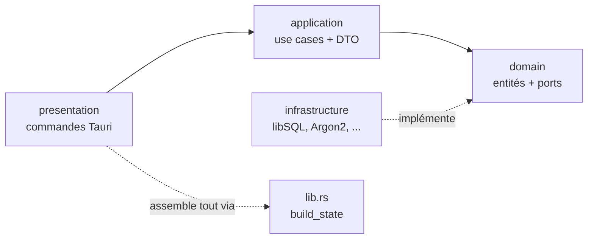
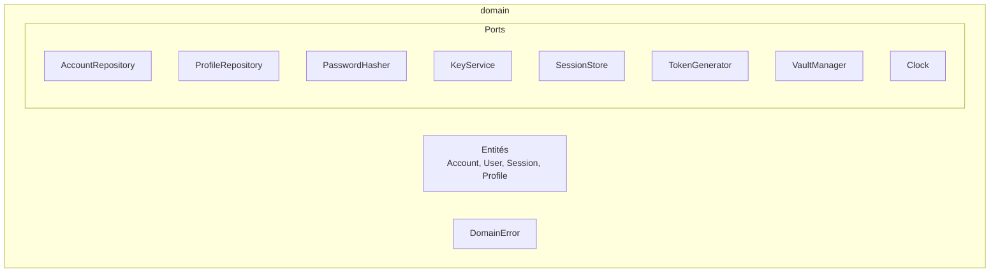
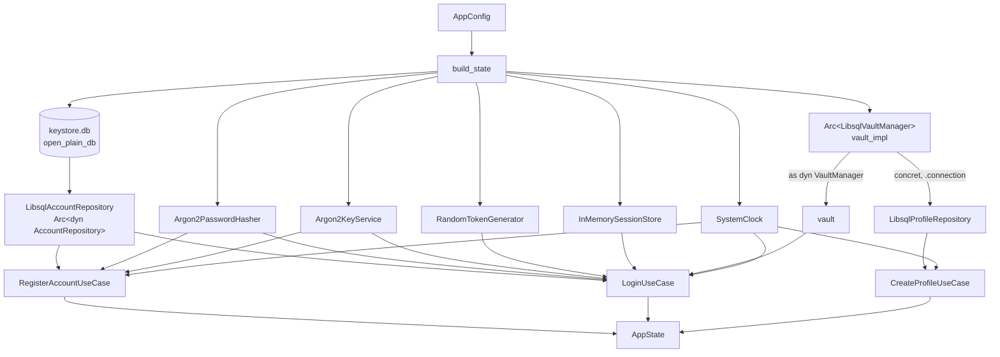

# 04 — Le backend Rust couche par couche

## Ce que tu vas apprendre

- Le rôle exact des **4 couches** Rust (`domain`, `application`, `infrastructure`, `presentation`) et comment elles s'empilent.
- Pourquoi le `domain` ne contient que des **structs nues** et des **traits** (les "ports"), sans une seule ligne de SQL, de crypto ou de Tauri.
- Comment un **use case** orchestre des `Arc<dyn Port>` injectés et expose un `execute()`.
- Pourquoi un **DTO** n'est pas une entité, et comment `serde` en fait le "contrat de sérialisation" vers le front.
- Comment l'**infrastructure** branche du vrai libSQL / Argon2 derrière les traits du domain.
- Comment le **composition root** (`build_state` dans `lib.rs`) assemble tout ça et le donne à Tauri.

> 🧭 **Prérequis** : avoir lu [02 — Rust pour les devs React](./02-rust-pour-les-devs-react.md) (traits, `Result`, `?`, `Arc`, ownership) et [03 — Clean Architecture](./03-clean-architecture.md) (règle de dépendance, inversion par interfaces, composition root). Ce chapitre applique concrètement ces deux théories au code Rust réel du projet.

---

## La carte du backend

Tout le backend Rust vit dans `src-tauri/src/`. Quatre dossiers = quatre couches. La **règle de dépendance** dit que les flèches pointent toujours **vers l'intérieur** : `presentation` connaît `application`, qui connaît `domain` ; `infrastructure` connaît `domain` (pour l'implémenter), mais le `domain` ne connaît **personne**.



> En React, tu connais déjà ce découpage : tes composants (presentation) appellent des hooks/use-cases (application), qui s'appuient sur des interfaces de repository (domain), implémentées par une classe qui parle à l'API (infrastructure). C'est exactement la même idée, mais en Rust et côté serveur local.

On visite les couches **dans l'ordre de la règle de dépendance** : le `domain` d'abord, parce que tout le reste dépend de lui.

---

## Couche 1 — `domain` : le cœur métier, sans dépendances

**Rôle** : décrire *quoi* l'application manipule (les entités), *quelles erreurs* métier existent (`DomainError`), et *quels services* lui sont nécessaires (les **ports** = traits). Aucun détail technique ici : pas de SQL, pas de Tauri, pas de crate crypto.

### Les entités : de simples `struct`

Une entité, c'est une donnée métier pure. Regarde `Account` et son `KeyMaterial` :

[src-tauri/src/domain/entities/account.rs](../../src-tauri/src/domain/entities/account.rs)

```rust
#[derive(Debug, Clone)]
pub struct KeyMaterial {
    /// DEK encrypted (wrapped) with the password-derived KEK (AEAD ciphertext).
    pub wrapped_dek: Vec<u8>,
    /// Salt used to derive the KEK from the password (Argon2id).
    pub kek_salt: Vec<u8>,
    /// AEAD nonce used when wrapping the DEK (24 bytes, XChaCha20-Poly1305).
    pub dek_nonce: Vec<u8>,
}

#[derive(Debug, Clone)]
pub struct Account {
    pub id: String,
    pub username: String,
    /// Argon2id PHC string. Never leaves the backend.
    pub password_hash: String,
    pub key_material: KeyMaterial,
    pub failed_attempts: i64,
    pub locked_until: Option<i64>,
    pub created_at: i64,
    pub updated_at: i64,
}
```

Décortiquons pour un débutant Rust :

- `#[derive(Debug, Clone)]` : une **annotation** qui demande au compilateur de générer automatiquement deux capacités. `Debug` = pouvoir afficher la struct dans les logs (`{:?}`), `Clone` = pouvoir la copier explicitement avec `.clone()`. En React/TS, c'est comme si tu n'avais rien à écrire pour `console.log(obj)` ou `{...obj}` ; ici Rust t'oblige à le déclarer.
- `pub struct Account { ... }` : un objet de données. `pub` = champ public (visible hors du module). Aucune méthode métier compliquée, aucune référence à une base : c'est volontaire.
- `Vec<u8>` = un tableau d'octets dynamique (`Uint8Array` côté JS). `Option<i64>` = un entier *ou rien* (`number | null` en TS) ; `locked_until` vaut `None` quand le compte n'est pas verrouillé.
- `password_hash` est ici, mais le commentaire le martèle : **"Never leaves the backend"**. On verra plus bas comment le DTO garantit ça.

Petite méthode utilitaire pour fabriquer une projection publique :

[src-tauri/src/domain/entities/account.rs](../../src-tauri/src/domain/entities/account.rs)

```rust
impl Account {
    pub fn to_user(&self) -> User {
        User {
            id: self.id.clone(),
            username: self.username.clone(),
            created_at: self.created_at,
            updated_at: self.updated_at,
        }
    }
}
```

`impl Account { ... }` = "voici les méthodes attachées à `Account`" (comme des méthodes de classe). `to_user` recopie seulement les champs **non sensibles** : ni `password_hash`, ni `key_material`. C'est le premier filtre de sécurité, dès le domain.

Les autres entités sont tout aussi maigres. `User` est la projection publique. `Session` porte un peu de logique métier *pure* (pas d'I/O) :

[src-tauri/src/domain/entities/session.rs](../../src-tauri/src/domain/entities/session.rs)

```rust
impl Session {
    pub fn is_valid(&self, now_ms: i64) -> bool {
        self.expires_at > now_ms
    }

    pub fn remaining_ms(&self, now_ms: i64) -> i64 {
        (self.expires_at - now_ms).max(0)
    }
}
```

Note un détail de design : `is_valid` reçoit `now_ms` **en paramètre** au lieu d'aller chercher l'heure elle-même. La session ne connaît donc aucune horloge système — elle reste pure et testable. C'est l'appelant (le use case, qui possède l'horloge) qui fournit le temps.

Et `Profile`, l'entité métier qui vit dans le coffre chiffré :

[src-tauri/src/domain/entities/profile.rs](../../src-tauri/src/domain/entities/profile.rs)

```rust
#[derive(Debug, Clone)]
pub struct Profile {
    pub id: String,
    pub first_name: String,
    pub last_name: String,
    pub enterprise: String,
    pub poste: Option<String>,
    pub created_at: i64,
    pub updated_at: i64,
}
```

### Les erreurs métier : `DomainError`

[src-tauri/src/domain/error.rs](../../src-tauri/src/domain/error.rs)

```rust
use thiserror::Error;

#[derive(Debug, Error)]
pub enum DomainError {
    #[error("invalid credentials")]
    InvalidCredentials,

    #[error("account locked")]
    AccountLocked { retry_after_ms: i64 },

    #[error("an account already exists")]
    AccountAlreadyExists,

    #[error("unauthorized: the vault is locked")]
    Unauthorized,

    #[error("profile not found")]
    ProfileNotFound,

    #[error("validation error: {0}")]
    Validation(String),

    #[error("storage error: {0}")]
    Storage(String),
    // ... Hashing, Crypto, Token
}
```

- `enum` en Rust est bien plus puissant qu'en TS : chaque variante peut transporter des données. `AccountLocked { retry_after_ms: i64 }` est une erreur qui *contient* combien de millisecondes attendre. `Validation(String)` contient un message. C'est une **union discriminée** TypeScript, mais native et exhaustive.
- `#[derive(Error)]` + `#[error("...")]` viennent de la crate `thiserror`. Ça génère pour toi le code qui transforme la variante en message lisible (l'équivalent du `message` d'une `Error` JS).
- **Distinction clé** : `InvalidCredentials`, `AccountLocked`, `Validation`... sont des erreurs *métier* qu'on veut montrer à l'utilisateur. `Storage`, `Hashing`, `Crypto`, `Token` sont des fuites techniques qu'on **écrasera** plus tard (chapitre 06) en un générique `INTERNAL`. On garde toute la richesse en interne, et on n'expose que ce qui est sûr.

### Les ports : repositories et services (des `trait`)

Un **port** est un trait = une interface. Le domain dit "j'ai besoin de quelqu'un qui sait faire ça", sans dire *comment*. C'est l'**inversion de dépendance** du chapitre 03.

> 🧠 Rappel : un `trait` Rust ≈ une `interface` TypeScript. `Arc<dyn MonTrait>` ≈ une dépendance injectée typée par cette interface (un objet derrière un pointeur partagé).

On distingue deux familles :

**Les repositories** (accès aux **données**). Exemple, le contrat de persistance du compte :

[src-tauri/src/domain/repositories/account_repository.rs](../../src-tauri/src/domain/repositories/account_repository.rs)

```rust
use async_trait::async_trait;

#[async_trait]
pub trait AccountRepository: Send + Sync {
    async fn exists(&self) -> Result<bool, DomainError>;
    async fn find_by_username(&self, username: &str) -> Result<Option<Account>, DomainError>;
    async fn create(&self, account: &Account) -> Result<(), DomainError>;
    async fn record_failed_attempt(/* ... */) -> Result<(), DomainError>;
    async fn reset_failed_attempts(&self, id: &str, updated_at: i64) -> Result<(), DomainError>;
}
```

Trois points à comprendre :

- `#[async_trait]` : Rust ne supporte pas encore *nativement* les méthodes `async` dans un trait *objet* (`dyn`). La macro `async_trait` règle ça. Retiens la règle : **dès qu'un port a des méthodes `async`, il porte `#[async_trait]`** (c'est le cas pour `AccountRepository`, `ProfileRepository`, `VaultManager`). Les ports purement synchrones (voir plus bas) n'en ont pas besoin.
- `: Send + Sync` : ce sont des "marqueurs" qui disent "cet objet peut traverser les threads en sécurité". Tauri exécute les commandes sur un pool de threads, donc tout l'état partagé doit l'être. Considère ça comme une obligation technique à recopier ; tu n'auras presque jamais à y penser.
- Chaque méthode renvoie `Result<T, DomainError>` : soit `Ok(valeur)`, soit `Err(DomainError)`. C'est le "ne pas `throw`, retourner ok-ou-err" du chapitre 02.

**Les services** (capacités **techniques** abstraites : crypto, horloge, sessions). Le domain les définit aussi comme des ports, sans savoir comment ils marchent. Exemple, le hachage de mot de passe :

[src-tauri/src/domain/services/password_hasher.rs](../../src-tauri/src/domain/services/password_hasher.rs)

```rust
pub trait PasswordHasher: Send + Sync {
    fn hash(&self, password: &[u8]) -> Result<String, DomainError>;
    fn verify(&self, password: &[u8], phc: &str) -> Result<bool, DomainError>;
}
```

Aucune mention d'Argon2 ici : juste "sait hacher et vérifier". L'implémentation Argon2id viendra dans l'infrastructure. Pas d'`#[async_trait]` car ces méthodes sont synchrones.

Le `KeyService` abstrait toute l'**envelope encryption** (détaillée au [chapitre 05](./05-securite-et-chiffrement.md)) :

[src-tauri/src/domain/services/key_service.rs](../../src-tauri/src/domain/services/key_service.rs)

```rust
pub trait KeyService: Send + Sync {
    fn derive_kek(&self, password: &[u8], salt: &[u8]) -> Result<Zeroizing<[u8; 32]>, DomainError>;
    fn generate_dek(&self) -> Result<Zeroizing<[u8; 32]>, DomainError>;
    fn generate_salt(&self) -> Result<Vec<u8>, DomainError>;
    fn wrap_dek(&self, dek: &[u8], kek: &[u8]) -> Result<WrappedKey, DomainError>;
    fn unwrap_dek(&self, wrapped: &WrappedKey, kek: &[u8]) -> Result<Zeroizing<[u8; 32]>, DomainError>;
}
```

> ⚠️ Remarque `Zeroizing<[u8; 32]>` comme type de retour des clés. `[u8; 32]` est un tableau de **32 octets** (taille fixe, vérifiée à la compilation). Le wrapper `Zeroizing` garantit que la mémoire est **écrasée à zéro** quand la valeur est libérée. La clé (KEK/DEK) ne traîne donc jamais en RAM après usage. Plus de détails au chapitre 05.

Les autres ports services, plus courts :

- `SessionStore` — stockage "bête" des sessions en mémoire (`insert`/`get`/`remove`). Le commentaire le dit : la logique d'expiration vit dans les use cases, pas ici.
- `TokenGenerator` — `generate()` qui rend un jeton de session aléatoire.
- `VaultManager` — `open(dek)` / `close()` : le cycle de vie du coffre chiffré (`#[async_trait]` car `open` est async).
- `Clock` — `now_ms()` : l'heure injectable, indispensable pour tester les TTL sans attendre 15 minutes pour de vrai.



---

## Couche 2 — `application` : les use cases orchestrent

**Rôle** : un use case = un scénario métier complet ("inscrire un compte", "se connecter"). Il ne sait pas *comment* hacher ni *comment* parler à la base : il reçoit des `Arc<dyn Port>` (les interfaces) et les fait jouer ensemble. C'est ici que vit la **logique d'orchestration**.

Forme générale d'un use case : une `struct` qui tient ses dépendances + un `new(...)` constructeur + un `execute(...)`.

### `RegisterAccountUseCase` — créer le compte du premier démarrage

[src-tauri/src/application/use_cases/register_account.rs](../../src-tauri/src/application/use_cases/register_account.rs)

```rust
pub struct RegisterAccountUseCase {
    accounts: Arc<dyn AccountRepository>,
    hasher: Arc<dyn PasswordHasher>,
    keys: Arc<dyn KeyService>,
    clock: Arc<dyn Clock>,
}
```

Les quatre champs sont **typés par les ports**, pas par les implémentations. Le use case ne sait pas que c'est libSQL ou Argon2 derrière : il ne voit que les interfaces. Voilà l'injection de dépendances, version Rust.

Le `execute()` enchaîne les étapes :

[src-tauri/src/application/use_cases/register_account.rs](../../src-tauri/src/application/use_cases/register_account.rs)

```rust
pub async fn execute(&self, username: &str, password: &str) -> Result<UserDto, DomainError> {
    let username = username.trim();
    validate_username(username)?;
    validate_password(password)?;

    // Single-owner device: refuse a second account.
    if self.accounts.exists().await? {
        return Err(DomainError::AccountAlreadyExists);
    }

    // Password lives in a buffer that is zeroized on every exit path.
    let pw = Zeroizing::new(password.as_bytes().to_vec());
    let password_hash = self.hasher.hash(pw.as_slice())?;

    // Generate the DEK, derive the password-KEK, wrap the DEK.
    let dek = self.keys.generate_dek()?;
    let kek_salt = self.keys.generate_salt()?;
    let kek = self.keys.derive_kek(pw.as_slice(), &kek_salt)?;
    let wrapped = self.keys.wrap_dek(dek.as_slice(), kek.as_slice())?;

    let now = self.clock.now_ms();
    let account = Account {
        id: Uuid::now_v7().to_string(),
        username: username.to_string(),
        password_hash,
        key_material: KeyMaterial {
            wrapped_dek: wrapped.ciphertext,
            kek_salt,
            dek_nonce: wrapped.nonce,
        },
        failed_attempts: 0,
        locked_until: None,
        created_at: now,
        updated_at: now,
    };
    self.accounts.create(&account).await?;

    Ok(UserDto::from(account.to_user()))
}
```

Lecture pas à pas (très React-friendly) :

1. **Validation** : `validate_username(username)?`. Le `?` final est le détail Rust crucial — il signifie *"si c'est une `Err`, retourne-la tout de suite"*. C'est exactement comme un `await` qui propagerait le `throw` : pas de `if (err) return err` répété partout.
2. **Règle métier** : `self.accounts.exists().await?` — appareil mono-propriétaire, on refuse un 2ᵉ compte. `.await` parce que la méthode est async (elle parle à la base) ; `?` pour propager une éventuelle erreur de stockage.
3. **Sécurité mémoire** : `Zeroizing::new(...)` enveloppe le mot de passe pour qu'il soit effacé de la RAM dès qu'on en sort (chapitre 05).
4. **Crypto via les ports** : hacher le mot de passe, puis générer le DEK, dériver la KEK, wrapper le DEK. Le use case orchestre, le `KeyService` fait le travail. C'est la séquence d'**envelope encryption**.
5. **Construire l'entité** avec un `Uuid::now_v7()` (identifiant trié par le temps) et `self.clock.now_ms()` (l'horloge injectée, jamais `SystemTime` en dur).
6. **Persister** : `self.accounts.create(&account).await?`.
7. **Renvoyer un DTO**, pas l'entité : `Ok(UserDto::from(account.to_user()))`. On y revient juste après.

### `LoginUseCase` — vérifier, déverrouiller, ouvrir une session

C'est le use case le plus dense. Sa `struct` agrège **huit** dépendances (toutes des ports) plus la politique d'auth :

[src-tauri/src/application/use_cases/login.rs](../../src-tauri/src/application/use_cases/login.rs)

```rust
pub struct LoginUseCase {
    accounts: Arc<dyn AccountRepository>,
    hasher: Arc<dyn PasswordHasher>,
    keys: Arc<dyn KeyService>,
    tokens: Arc<dyn TokenGenerator>,
    sessions: Arc<dyn SessionStore>,
    vault: Arc<dyn VaultManager>,
    clock: Arc<dyn Clock>,
    policy: AuthPolicy,
}
```

Le `execute()` (extraits commentés des passages clés) :

[src-tauri/src/application/use_cases/login.rs](../../src-tauri/src/application/use_cases/login.rs)

```rust
let Some(account) = self.accounts.find_by_username(username).await? else {
    // Equalize timing against username enumeration (hash, discard).
    let _ = self.hasher.hash(pw.as_slice());
    return Err(DomainError::InvalidCredentials);
};
```

`let Some(account) = ... else { ... }` est un **let-else** : "si on obtient `Some`, garde la valeur dans `account` ; sinon exécute le bloc `else`" (qui doit terminer la fonction). Subtilité de sécurité : si le username n'existe pas, on **hache quand même** un mot de passe (`let _ = ...` = on jette le résultat) pour que le temps de réponse soit identique. Sans ça, un attaquant mesurerait les délais pour deviner quels usernames existent (énumération). Détail traité au chapitre 05.

```rust
// Locked out?
if let Some(locked_until) = account.locked_until {
    if locked_until > now {
        return Err(DomainError::AccountLocked { retry_after_ms: locked_until - now });
    }
}

// Verify the password.
if !self.hasher.verify(pw.as_slice(), &account.password_hash)? {
    let attempts = account.failed_attempts + 1;
    let locked_until = if attempts >= self.policy.max_attempts {
        Some(now + self.policy.lockout_ms)
    } else {
        None
    };
    self.accounts
        .record_failed_attempt(&account.id, attempts, locked_until, now)
        .await?;
    return Err(DomainError::InvalidCredentials);
}
```

C'est l'**anti-bruteforce** : on vérifie d'abord si le compte est verrouillé. Si le mot de passe est faux, on incrémente le compteur d'échecs ; au 5ᵉ échec (`self.policy.max_attempts`), on pose un `locked_until` à `maintenant + 5 min` (`self.policy.lockout_ms`). On persiste, puis on renvoie une erreur **volontairement vague** (`InvalidCredentials`, jamais "mauvais mot de passe pour ce user existant").

```rust
// Success: derive the KEK, unwrap the DEK, unlock the vault.
let kek = self.keys.derive_kek(pw.as_slice(), &account.key_material.kek_salt)?;
let wrapped = WrappedKey {
    ciphertext: account.key_material.wrapped_dek.clone(),
    nonce: account.key_material.dek_nonce.clone(),
};
let dek = self.keys.unwrap_dek(&wrapped, kek.as_slice())?;
self.vault.open(dek.as_slice()).await?;

// Clear lockout counters and open the session.
self.accounts.reset_failed_attempts(&account.id, now).await?;
let token = self.tokens.generate()?;
let expires_at = now + self.policy.session_ttl_ms;
self.sessions.insert(Session { token: token.clone(), expires_at });

Ok(LoginResultDto { token, expires_at, user: UserDto::from(account.to_user()) })
```

Sur le **chemin de succès**, c'est l'envelope encryption en sens inverse : dériver la KEK depuis le mot de passe, unwrapper le DEK, puis **ouvrir le coffre** (`self.vault.open(...)` déchiffre `vault.db`). Ensuite : remise à zéro des compteurs d'échec, génération d'un token, création d'une session à TTL absolu (15 min), et renvoi d'un `LoginResultDto`.

### Les autres use cases, en bref

- **`CheckSessionUseCase`** ([fichier](../../src-tauri/src/application/use_cases/check_session.rs)) : `execute()` *synchrone*. Il lit la session, et si elle est expirée il la **révoque et verrouille le coffre** (`self.vault.close()`) comme effet de bord — la sécurité prime.
- **`CreateProfileUseCase`** ([fichier](../../src-tauri/src/application/use_cases/create_profile.rs)) : valide les champs (helpers `validate_required` / `normalize_optional`), crée le `Profile`, et **si aucun profil actif n'existe, marque le premier comme actif**.
- **`ListProfilesUseCase`** ([fichier](../../src-tauri/src/application/use_cases/list_profiles.rs)) : un cas minimaliste — une seule dépendance, et un joli pipeline fonctionnel :

[src-tauri/src/application/use_cases/list_profiles.rs](../../src-tauri/src/application/use_cases/list_profiles.rs)

```rust
let profiles = self.profiles.list().await?
    .into_iter()
    .map(ProfileDto::from)   // chaque Profile -> ProfileDto
    .collect();
```

`.into_iter().map(...).collect()` est l'équivalent direct de `array.map(...)` en JS, mais avec conversion entité → DTO au passage.

### Les DTOs : le contrat de sérialisation vers le front

Un **DTO** (Data Transfer Object) est la forme *exacte* envoyée à la WebView. Pourquoi pas l'entité directement ? Parce que l'entité peut contenir des secrets (`Account.password_hash`, `key_material`) et que sa structure interne ne doit pas fuiter dans le contrat IPC.

[src-tauri/src/application/dto/user_dto.rs](../../src-tauri/src/application/dto/user_dto.rs)

```rust
#[derive(Debug, Clone, Serialize)]
#[serde(rename_all = "camelCase")]
pub struct UserDto {
    pub id: String,
    pub username: String,
    pub created_at: i64,
    pub updated_at: i64,
}

impl From<User> for UserDto {
    fn from(u: User) -> Self {
        Self { id: u.id, username: u.username, created_at: u.created_at, updated_at: u.updated_at }
    }
}
```

- `#[derive(Serialize)]` (de `serde`) : génère le code qui transforme la struct en JSON. C'est ce qui rend le DTO transmissible par l'IPC.
- `#[serde(rename_all = "camelCase")]` : à la sérialisation, `created_at` devient `createdAt`. Le backend reste idiomatique Rust (`snake_case`), le front reçoit du `camelCase` idiomatique JS. Pratique : zéro mapping manuel des noms.
- `impl From<User> for UserDto` : implémente la conversion standard de Rust. C'est ce qui permet d'écrire `UserDto::from(user)` (ou `user.into()`). Remarque qu'on convertit depuis `User` (déjà sans secret), pas depuis `Account` : double barrière. **Un `UserDto` ne peut structurellement pas contenir le hash** — le champ n'existe pas.

Les autres DTOs suivent le même moule : `LoginResultDto` (token + `expiresAt` + `user`), `ProfileDto` et `ProfilesDto` (la liste + l'id du profil actif). Tous en `camelCase`, tous `Serialize`.

---

## Couche 3 — `infrastructure` : les implémentations concrètes

**Rôle** : fournir les *vraies* implémentations des ports du domain. C'est la seule couche qui a le droit de connaître libSQL, Argon2, `getrandom`, le système de fichiers, etc. Chaque fichier ici dit `impl MonPort for MaStructConcrete`.

### `LibsqlAccountRepository` — le SQL réel

[src-tauri/src/infrastructure/persistence/account_repository.rs](../../src-tauri/src/infrastructure/persistence/account_repository.rs)

```rust
pub struct LibsqlAccountRepository {
    conn: Connection,
}

#[async_trait]
impl AccountRepository for LibsqlAccountRepository {
    async fn exists(&self) -> Result<bool, DomainError> {
        let mut rows = self.conn
            .query("SELECT COUNT(*) FROM account", ())
            .await
            .map_err(map_storage)?;
        let row = rows.next().await.map_err(map_storage)?
            .ok_or_else(|| DomainError::Storage("count returned no row".into()))?;
        let count: i64 = row.get(0).map_err(map_storage)?;
        Ok(count > 0)
    }
    // create / find_by_username / record_failed_attempt / reset_failed_attempts ...
}
```

- `impl AccountRepository for LibsqlAccountRepository` : "cette struct *est* un `AccountRepository`". Le use case n'en saura jamais plus que l'interface.
- `.map_err(map_storage)?` : c'est le **pont entre les erreurs libSQL et le domain**. `map_storage` transforme une `libsql::Error` en `DomainError::Storage(...)`, puis `?` la propage. Le domain ne voit jamais de type libSQL.

Le **mapping ligne → entité** est isolé dans une petite fonction :

[src-tauri/src/infrastructure/persistence/account_repository.rs](../../src-tauri/src/infrastructure/persistence/account_repository.rs)

```rust
fn row_to_account(row: &Row) -> Result<Account, DomainError> {
    Ok(Account {
        id: row.get(0).map_err(map_storage)?,
        username: row.get(1).map_err(map_storage)?,
        password_hash: row.get(2).map_err(map_storage)?,
        key_material: KeyMaterial {
            wrapped_dek: row.get(3).map_err(map_storage)?,
            kek_salt: row.get(4).map_err(map_storage)?,
            dek_nonce: row.get(5).map_err(map_storage)?,
        },
        failed_attempts: row.get(6).map_err(map_storage)?,
        locked_until: row.get(7).map_err(map_storage)?,
        created_at: row.get(8).map_err(map_storage)?,
        updated_at: row.get(9).map_err(map_storage)?,
    })
}
```

`row.get(N)` lit la colonne d'index `N` ; Rust infère le type attendu d'après le champ qu'on remplit. Les requêtes utilisent des paramètres liés (`params![...]`, `?1`, `?2`...) — jamais de concaténation de valeurs utilisateur, donc pas d'injection SQL.

### `db.rs` — ouvrir les bases (clair vs chiffré)

[src-tauri/src/infrastructure/persistence/db.rs](../../src-tauri/src/infrastructure/persistence/db.rs)

```rust
/// Open a plaintext local libSQL database (used for the keystore).
pub async fn open_plain_db(path: &Path) -> Result<Database, DomainError> {
    Builder::new_local(path).build().await.map_err(map_storage)
}

/// Open an encrypted local libSQL database (the vault) with a 32-byte key.
pub async fn open_encrypted_db(path: &Path, dek: &[u8]) -> Result<Database, DomainError> {
    let config = EncryptionConfig::new(Cipher::Aes256Cbc, Bytes::copy_from_slice(dek));
    Builder::new_local(path)
        .encryption_config(config)
        .build()
        .await
        .map_err(map_storage)
}
```

C'est ici que se matérialise le modèle **"deux bases"** : `keystore.db` ouverte *en clair* (`open_plain_db`) — elle ne contient que des secrets déjà protégés (hash, DEK wrappé) ; et `vault.db` ouverte *chiffrée* en AES-256-CBC avec le DEK brut de 32 octets (`open_encrypted_db`). libSQL chiffre/déchiffre tout le fichier au repos. (Détail crypto complet au chapitre 05.)

### `migrations.rs` — du SQL embarqué dans le binaire

[src-tauri/src/infrastructure/persistence/migrations.rs](../../src-tauri/src/infrastructure/persistence/migrations.rs)

```rust
pub const VAULT_MIGRATIONS: &[Migration] = &[
    Migration { version: 1, sql: include_str!("../../../migrations/vault/0001_init.sql") },
    Migration { version: 2, sql: include_str!("../../../migrations/vault/0002_add_profiles.sql") },
];
```

`include_str!(...)` est une **macro** qui lit le fichier `.sql` *à la compilation* et en colle le contenu directement dans le binaire (`&'static str`). Aucun fichier SQL à embarquer à la livraison : tout est dans l'exécutable. En React, l'analogue le plus proche est un `import sql from './x.sql?raw'` géré par le bundler — mais ici c'est fait au build Rust.

La fonction `run` applique les migrations **idempotemment** : elle crée une table `_migrations`, lit la version max déjà appliquée, et n'exécute (`execute_batch`) que les versions supérieures, en enregistrant chaque succès. Rejouer `run` deux fois ne casse rien.

### Les services techniques

- **`Argon2PasswordHasher`** ([fichier](../../src-tauri/src/infrastructure/crypto/argon2_hasher.rs)) : implémente `PasswordHasher` avec `Algorithm::Argon2id`. Produit une **chaîne PHC** auto-descriptive (sel + paramètres embarqués), si bien que `verify` n'a pas besoin de reconfigurer quoi que ce soit. À noter : il contient ses propres tests unitaires (`#[cfg(test)]`).
- **`RandomTokenGenerator`** ([fichier](../../src-tauri/src/infrastructure/crypto/token_generator.rs)) : 32 octets de `getrandom::fill`, encodés en base64 URL-safe → un token de session de 256 bits.
- **`InMemorySessionStore`** ([fichier](../../src-tauri/src/infrastructure/session/in_memory_session_store.rs)) : un `Mutex<HashMap<String, Session>>`. Le `Mutex` rend l'accès thread-safe (rappel : commandes Tauri multi-threadées). Comme c'est en mémoire, **fermer l'app vide tout** → re-login obligatoire au démarrage, exactement le comportement voulu.

[src-tauri/src/infrastructure/session/in_memory_session_store.rs](../../src-tauri/src/infrastructure/session/in_memory_session_store.rs)

```rust
#[derive(Default)]
pub struct InMemorySessionStore {
    sessions: Mutex<HashMap<String, Session>>,
}

impl SessionStore for InMemorySessionStore {
    fn insert(&self, session: Session) {
        self.sessions.lock().unwrap_or_else(|p| p.into_inner())
            .insert(session.token.clone(), session);
    }
    // get / remove ...
}
```

`.lock().unwrap_or_else(|p| p.into_inner())` : prend le verrou ; même si un autre thread a "empoisonné" le mutex (paniqué en le tenant), on récupère quand même les données au lieu de planter. Robustesse pragmatique.

- **`SystemClock`** ([fichier](../../src-tauri/src/infrastructure/clock.rs)) : l'unique endroit du code qui appelle vraiment `SystemTime::now()`. Tout le reste reçoit l'heure via le port `Clock`, ce qui rend les TTL testables.

### `AppConfig` — les réglages au même endroit

[src-tauri/src/infrastructure/config.rs](../../src-tauri/src/infrastructure/config.rs)

```rust
impl AppConfig {
    pub fn new(data_dir: &Path) -> Self {
        Self {
            keystore_path: data_dir.join("keystore.db"),
            vault_path: data_dir.join("vault.db"),
            // OWASP Argon2id "46 MiB" profile (bank-grade).
            argon2: Argon2Params { m_cost: 47104, t_cost: 1, p_cost: 1 },
            auth: AuthPolicy {
                session_ttl_ms: 15 * 60 * 1000, // 15 minutes, absolute
                max_attempts: 5,
                lockout_ms: 5 * 60 * 1000,      // 5 minutes
            },
        }
    }
}
```

Tous les paramètres "politiques" sont centralisés : chemins des deux bases, coût Argon2id (profil OWASP "46 MiB"), TTL de session (15 min), seuil de verrouillage (5 essais → 5 min). C'est cet `AuthPolicy` qu'on injecte dans `LoginUseCase`.

---

## Couche 4 — `presentation` : la frontière IPC, fine

**Rôle** : exposer les use cases à la WebView via des commandes Tauri, et **traduire** les erreurs en quelque chose de sûr pour le front. C'est volontairement une couche **mince** : aucune logique métier ici. (Le pont IPC complet est détaillé au [chapitre 06](./06-le-pont-ipc.md).)

### `AppState` — l'agrégat des use cases

[src-tauri/src/presentation/state.rs](../../src-tauri/src/presentation/state.rs)

```rust
pub struct AppState {
    pub register_account: RegisterAccountUseCase,
    pub login: LoginUseCase,
    pub logout: LogoutUseCase,
    pub check_session: CheckSessionUseCase,
    pub account_exists: AccountExistsUseCase,
    pub create_profile: CreateProfileUseCase,
    pub list_profiles: ListProfilesUseCase,
    // update / delete / set_active ...
    /// Keeps the keystore database alive for the lifetime of the app.
    #[allow(dead_code)]
    pub keystore_db: libsql::Database,
}
```

`AppState` réunit tous les use cases prêts à l'emploi. Le champ `keystore_db` ne sert "à rien" directement (`#[allow(dead_code)]`) mais reste indispensable : tant qu'il vit, la base keystore reste ouverte. Si on le droppait, la connexion derrière deviendrait invalide. C'est de la gestion de durée de vie typiquement Rust.

### Les commandes : `#[tauri::command]`, ultra-fines

[src-tauri/src/presentation/commands/auth.rs](../../src-tauri/src/presentation/commands/auth.rs)

```rust
#[tauri::command]
pub async fn login(
    username: String,
    password: String,
    state: State<'_, AppState>,
) -> Result<LoginResultDto, AppError> {
    Ok(state.login.execute(&username, &password).await?)
}
```

Anatomie d'une commande :

- `#[tauri::command]` : la macro qui expose la fonction au front. Côté React, on l'appellera via `invoke("login", { username, password })`.
- `state: State<'_, AppState>` : Tauri **injecte** l'`AppState` qu'on a `.manage()` (voir composition root). C'est l'équivalent d'un `useContext` côté serveur : on récupère l'état partagé sans le passer à la main.
- Le corps tient en une ligne : récupérer le bon use case, appeler `.execute(...)`, propager avec `?`. **Toute la logique est dans `application`** ; la commande n'est qu'un câble.
- Le `?` ici fait quelque chose de spécial : il convertit le `DomainError` en `AppError` automatiquement. C'est l'objet du fichier suivant.

### `error.rs` — écraser les détails internes

[src-tauri/src/presentation/commands/error.rs](../../src-tauri/src/presentation/commands/error.rs)

```rust
#[derive(Debug, Serialize)]
pub struct AppError {
    pub code: String,
    pub message: String,
}

impl From<DomainError> for AppError {
    fn from(e: DomainError) -> Self {
        match e {
            DomainError::InvalidCredentials => AppError::new("INVALID_CREDENTIALS", "Identifiants invalides"),
            DomainError::AccountLocked { retry_after_ms } => AppError::new(
                "ACCOUNT_LOCKED",
                format!("Compte verrouillé. Réessayez dans {} s.", (retry_after_ms / 1000).max(1)),
            ),
            // ... AccountAlreadyExists, Unauthorized, ProfileNotFound, Validation ...
            DomainError::Storage(_)
            | DomainError::Hashing(_)
            | DomainError::Crypto(_)
            | DomainError::Token(_) => AppError::new("INTERNAL", "Erreur interne"),
        }
    }
}
```

C'est le **garde-fou de sécurité de la frontière**. `impl From<DomainError> for AppError` est ce qui permet au `?` des commandes de convertir l'erreur tout seul. Le `match` exhaustif :

- mappe les erreurs métier sûres vers un `code` stable (que le front peut tester) + un `message` en français ;
- **écrase** toutes les erreurs techniques (`Storage`, `Hashing`, `Crypto`, `Token`) en un seul `"INTERNAL"` / "Erreur interne". Un message SQL ou crypto ne peut donc *jamais* atteindre la WebView.

> ⚠️ C'est ici que la richesse de `DomainError` (utile pour debugger côté Rust) est délibérément aplatie. Le front ne voit que `{ code, message }`. Tout indice exploitable par un attaquant est filtré à cette frontière.

---

## Le composition root : `build_state()` dans `lib.rs`

C'est le seul endroit où l'on **choisit les implémentations concrètes** et où on les **injecte** dans les use cases. Ailleurs, tout le code ne parle qu'à des traits. C'est le "câblage" de l'application.

[src-tauri/src/lib.rs](../../src-tauri/src/lib.rs)

```rust
async fn build_state(config: AppConfig) -> Result<AppState, DomainError> {
    // 1. Keystore (plaintext): auth credentials + wrapped key material.
    let keystore_db = open_plain_db(&config.keystore_path).await?;
    let keystore_conn = connect(&keystore_db)?;
    migrations::run(&keystore_conn, KEYSTORE_MIGRATIONS).await?;

    // 2. Infrastructure implementations (behind domain ports).
    let accounts: Arc<dyn AccountRepository> = Arc::new(LibsqlAccountRepository::new(keystore_conn));
    let hasher: Arc<dyn PasswordHasher> = Arc::new(Argon2PasswordHasher::new(
        config.argon2.m_cost, config.argon2.t_cost, config.argon2.p_cost)?);
    let keys: Arc<dyn KeyService> = Arc::new(Argon2KeyService::new(
        config.argon2.m_cost, config.argon2.t_cost, config.argon2.p_cost)?);
    let tokens: Arc<dyn TokenGenerator> = Arc::new(RandomTokenGenerator);
    let sessions: Arc<dyn SessionStore> = Arc::new(InMemorySessionStore::new());

    // 3. Keep a concrete handle so the profile repository can read the live vault
    //    connection, while the auth use cases depend on the `VaultManager` port.
    let vault_impl = Arc::new(LibsqlVaultManager::new(config.vault_path.clone()));
    let vault: Arc<dyn VaultManager> = vault_impl.clone();
    let profiles: Arc<dyn ProfileRepository> = Arc::new(LibsqlProfileRepository::new(vault_impl.clone()));
    let clock: Arc<dyn Clock> = Arc::new(SystemClock);

    // 4. Inject everything into the use cases and assemble the state.
    Ok(AppState {
        register_account: RegisterAccountUseCase::new(
            accounts.clone(), hasher.clone(), keys.clone(), clock.clone()),
        login: LoginUseCase::new(
            accounts.clone(), hasher.clone(), keys.clone(), tokens.clone(),
            sessions.clone(), vault.clone(), clock.clone(), config.auth.clone()),
        // logout / check_session / account_exists / create_profile / ... 
        keystore_db,
    })
}
```

Pas à pas :

1. **Ouvrir le keystore** en clair et lancer ses migrations. (Le vault, lui, ne s'ouvre qu'au login, avec le DEK.)
2. **Créer chaque implémentation** et l'envelopper dans un `Arc<dyn Port>`. L'annotation de type `: Arc<dyn AccountRepository>` est essentielle : elle "efface" le type concret, de sorte que le use case ne verra que l'interface. `Arc` (Atomically Reference Counted) = un pointeur partagé thread-safe ; plusieurs use cases peuvent détenir le *même* objet.
3. **Le détail subtil du vault** (regarde bien le commentaire du code) :
   - `vault_impl` est un `Arc<LibsqlVaultManager>` **concret** (type précis).
   - `vault` en est un clone vu comme le **port** `Arc<dyn VaultManager>` → c'est lui qu'on injecte dans les use cases auth (`login`, `logout`, `check_session`), qui ne veulent qu'`open`/`close`.
   - mais le `LibsqlProfileRepository` reçoit le clone **concret** `vault_impl.clone()`, parce qu'il a besoin d'une méthode *en plus* du port : `vault_impl.connection()`, qui clone la connexion **vive** du coffre déverrouillé. Si le coffre est verrouillé, il renvoie `None` → le repository renvoie `DomainError::Unauthorized` au lieu d'utiliser un handle périmé.
   - Conséquence concrète : quand `login` appelle `vault.open(dek)`, le `LibsqlVaultManager` stocke la connexion ; le `profile_repository` (qui pointe sur le *même* objet via `Arc`) la voit immédiatement. Les deux partagent un seul `LibsqlVaultManager`.
4. **Assembler l'`AppState`** en passant les `Arc` à chaque `UseCase::new(...)`. `.clone()` sur un `Arc` ne copie pas l'objet, juste le compteur de références — plusieurs use cases pointent vers la même implémentation.



### Du `build_state` jusqu'à Tauri

Dans `run()`, l'`AppState` construit est donné à Tauri, et les commandes sont enregistrées :

[src-tauri/src/lib.rs](../../src-tauri/src/lib.rs)

```rust
.setup(|app| {
    let data_dir = app.path().app_data_dir()/* ... */?;
    std::fs::create_dir_all(&data_dir)/* ... */?;
    let config = AppConfig::new(&data_dir);
    let state = tauri::async_runtime::block_on(build_state(config))/* ... */?;
    app.manage(state);   // <- l'AppState devient injectable dans les commandes
    Ok(())
})
.invoke_handler(tauri::generate_handler![
    auth::account_exists, auth::register, auth::login, auth::check_session, auth::logout,
    profile::create_profile, profile::list_profiles, profile::update_profile,
    profile::delete_profile, profile::set_active_profile
])
```

- `app.manage(state)` : range l'`AppState` dans Tauri. C'est ce qui rend `State<'_, AppState>` disponible dans chaque commande (le `useContext` côté Rust dont on parlait).
- `tauri::generate_handler![...]` : enregistre la liste des commandes appelables depuis le front. Si une commande n'est pas dans cette liste, `invoke` côté React échouera. Ces 10 noms sont la surface IPC complète du backend.
- `block_on(build_state(...))` : le `setup` est synchrone mais `build_state` est `async` ; `block_on` exécute le futur jusqu'au bout, une seule fois au démarrage.

---

## Où trouver quoi

| Couche | Dossier | À quoi ça sert | Fichier-exemple |
|---|---|---|---|
| **domain** (entités) | `src-tauri/src/domain/entities/` | structs métier nues | `account.rs`, `profile.rs` |
| **domain** (erreurs) | `src-tauri/src/domain/` | `DomainError` (enum thiserror) | `error.rs` |
| **domain** (ports données) | `src-tauri/src/domain/repositories/` | traits de persistance | `account_repository.rs` |
| **domain** (ports techniques) | `src-tauri/src/domain/services/` | traits crypto/horloge/session | `key_service.rs`, `clock.rs` |
| **application** (use cases) | `src-tauri/src/application/use_cases/` | orchestration métier | `login.rs`, `register_account.rs` |
| **application** (DTO) | `src-tauri/src/application/dto/` | contrats sérialisés vers le front | `user_dto.rs`, `profile_dto.rs` |
| **infrastructure** (persistance) | `src-tauri/src/infrastructure/persistence/` | libSQL réel, migrations | `account_repository.rs`, `db.rs`, `migrations.rs` |
| **infrastructure** (crypto) | `src-tauri/src/infrastructure/crypto/` | Argon2id, tokens | `argon2_hasher.rs` |
| **infrastructure** (divers) | `src-tauri/src/infrastructure/` | session, horloge, config | `session/…`, `clock.rs`, `config.rs` |
| **presentation** (état) | `src-tauri/src/presentation/` | `AppState` agrégateur | `state.rs` |
| **presentation** (commandes) | `src-tauri/src/presentation/commands/` | `#[tauri::command]` + mapping d'erreur | `auth.rs`, `error.rs` |
| **composition root** | `src-tauri/src/` | `build_state()` + `run()` | `lib.rs` |

---

## Étape suivante

Tu connais maintenant la structure du backend et le flux d'un use case. Plonge dans le détail du **chiffrement** — Argon2id, envelope encryption, les deux bases, la session et `zeroize` — au chapitre [05 — Sécurité et chiffrement](./05-securite-et-chiffrement.md).
