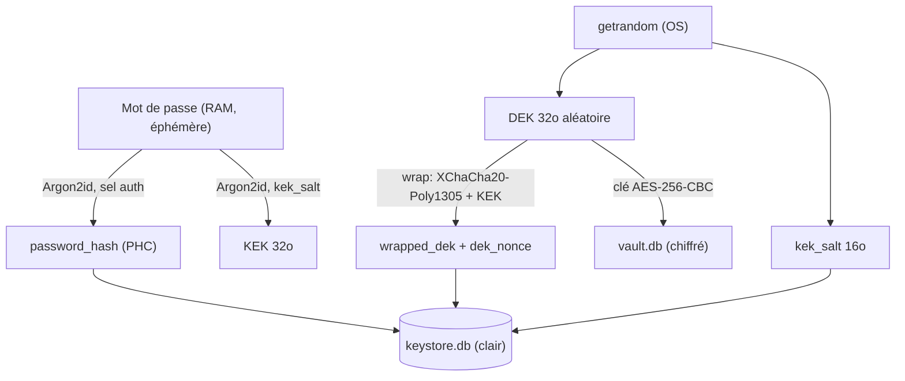

# 05 — Sécurité et chiffrement

## Ce que tu vas apprendre

- Pourquoi on **hache** un mot de passe (Argon2id) au lieu de le chiffrer, et comment on le vérifie sans jamais le stocker en clair.
- L'**envelope encryption** : deux niveaux de clés (DEK et KEK), et pourquoi ce double étage est malin.
- Pourquoi on a **deux bases** : `keystore.db` (en clair) et `vault.db` (chiffré), et pourquoi stocker du matériel d'auth en clair reste sûr.
- Comment marche la **session** (en mémoire, 15 min) et l'**anti-bruteforce** (verrouillage + timing constant).
- L'**hygiène mémoire** (`zeroize`) et la **frontière de sécurité** côté IPC (CSP, permissions minimales, erreurs masquées).

> 🧭 **Prérequis** : avoir lu [04-backend-rust-couche-par-couche.md](./04-backend-rust-couche-par-couche.md) (tu dois savoir ce qu'est un trait/port, une implémentation d'infrastructure et un use case). Les concepts Rust de base (`Result`, `?`, `Arc<dyn Trait>`) sont expliqués dans [02-rust-pour-les-devs-react.md](./02-rust-pour-les-devs-react.md).

---

## Le contexte : pourquoi tout ce cérémonial

Les données de présence sont jugées **très confidentielles** (« niveau banque »). On veut trois garanties :

1. Le mot de passe est stocké de façon **irréversible** (impossible de le retrouver, même avec un accès complet au disque).
2. Les données au repos sont **chiffrées** et ne se déchiffrent qu'après saisie du bon mot de passe.
3. La session est **courte (15 min)** et le mot de passe est redemandé à **chaque démarrage**.

> En React, tu déléguerais ça à un backend + un fournisseur d'auth (Auth0, Supabase…). Ici il n'y a pas de serveur : tout vit sur la machine de l'utilisateur, **offline-first**. C'est donc à nous d'assembler les primitives cryptographiques correctement.

On va voir trois familles d'outils : **hacher** (mot de passe), **chiffrer** (les données + les clés) et **gérer la session/le bruteforce**.

---

## 1. Le mot de passe : on HACHE, on ne chiffre jamais

### Hacher vs chiffrer

- **Chiffrer** est *réversible* : avec la clé, on retrouve le texte d'origine. Mauvais pour un mot de passe — si quelqu'un vole la clé, il vole tous les mots de passe.
- **Hacher** est *à sens unique* : on transforme le mot de passe en empreinte, et on **ne peut pas** remonter au mot de passe. À la connexion, on re-hache ce que l'utilisateur tape et on compare les empreintes.

> En React/JS tu aurais peut-être déjà croisé `bcrypt` côté Node. Ici on utilise **Argon2id**, le premier choix recommandé par l'OWASP : c'est un hash conçu pour être **lent et gourmand en mémoire**, justement pour qu'un attaquant ne puisse pas tester des milliards de mots de passe par seconde.

### L'implémentation

Le port (l'interface) côté domaine est `PasswordHasher`. Son implémentation concrète vit dans l'infrastructure.

[src-tauri/src/infrastructure/crypto/argon2_hasher.rs](../../src-tauri/src/infrastructure/crypto/argon2_hasher.rs)

```rust
impl PasswordHasher for Argon2PasswordHasher {
    fn hash(&self, password: &[u8]) -> Result<String, DomainError> {
        let mut salt_bytes = [0u8; 16];
        getrandom::fill(&mut salt_bytes).map_err(|e| DomainError::Hashing(e.to_string()))?;
        let salt =
            SaltString::encode_b64(&salt_bytes).map_err(|e| DomainError::Hashing(e.to_string()))?;
        let hash = self
            .argon2()
            .hash_password(password, &salt)
            .map_err(|e| DomainError::Hashing(e.to_string()))?;
        Ok(hash.to_string())
    }
```

Ligne par ligne :

- `password: &[u8]` : le mot de passe arrive en **octets bruts**, pas en `String` (on évite les copies inutiles et on garde la main sur l'effacement mémoire, voir plus loin).
- On génère un **sel** (`salt`) de 16 octets aléatoires via `getrandom::fill`. Le sel garantit que deux personnes avec le **même** mot de passe obtiennent des hash **différents** (impossible de pré-calculer une table d'attaque).
- `hash_password` produit une chaîne **PHC** (`$argon2id$v=19$m=...,t=...,p=...$<sel>$<hash>`) qui contient *tout* : l'algo, les paramètres, le sel, le hash. C'est cette chaîne qu'on stocke. Pas besoin de stocker le sel à part.
- `Result<String, DomainError>` : en cas de souci, on **retourne** une erreur, on ne *throw* pas. Le `?` (implicite via `map_err(...)?`) propage l'erreur vers l'appelant — c'est l'équivalent d'un `throw` qui remonterait automatiquement.

La vérification ne « déchiffre » rien : elle re-calcule et compare.

[src-tauri/src/infrastructure/crypto/argon2_hasher.rs](../../src-tauri/src/infrastructure/crypto/argon2_hasher.rs)

```rust
    fn verify(&self, password: &[u8], phc: &str) -> Result<bool, DomainError> {
        let parsed = PasswordHash::new(phc).map_err(|e| DomainError::Hashing(e.to_string()))?;
        match self.argon2().verify_password(password, &parsed) {
            Ok(()) => Ok(true),
            Err(PhError::Password) => Ok(false),
            Err(e) => Err(DomainError::Hashing(e.to_string())),
        }
    }
```

- `PasswordHash::new(phc)` relit la chaîne PHC stockée et en ressort les paramètres + le sel.
- `verify_password` re-hache le mot de passe fourni avec **ces mêmes** paramètres et compare.
- Subtilité de modélisation : un **mauvais mot de passe** (`PhError::Password`) n'est *pas* une erreur technique → on renvoie `Ok(false)`. Une vraie panne (chaîne corrompue, etc.) → `Err(...)`. On distingue « réponse négative » et « problème système ».

### Les paramètres OWASP

Les coûts ne sont pas codés en dur dans l'implémentation : ils viennent de la config.

[src-tauri/src/infrastructure/config.rs](../../src-tauri/src/infrastructure/config.rs)

```rust
            // OWASP Argon2id "46 MiB" profile (bank-grade). Tune to ~0.5-1s/hash
            // on the target hardware.
            argon2: Argon2Params {
                m_cost: 47104,
                t_cost: 1,
                p_cost: 1,
            },
```

- `m_cost: 47104` → mémoire utilisée par hash, en **KiB**, soit ≈ **46 MiB**. C'est le levier principal : il force l'attaquant à allouer beaucoup de RAM par tentative.
- `t_cost: 1` → nombre d'itérations (le « temps »).
- `p_cost: 1` → parallélisme.

> ⚠️ Ces paramètres sont un **compromis**. Plus c'est haut, plus c'est sûr… mais plus la connexion est lente pour l'utilisateur légitime. Le profil OWASP « 46 MiB » vise environ 0,5 à 1 s par hash. Dans les **tests**, on utilise des paramètres minuscules (`Argon2PasswordHasher::new(64, 1, 1)`) pour que la suite reste rapide ; jamais en production.

---

## 2. Envelope encryption : le cœur du système

### Le problème à résoudre

On veut chiffrer `vault.db` avec une **clé robuste** (32 octets vraiment aléatoires). Mais la seule chose que l'utilisateur connaît, c'est son **mot de passe**. Deux mauvaises idées :

- Chiffrer directement avec une clé dérivée du mot de passe → si l'utilisateur change de mot de passe, il faut **tout re-chiffrer** (potentiellement des Go de données). Et la qualité de la clé dépend de la qualité du mot de passe.
- Stocker la clé robuste en clair → inutile, autant ne pas chiffrer.

### La solution : deux étages de clés

C'est exactement le modèle de Bitwarden / 1Password. On sépare la clé qui **chiffre les données** de la clé qui **protège cette clé** :

- **DEK** (*Data Encryption Key*) : **32 octets aléatoires**. C'est la *vraie* clé du coffre `vault.db`. Elle ne dépend pas du mot de passe.
- **KEK** (*Key Encryption Key*) : **32 octets dérivés du mot de passe** via Argon2id (avec son propre sel de 16 octets). Elle ne sert qu'à protéger le DEK.
- **Wrap** : on **chiffre** le DEK avec le KEK (XChaCha20-Poly1305). Le résultat (`wrapped_dek`) est ce qu'on stocke.

> L'analogie : le DEK est la clé du coffre-fort. Au lieu de la garder dans ta poche, tu la ranges dans un **petit cadenas** (le KEK) dont la combinaison est ton mot de passe. Changer de mot de passe = changer juste la combinaison du petit cadenas (= re-wrapper le DEK), **sans** toucher au coffre lui-même.

### Le port (domaine)

Le domaine décrit *ce qu'on veut faire*, sans dire avec quel algo. C'est une interface, comme en TS.

[src-tauri/src/domain/services/key_service.rs](../../src-tauri/src/domain/services/key_service.rs)

```rust
pub trait KeyService: Send + Sync {
    /// Derive a 32-byte KEK from a password + salt (Argon2id).
    fn derive_kek(&self, password: &[u8], salt: &[u8]) -> Result<Zeroizing<[u8; 32]>, DomainError>;

    /// Generate a fresh random 32-byte Data Encryption Key.
    fn generate_dek(&self) -> Result<Zeroizing<[u8; 32]>, DomainError>;

    /// Generate a fresh random salt (for KEK derivation).
    fn generate_salt(&self) -> Result<Vec<u8>, DomainError>;

    /// Encrypt (wrap) the DEK with the KEK using an authenticated AEAD.
    fn wrap_dek(&self, dek: &[u8], kek: &[u8]) -> Result<WrappedKey, DomainError>;

    /// Decrypt (unwrap) the DEK with the KEK.
    fn unwrap_dek(
        &self,
        wrapped: &WrappedKey,
        kek: &[u8],
    ) -> Result<Zeroizing<[u8; 32]>, DomainError>;
}
```

Quelques points pour un dev React :

- `trait KeyService: Send + Sync ≈ interface KeyService`. Les bornes `Send + Sync` veulent dire « cet objet peut être partagé entre threads en toute sécurité » — indispensable car Tauri sert plusieurs commandes en parallèle.
- Le type de retour des clés n'est pas `[u8; 32]` mais `Zeroizing<[u8; 32]>`. On y revient en section 6 : c'est un tableau de 32 octets qui s'**efface tout seul de la RAM** quand on a fini de l'utiliser.
- `WrappedKey` est juste une petite structure `{ ciphertext, nonce }` (le DEK chiffré + le nombre à usage unique nécessaire au déchiffrement).

### L'implémentation cryptographique

[src-tauri/src/infrastructure/crypto/key_service.rs](../../src-tauri/src/infrastructure/crypto/key_service.rs)

**Dériver le KEK** depuis le mot de passe :

```rust
    fn derive_kek(&self, password: &[u8], salt: &[u8]) -> Result<Zeroizing<[u8; 32]>, DomainError> {
        let argon = Argon2::new(Algorithm::Argon2id, Version::V0x13, self.params.clone());
        let mut out = Zeroizing::new([0u8; 32]);
        argon
            .hash_password_into(password, salt, out.as_mut_slice())
            .map_err(|e| DomainError::Crypto(e.to_string()))?;
        Ok(out)
    }
```

- On réutilise **Argon2id**, mais cette fois en mode « dérivation de clé » : `hash_password_into` écrit directement 32 octets bruts dans `out` (au lieu de produire une chaîne PHC). C'est la **deuxième** utilisation d'Argon2id, **avec un sel distinct** du hash d'auth.
- Même mot de passe + même sel ⇒ toujours le **même** KEK : c'est ce qui permet de re-dériver le KEK à chaque login pour ré-ouvrir le coffre.

**Générer le DEK et le sel** (octets vraiment aléatoires) :

```rust
    fn generate_dek(&self) -> Result<Zeroizing<[u8; 32]>, DomainError> {
        let mut dek = Zeroizing::new([0u8; 32]);
        getrandom::fill(dek.as_mut_slice()).map_err(|e| DomainError::Crypto(e.to_string()))?;
        Ok(dek)
    }

    fn generate_salt(&self) -> Result<Vec<u8>, DomainError> {
        let mut salt = vec![0u8; 16];
        getrandom::fill(&mut salt).map_err(|e| DomainError::Crypto(e.to_string()))?;
        Ok(salt)
    }
```

- `getrandom::fill` puise dans le générateur aléatoire **du système d'exploitation** (cryptographiquement sûr). Le DEK n'a donc **rien** à voir avec le mot de passe : sa robustesse est totale, indépendamment d'un mot de passe faible.

**Wrap** (chiffrer le DEK avec le KEK) :

```rust
    fn wrap_dek(&self, dek: &[u8], kek: &[u8]) -> Result<WrappedKey, DomainError> {
        if kek.len() != 32 {
            return Err(DomainError::Crypto("invalid KEK length".into()));
        }
        let cipher = XChaCha20Poly1305::new(Key::from_slice(kek));
        let mut nonce_bytes = [0u8; 24];
        getrandom::fill(&mut nonce_bytes).map_err(|e| DomainError::Crypto(e.to_string()))?;
        let nonce = XNonce::from_slice(&nonce_bytes);
        let ciphertext = cipher
            .encrypt(nonce, dek)
            .map_err(|_| DomainError::Crypto("failed to wrap DEK".into()))?;
        Ok(WrappedKey {
            ciphertext,
            nonce: nonce_bytes.to_vec(),
        })
    }
```

- **XChaCha20-Poly1305** est un chiffrement **AEAD** = *Authenticated Encryption with Associated Data*. En clair : il chiffre **et** ajoute un sceau d'authenticité. Si quelqu'un trifouille un seul octet du `wrapped_dek`, le déchiffrement **échoue** au lieu de rendre une clé fausse silencieusement.
- Le **nonce** (24 octets aléatoires, le « X » de XChaCha veut dire *eXtended nonce*) est un nombre à usage unique. Il doit être différent à chaque chiffrement mais **n'est pas secret** : on le stocke à côté du ciphertext.
- Remarque l'erreur volontairement **vague** `"failed to wrap DEK"` (avec `map_err(|_| ...)` qui jette le détail) : on ne fait pas fuiter d'info crypto.

**Unwrap** (retrouver le DEK depuis le mot de passe au login) :

```rust
    fn unwrap_dek(
        &self,
        wrapped: &WrappedKey,
        kek: &[u8],
    ) -> Result<Zeroizing<[u8; 32]>, DomainError> {
        if kek.len() != 32 {
            return Err(DomainError::Crypto("invalid KEK length".into()));
        }
        if wrapped.nonce.len() != 24 {
            return Err(DomainError::Crypto("invalid nonce length".into()));
        }
        let cipher = XChaCha20Poly1305::new(Key::from_slice(kek));
        let nonce = XNonce::from_slice(&wrapped.nonce);
        let mut plaintext = cipher
            .decrypt(nonce, wrapped.ciphertext.as_ref())
            .map_err(|_| DomainError::Crypto("failed to unwrap DEK".into()))?;
        if plaintext.len() != 32 {
            plaintext.zeroize();
            return Err(DomainError::Crypto("unexpected DEK length".into()));
        }
        let mut dek = Zeroizing::new([0u8; 32]);
        dek.as_mut_slice().copy_from_slice(&plaintext);
        plaintext.zeroize();
        Ok(dek)
    }
```

- Si le **mauvais** mot de passe a été saisi, le KEK dérivé est faux → `decrypt` échoue (grâce à l'authentification AEAD) → `Err`. C'est exactement le test `wrong_password_fails_to_unwrap` du fichier.
- Le tampon intermédiaire `plaintext` (qui contient brièvement le DEK en clair) est **explicitement effacé** (`plaintext.zeroize()`) sur **tous** les chemins de sortie, y compris l'erreur. Rien ne traîne en RAM.

### Le flux complet des clés



- **`register`** suit les flèches du haut vers le bas : génère DEK + sel, dérive KEK, wrappe le DEK, range hash + matériel dans `keystore.db`.
- **`login`** fait le chemin inverse : depuis le mot de passe et le `kek_salt` lu en base, re-dérive le KEK, **unwrappe** le DEK, puis ouvre `vault.db` avec ce DEK.

### Le code de `register`

[src-tauri/src/application/use_cases/register_account.rs](../../src-tauri/src/application/use_cases/register_account.rs)

```rust
        let password_hash = self.hasher.hash(pw.as_slice())?;

        // Generate the DEK, derive the password-KEK, wrap the DEK.
        let dek = self.keys.generate_dek()?;
        let kek_salt = self.keys.generate_salt()?;
        let kek = self.keys.derive_kek(pw.as_slice(), &kek_salt)?;
        let wrapped = self.keys.wrap_dek(dek.as_slice(), kek.as_slice())?;
```

C'est la prose de la section précédente, en quatre lignes. Note que le use case orchestre des **ports** (`self.hasher`, `self.keys`) sans jamais savoir que derrière il y a Argon2 ou XChaCha20 — c'est l'inversion de dépendance vue au chapitre 03/04.

### Le code de `login`

[src-tauri/src/application/use_cases/login.rs](../../src-tauri/src/application/use_cases/login.rs)

```rust
        // Success: derive the KEK, unwrap the DEK, unlock the vault.
        let kek = self
            .keys
            .derive_kek(pw.as_slice(), &account.key_material.kek_salt)?;
        let wrapped = WrappedKey {
            ciphertext: account.key_material.wrapped_dek.clone(),
            nonce: account.key_material.dek_nonce.clone(),
        };
        let dek = self.keys.unwrap_dek(&wrapped, kek.as_slice())?;
        self.vault.open(dek.as_slice()).await?;
```

> ⚠️ Le « problème de l'œuf et la poule » est résolu ici : pour ouvrir le coffre chiffré il faut le DEK, mais le DEK est *wrappé*. Heureusement le matériel d'auth (`wrapped_dek`, `kek_salt`, `dek_nonce`, `password_hash`) vit **hors** du coffre, dans `keystore.db` en clair. On peut donc vérifier le mot de passe et reconstruire le DEK **avant** d'ouvrir quoi que ce soit de chiffré.

---

## 3. Les deux bases : keystore (clair) vs vault (chiffré)

### keystore.db — en clair, et c'est OK

[src-tauri/migrations/keystore/0001_init.sql](../../src-tauri/migrations/keystore/0001_init.sql)

```sql
-- Keystore (NOT encrypted): holds auth credentials + wrapped key material.
-- Safe to store in clear: the password is Argon2id-hashed and the DEK is wrapped.
CREATE TABLE IF NOT EXISTS account (
    id              TEXT PRIMARY KEY,
    username        TEXT NOT NULL UNIQUE,
    password_hash   TEXT NOT NULL,
    wrapped_dek     BLOB NOT NULL,
    kek_salt        BLOB NOT NULL,
    dek_nonce       BLOB NOT NULL,
    failed_attempts INTEGER NOT NULL DEFAULT 0,
    locked_until    INTEGER,
    created_at      INTEGER NOT NULL,
    updated_at      INTEGER NOT NULL
);
```

Pourquoi peut-on laisser ça en clair sur le disque ?

- `password_hash` est **irréversible** (Argon2id) : il ne révèle pas le mot de passe.
- `wrapped_dek` est le DEK **chiffré** : inutilisable sans le KEK, donc sans le mot de passe.
- `kek_salt` et `dek_nonce` ne sont **pas** des secrets : ils sont *conçus* pour être publics.
- `failed_attempts` / `locked_until` servent à l'anti-bruteforce (section 5).

Bref, tout ce fichier est **inerte sans le mot de passe**. (Ses limites face à une attaque hors-ligne sont discutées en fin de chapitre.)

### vault.db — chiffré avec le DEK

[src-tauri/migrations/vault/0001_init.sql](../../src-tauri/migrations/vault/0001_init.sql)

```sql
-- Vault (ENCRYPTED with the DEK). Holds the confidential data.
-- Presence / transport-mode / CO2 tables will be added here in later iterations.
-- For now a tiny meta table proves the encrypted DB opens and is writable.
CREATE TABLE IF NOT EXISTS vault_meta (
    key   TEXT PRIMARY KEY,
    value TEXT NOT NULL
);
```

Le chiffrement at-rest est délégué à libSQL : on ouvre la base en lui passant le DEK comme clé AES-256-CBC.

[src-tauri/src/infrastructure/persistence/db.rs](../../src-tauri/src/infrastructure/persistence/db.rs)

```rust
/// Open an encrypted local libSQL database (the vault) with a 32-byte key.
///
/// Uses libSQL's AES-256-CBC at-rest encryption; the DEK is supplied as the raw
/// 32-byte key (never derived by libSQL itself).
pub async fn open_encrypted_db(path: &Path, dek: &[u8]) -> Result<Database, DomainError> {
    let config = EncryptionConfig::new(Cipher::Aes256Cbc, Bytes::copy_from_slice(dek));
    Builder::new_local(path)
        .encryption_config(config)
        .build()
        .await
        .map_err(map_storage)
}
```

- `Cipher::Aes256Cbc` + le DEK brut : le fichier sur disque est illisible sans cette clé.
- Comparaison avec le keystore : `open_plain_db` (juste à côté dans le même fichier) ne passe **aucune** `encryption_config` → base en clair.

### Le coffre n'existe que « déverrouillé »

`LibsqlVaultManager` garde la connexion **uniquement** pendant que le coffre est ouvert. Verrouiller = lâcher la connexion et la clé qu'elle porte.

[src-tauri/src/infrastructure/persistence/vault.rs](../../src-tauri/src/infrastructure/persistence/vault.rs)

```rust
/// libSQL-backed encrypted vault. Holds an open connection only while unlocked;
/// locking drops the connection (and the in-memory key it carries).
pub struct LibsqlVaultManager {
    path: PathBuf,
    state: Mutex<Option<OpenVault>>,
}
```

```rust
    async fn open(&self, dek: &[u8]) -> Result<(), DomainError> {
        let db = open_encrypted_db(&self.path, dek).await?;
        let conn = connect(&db)?;
        migrations::run(&conn, VAULT_MIGRATIONS).await?;
        let mut guard = self.state.lock().unwrap_or_else(|p| p.into_inner());
        *guard = Some(OpenVault { _db: db, conn });
        Ok(())
    }

    fn close(&self) {
        let mut guard = self.state.lock().unwrap_or_else(|p| p.into_inner());
        *guard = None;
    }
```

- `state: Mutex<Option<OpenVault>>` : `None` = verrouillé, `Some(...)` = déverrouillé. Le `Mutex` protège contre les accès concurrents (Tauri appelle les commandes en parallèle).
- `open` ouvre la base chiffrée, lance les migrations, et **stocke** la connexion vivante.
- `close` remet `None`. En Rust, écraser le `Some(...)` provoque le **drop** (libération) de `OpenVault` : la connexion est fermée et la clé qu'elle détenait en mémoire disparaît. Pas de garbage collector à attendre — la libération est **déterministe**, immédiate.

> En React tu mettrais peut-être un `null` dans un state et tu compterais sur le GC plus tard. En Rust, `*guard = None` libère les ressources **tout de suite** : c'est précieux pour des secrets.

---

## 4. La session : en mémoire, courte, jamais persistée

Un **token** de session (32 octets aléatoires, encodés base64url) est généré à la connexion :

[src-tauri/src/infrastructure/crypto/token_generator.rs](../../src-tauri/src/infrastructure/crypto/token_generator.rs)

```rust
impl TokenGenerator for RandomTokenGenerator {
    fn generate(&self) -> Result<String, DomainError> {
        let mut bytes = [0u8; 32];
        getrandom::fill(&mut bytes).map_err(|e| DomainError::Token(e.to_string()))?;
        Ok(URL_SAFE_NO_PAD.encode(bytes))
    }
}
```

Ce token est rangé **uniquement en RAM**, dans une `HashMap` protégée par un `Mutex` :

[src-tauri/src/infrastructure/session/in_memory_session_store.rs](../../src-tauri/src/infrastructure/session/in_memory_session_store.rs)

```rust
/// In-memory session store. Cleared when the process exits, which is exactly the
/// desired behaviour: a fresh app start has no sessions and forces re-login.
#[derive(Default)]
pub struct InMemorySessionStore {
    sessions: Mutex<HashMap<String, Session>>,
}
```

- **Aucune** persistance disque, aucun `localStorage`. Conséquence : fermer l'app = perdre la session = **re-login obligatoire** au prochain démarrage. C'est *voulu* (exigence n°3).
- `HashMap<String, Session>` (clé = token) : ≈ une `Map<string, Session>` JS.

L'expiration est **absolue** : 15 minutes à partir de la connexion, peu importe l'activité.

[src-tauri/src/infrastructure/config.rs](../../src-tauri/src/infrastructure/config.rs)

```rust
            auth: AuthPolicy {
                session_ttl_ms: 15 * 60 * 1000, // 15 minutes, absolute
                max_attempts: 5,
                lockout_ms: 5 * 60 * 1000, // 5 minutes
            },
```

Le use case `check_session` vérifie la validité et, si le token a expiré, **révoque la session et ferme le coffre** :

[src-tauri/src/application/use_cases/check_session.rs](../../src-tauri/src/application/use_cases/check_session.rs)

```rust
            Some(_) => {
                // Expired: revoke and lock the vault.
                self.sessions.remove(token);
                self.vault.close();
                Ok(SessionStatusDto {
                    valid: false,
                    remaining_ms: 0,
                })
            }
```

- L'expiration repose sur `expires_at` (un horodatage epoch en ms) comparé à `now`, **pas** sur un minuteur. Donc insensible à la mise en veille ou aux changements d'horloge système.
- Quand la session tombe, `self.vault.close()` re-verrouille le coffre : le DEK quitte la mémoire. Le `logout` fait pareil.

---

## 5. Anti-bruteforce et anti-énumération

### Verrouillage après échecs répétés

Dans `login`, chaque mauvais mot de passe **incrémente** un compteur ; au seuil, le compte est **verrouillé** temporairement.

[src-tauri/src/application/use_cases/login.rs](../../src-tauri/src/application/use_cases/login.rs)

```rust
        // Verify the password.
        if !self.hasher.verify(pw.as_slice(), &account.password_hash)? {
            let attempts = account.failed_attempts + 1;
            let locked_until = if attempts >= self.policy.max_attempts {
                Some(now + self.policy.lockout_ms)
            } else {
                None
            };
            self.accounts
                .record_failed_attempt(&account.id, attempts, locked_until, now)
                .await?;
            return Err(DomainError::InvalidCredentials);
        }
```

- Au-delà de `max_attempts` (= 5), on pose `locked_until = now + lockout_ms` (= 5 min plus tard).
- Au début du use case, si `locked_until` est dans le futur, on refuse d'emblée avec `AccountLocked { retry_after_ms }`.
- En cas de **succès**, les compteurs sont remis à zéro (`reset_failed_attempts`).

### Égalisation du timing (anti-énumération)

Si le username n'existe pas, on pourrait répondre instantanément — mais ça **révélerait** que ce username n'existe pas (la réponse arriverait plus vite que pour un username connu, où l'on a dû hacher). Pour éviter ça, on hache **quand même**, puis on jette le résultat :

[src-tauri/src/application/use_cases/login.rs](../../src-tauri/src/application/use_cases/login.rs)

```rust
        let Some(account) = self.accounts.find_by_username(username).await? else {
            // Equalize timing against username enumeration (hash, discard).
            let _ = self.hasher.hash(pw.as_slice());
            return Err(DomainError::InvalidCredentials);
        };
```

- `let Some(account) = ... else { ... }` est un **let-else** Rust : si le motif (`Some`) ne correspond pas (donc `None`, username inconnu), on exécute le bloc `else` qui **doit** sortir de la fonction. ≈ un *early return* TS du genre `const account = ...; if (!account) { ...; return; }`.
- `let _ = self.hasher.hash(...)` : on calcule le hash (coûteux, ≈ même durée qu'une vraie vérif) et on **assigne à `_`** = on ignore explicitement le résultat. Le but n'est pas le résultat, c'est de **brûler le même temps CPU**.
- Et dans tous les cas, l'erreur renvoyée est la **même** : `InvalidCredentials` (jamais « ce username n'existe pas »).

---

## 6. Hygiène mémoire : effacer les secrets de la RAM

Un mot de passe / KEK / DEK qui traîne en RAM, c'est une fuite potentielle (dump mémoire, swap disque, crash dump…). On les efface dès qu'on a fini.

Dans les use cases, le mot de passe est enveloppé dans `Zeroizing` dès l'entrée :

[src-tauri/src/application/use_cases/register_account.rs](../../src-tauri/src/application/use_cases/register_account.rs)

```rust
        // Password lives in a buffer that is zeroized on every exit path.
        let pw = Zeroizing::new(password.as_bytes().to_vec());
```

- `Zeroizing<T>` est un wrapper : quand la variable sort du scope (fin de fonction, ou `return` anticipé, ou panic), son contenu est **écrasé par des zéros** en mémoire **avant** d'être libéré. C'est automatique.
- C'est pour ça que `KeyService` renvoie `Zeroizing<[u8; 32]>` pour le KEK et le DEK : ces clés s'auto-effacent. Et dans `unwrap_dek`, le tampon intermédiaire est nettoyé à la main avec `plaintext.zeroize()` (vu en section 2).

> En JS/React, tu **ne peux pas** vraiment effacer une chaîne de la mémoire (les `string` sont immuables et gérées par le GC). En Rust, on contrôle la mémoire, donc on peut — et on doit — neutraliser les secrets.

---

## 7. La frontière de sécurité côté IPC

### Les erreurs ne fuient pas

Côté domaine, `DomainError` est **détaillé** (utile pour debugger). Mais à la frontière de présentation, il est traduit en `AppError { code, message }`, et les détails techniques (SQL, crypto) sont **écrasés** sous un code générique `INTERNAL`. Le frontend ne voit jamais l'intérieur de la machinerie.

On l'a déjà aperçu dans `wrap_dek` / `unwrap_dek` : les erreurs crypto sont volontairement vagues (`"failed to wrap DEK"`), et le mapping vers le front les masque encore davantage. Le détail du mapping IPC est traité au [chapitre 06 — Le pont IPC](./06-le-pont-ipc.md).

### CSP stricte (WebView)

La WebView qui affiche React tourne sous une **Content Security Policy** verrouillée :

[src-tauri/tauri.conf.json](../../src-tauri/tauri.conf.json)

```json
    "security": {
      "csp": "default-src 'self'; script-src 'self'; style-src 'self' 'unsafe-inline'; img-src 'self' data:; font-src 'self' data:; connect-src 'self' ipc: http://ipc.localhost; object-src 'none'; base-uri 'self'; frame-ancestors 'none'"
    }
```

- `default-src 'self'` : par défaut, **rien** ne peut être chargé depuis l'extérieur. Pas de CDN, pas de domaine tiers.
- `connect-src 'self' ipc: http://ipc.localhost` : les seules « connexions » autorisées sont le **pont IPC** vers le backend Rust. L'app étant offline-first, elle n'a aucune raison d'appeler le réseau.
- `object-src 'none'`, `frame-ancestors 'none'` : on coupe les vecteurs classiques (plugins, embarquement dans une iframe).

> L'intérêt : même si une dépendance npm était compromise et tentait d'exfiltrer des données vers un serveur, la CSP **bloquerait** la requête sortante.

### Permissions minimales (moindre privilège)

Tauri n'autorise une commande/API native que si une **capability** le déclare explicitement. La nôtre est volontairement minuscule :

[src-tauri/capabilities/default.json](../../src-tauri/capabilities/default.json)

```json
  "windows": ["main"],
  "permissions": [
    "core:default",
    "opener:default"
  ]
}
```

- Principe de **moindre privilège** : on n'accorde que le strict nécessaire (le cœur Tauri + l'ouverture de liens externes). Pas d'accès au système de fichiers arbitraire, pas de shell, etc.
- Bonne nouvelle : nos commandes métier (`register`, `login`, `create_profile`…) sont des `#[tauri::command]` applicatives — elles **n'ont pas besoin** d'entrée dans `capabilities/`. Seules les permissions de **plugins/core** en exigent une.

---

## 8. Limites connues & Phase 2 (en toute honnêteté)

Aucun système n'est parfait. Voici les limites assumées (reprises de [auth.md](../auth.md)) :

- **AES-256-CBC = confidentialité forte mais NON authentifiée** : pas de HMAC par page comme le SQLCipher complet, donc pas de détection d'altération du fichier `vault.db`. L'intégrité au repos est un durcissement **Phase 2**. (Le matériel de clé, lui, reste authentifié via XChaCha20-Poly1305.) Note : libSQL 0.9 n'expose que `Cipher::Aes256Cbc` — aucun cipher AEAD n'est disponible côté at-rest, c'est une **contrainte de la lib**, pas un choix.
- **Brute-force hors-ligne du `keystore.db`** : le keystore est en clair et contient `wrapped_dek`, `kek_salt`, `dek_nonce` et `password_hash`. Un attaquant ayant un accès **lecture au fichier** peut le copier et tester des mots de passe **hors-ligne**, contournant le verrouillage 5-tentatives (qui ne protège que l'application **en cours d'exécution**). C'est **inhérent** au chiffrement local dérivé d'un mot de passe ; la seule barrière est le coût Argon2id (profil OWASP 46 MiB). Durcissement Phase 2 possible : sceller un secret supplémentaire dans le **trousseau de l'OS** (Keychain / DPAPI / libsecret) pour rendre le keystore inutilisable hors de l'appareil.
- **`change_password`** : pas encore implémenté. Peu coûteux à ajouter grâce à l'envelope encryption — il suffit de **ré-envelopper** le DEK (re-dériver un KEK depuis le nouveau mot de passe, re-wrapper), **sans** re-chiffrer tout le coffre.
- **Idle-timeout** : en complément de l'expiration absolue de 15 min (Phase 2).
- **Multi-comptes par appareil** : le v1 est **mono-utilisateur**, cohérent avec une clé dérivée du mot de passe.

---

## Étape suivante

Tu sais maintenant *comment* les secrets sont protégés. Voyons *comment* le frontend React parle au backend Rust de façon typée et sûre : le pont IPC, la sérialisation `serde`, les DTOs et le mapping `DomainError → AppError`.

➡️ [06-le-pont-ipc.md](./06-le-pont-ipc.md)
