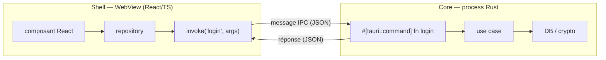
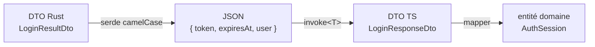
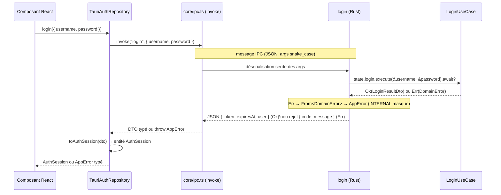

# 06 — Le pont IPC : comment un appel JS atterrit dans une fonction Rust

## Ce que tu vas apprendre

- Le mécanisme exact d'un aller-retour : `invoke('nom', { args })` côté React → `#[tauri::command] async fn nom(...)` côté Rust, et le retour.
- Comment **serde** (dé)sérialise les arguments et les réponses, et pourquoi les noms passent de `snake_case` (Rust) à `camelCase` (JSON exposé au front).
- Le **contrat d'erreur** : `Result<Dto, AppError>` côté Rust → `invoke` rejette → `normalizeError` → `AppError` typé côté TS, avec la correspondance des codes.
- Pourquoi `src/core/ipc.ts` est le **seul** module autorisé à toucher `@tauri-apps/api`, et comment un repository l'utilise.
- La **sécurité du pont** : modèle Core/Shell, validation côté Rust, permissions (`capabilities/`), CSP — et pourquoi tout secret reste dans le Core.

> 🧭 **Prérequis** : avoir lu [04-backend-rust-couche-par-couche.md](./04-backend-rust-couche-par-couche.md) (tu dois savoir ce qu'est un use case, un DTO et le composition root `build_state`) et idéalement [05-securite-et-chiffrement.md](./05-securite-et-chiffrement.md) (pour comprendre pourquoi le mot de passe et les clés ne quittent jamais le Rust).

---

## 1. Le problème : deux mondes qui ne parlent pas la même langue

Dans une app Tauri, tu as **deux processus distincts** :

- Le **Core** (Rust) : ta logique métier, la DB, la crypto. Il a accès au système de fichiers, au réseau, etc.
- Le **Shell / WebView** (React + TypeScript) : une page web dans une fenêtre native. Elle ne peut **rien** faire sur le système toute seule.

Ces deux mondes ne partagent pas de mémoire et ne s'appellent pas directement. Pour communiquer, ils s'envoient des **messages** : c'est l'**IPC** (Inter-Process Communication).

> En React tu connais déjà ce schéma : ton front appelle un backend HTTP via `fetch('/api/...')`. Ici c'est pareil, sauf que le "backend" est ton process Rust local, et le `fetch` s'appelle `invoke`. Pas de port HTTP, pas de serveur à démarrer : c'est un canal interne de Tauri.



---

## 2. Le mécanisme : `invoke` ⇄ `#[tauri::command]`

### Côté Rust : une commande

Une **commande** est une fonction Rust ordinaire décorée par l'attribut `#[tauri::command]`. Cet attribut est une **macro** : à la compilation, elle génère autour de ta fonction tout le code de "plomberie" qui lit le message IPC, désérialise les arguments et sérialise le retour.

> Un attribut `#[...]` en Rust ≈ un **décorateur** en TS (`@Component()` en Angular, par ex.). Tu écris une fonction simple, et la macro l'enrobe automatiquement. Tu n'as donc jamais à parser de JSON à la main.

Voici la commande `login` :

[src-tauri/src/presentation/commands/auth.rs](../../src-tauri/src/presentation/commands/auth.rs)

```rust
/// Authenticate, unlock the vault, and open a 15-minute session.
#[tauri::command]
pub async fn login(
    username: String,
    password: String,
    state: State<'_, AppState>,
) -> Result<LoginResultDto, AppError> {
    Ok(state.login.execute(&username, &password).await?)
}
```

Décortiquons, ligne par ligne, pour un débutant Rust :

- `#[tauri::command]` : marque cette fonction comme appelable depuis la WebView.
- `pub async fn login(...)` : `async` car le use case fait des I/O (DB, hash). Tauri sait `await` une commande async ; côté JS, `invoke` renvoie de toute façon une `Promise`.
- `username: String, password: String` : les **arguments métier**. Ils seront remplis à partir de l'objet JS passé à `invoke`. Le nommage compte beaucoup — on y revient en §3.
- `state: State<'_, AppState>` : argument **spécial**. Tu ne le passes **pas** depuis le JS ! Tauri l'injecte automatiquement. C'est ton `AppState` (le sac de use cases assemblé dans `build_state`, voir chapitre 04), partagé entre toutes les commandes.

> `State<'_, AppState>` ≈ une **dépendance injectée** que tu récupères dans un handler, comme un service injecté dans un controller. Le `'_` est un *lifetime* (durée de vie) : tu peux le lire comme « cette référence est valide le temps de l'appel » et l'ignorer pour l'instant.

- `-> Result<LoginResultDto, AppError>` : le **type de retour**. C'est le cœur du contrat. `Result<T, E>` ≈ « soit un succès `Ok(T)`, soit une erreur `Err(E)` », au lieu de `throw`. Ici : succès = un `LoginResultDto`, erreur = un `AppError`.
- `state.login.execute(...).await?` : on appelle le use case. Le `?` ≈ « si ça renvoie une erreur, **early-return** cette erreur tout de suite » (comme un `await` qui re-lancerait le `throw`). Subtilité : le use case renvoie une `DomainError`, mais la fonction attend un `AppError`. Le `?` **convertit automatiquement** l'une en l'autre grâce à un `impl From<DomainError> for AppError` (détaillé en §4).
- `Ok(...)` enveloppe le DTO dans la variante succès.

> Note la différence avec `logout`, qui ne renvoie pas de donnée utile : son type est `Result<(), AppError>`. Le `()` (« unit ») ≈ `void` en TS. Côté JS, `await invoke(...)` résout alors sur `undefined`.

### Enregistrer les commandes : `generate_handler!`

Déclarer la fonction ne suffit pas : il faut **enregistrer** chaque commande auprès de Tauri, sinon `invoke('login')` renverra une erreur « commande inconnue ». Ça se fait au démarrage, dans `lib.rs` :

[src-tauri/src/lib.rs](../../src-tauri/src/lib.rs)

```rust
.invoke_handler(tauri::generate_handler![
    auth::account_exists,
    auth::register,
    auth::login,
    auth::check_session,
    auth::logout,
    profile::create_profile,
    profile::list_profiles,
    profile::update_profile,
    profile::delete_profile,
    profile::set_active_profile
])
```

`generate_handler![...]` est une macro qui construit le **routeur** : elle associe le **nom de la fonction** (`login`) au code qui la dispatche. C'est l'équivalent de ton fichier de routes Express où chaque chemin pointe vers un handler. Le **nom IPC** d'une commande est exactement le nom de la fonction Rust : `login`, `create_profile`, etc. (toujours en `snake_case`).

> ⚠️ Règle d'or : toute nouvelle commande doit être **à la fois** décorée `#[tauri::command]` **et** ajoutée dans ce `generate_handler!`. Oublier le second est l'erreur n°1 du débutant Tauri — la compilation passe, mais `invoke` échoue à l'exécution.

---

## 3. Sérialisation serde : la traduction JS ⇄ Rust

Le message IPC voyage en **JSON**. C'est la lib **serde** (SERialize/DEserialize) qui fait la conversion des deux côtés :

- **À l'aller** : l'objet JS passé à `invoke` est **désérialisé** en arguments Rust.
- **Au retour** : la `struct` Rust est **sérialisée** en JSON pour le JS.

### À l'aller : le nommage des arguments doit matcher

Côté JS, le second argument d'`invoke` est un **objet** dont les **clés** doivent correspondre aux **noms des paramètres** de la fonction Rust :

[src/features/auth/data/repositories/tauri-auth.repository.ts](../../src/features/auth/data/repositories/tauri-auth.repository.ts)

```ts
async login({ username, password }: Credentials): Promise<AuthSession> {
  const dto = await invoke<LoginResponseDto>(COMMANDS.login, {
    username,
    password,
  });
  return toAuthSession(dto);
}
```

La clé `username` de l'objet JS remplit le paramètre `username: String` de la fonction Rust ; idem pour `password`. C'est un **mapping par nom**, pas par position. Si tu écrivais `{ user: ..., pass: ... }`, Rust ne trouverait pas ses paramètres et l'appel échouerait.

> ⚠️ Pour les **arguments** (l'aller), Tauri attend les clés telles quelles, donc en `snake_case` si ton paramètre Rust est en `snake_case`. Exemple concret : `create_profile` a un paramètre `first_name`. L'objet JS doit donc contenir la clé `first_name` (et non `firstName`). Vérifie toujours la signature de la commande Rust avant d'écrire l'appel.

### Au retour : DTO Rust en `snake_case`, JSON en `camelCase`

Le retour est une `struct` Rust marquée `#[derive(Serialize)]` — c'est ce `derive` qui demande à serde de générer le code de sérialisation (`derive` ≈ « génère automatiquement l'implémentation pour moi »).

[src-tauri/src/application/dto/login_result_dto.rs](../../src-tauri/src/application/dto/login_result_dto.rs)

```rust
#[derive(Debug, Clone, Serialize)]
#[serde(rename_all = "camelCase")]
pub struct LoginResultDto {
    pub token: String,
    /// Absolute expiry, epoch milliseconds.
    pub expires_at: i64,
    pub user: UserDto,
}
```

L'attribut **`#[serde(rename_all = "camelCase")]`** est crucial : en Rust, la convention de nommage des champs est `snake_case` (`expires_at`), mais la convention JS/TS est `camelCase` (`expiresAt`). Cet attribut dit à serde : « quand tu sérialises, renomme tous les champs en camelCase ». Donc le champ Rust `expires_at` apparaît **`expiresAt`** dans le JSON reçu par le front.

C'est pour ça que le DTO TS correspondant déclare bien `expiresAt` (et pas `expires_at`) :

[src/features/auth/data/dto/auth.dto.ts](../../src/features/auth/data/dto/auth.dto.ts)

```ts
export interface LoginResponseDto {
  token: string;
  expiresAt: number;
  user: UserDto;
}
```

Tu retrouves le même couple partout :

| Champ Rust (`snake_case`) | JSON exposé (`camelCase`) | Champ TS |
| --- | --- | --- |
| `expires_at` | `expiresAt` | `expiresAt` |
| `remaining_ms` | `remainingMs` | `remainingMs` |
| `created_at` / `updated_at` | `createdAt` / `updatedAt` | `createdAt` / `updatedAt` |
| `active_profile_id` | `activeProfileId` | `activeProfileId` |
| `first_name` / `last_name` | `firstName` / `lastName` | `firstName` / `lastName` |

> 🧠 Retiens l'**asymétrie** : pour les **arguments** (aller), tu envoies les clés en `snake_case` (le nom du paramètre Rust). Pour la **réponse** (retour), tu reçois du `camelCase` grâce à `rename_all`. C'est volontaire : la réponse est une vraie *struct* que serde renomme, alors que les arguments sont juste mappés sur des noms de paramètres bruts.

### Centraliser les noms de commandes côté front

Pour ne jamais écrire `invoke('login')` avec une chaîne magique dispersée dans le code (risque de typo, refactor pénible), les noms de commandes sont **centralisés** dans un seul objet :

[src/core/config.ts](../../src/core/config.ts)

```ts
/** Backend command names (snake_case, matching the Rust `#[tauri::command]`s). */
export const COMMANDS = {
  accountExists: "account_exists",
  register: "register",
  login: "login",
  checkSession: "check_session",
  logout: "logout",
  createProfile: "create_profile",
  listProfiles: "list_profiles",
  updateProfile: "update_profile",
  deleteProfile: "delete_profile",
  setActiveProfile: "set_active_profile",
} as const;
```

La **valeur** (`"create_profile"`) doit matcher **exactement** le nom de la fonction Rust enregistrée dans `generate_handler!`. La **clé** (`createProfile`) est juste un alias camelCase pratique pour le code TS. Le repository écrit donc `invoke(COMMANDS.login, ...)`, jamais la chaîne en dur.

---

## 4. Le contrat d'erreur : du `DomainError` au `AppError` typé en TS

C'est la partie la plus subtile du pont. Une commande renvoie `Result<Dto, AppError>`. Que se passe-t-il pour chaque variante ?

- **`Ok(dto)`** → `invoke` **résout** sa Promise avec le DTO (JSON).
- **`Err(appError)`** → `invoke` **rejette** sa Promise avec l'objet `AppError` sérialisé.

> En React tu connais ça : une réponse `2xx` résout, une `4xx/5xx` te fait `throw`. Ici, `Ok` ≈ succès, `Err` ≈ rejet de Promise.

### Côté Rust : un `AppError` minimal et sûr

[src-tauri/src/presentation/commands/error.rs](../../src-tauri/src/presentation/commands/error.rs)

```rust
/// Error shape returned to the WebView. Internal details (SQL, crypto) are
/// collapsed to a generic `INTERNAL` so they never leak to the frontend.
#[derive(Debug, Serialize)]
pub struct AppError {
    pub code: String,
    pub message: String,
}
```

`AppError` est **délibérément pauvre** : juste un `code` (machine-readable) et un `message` (pour l'humain). Il est `Serialize`, donc il part en JSON `{ "code": "...", "message": "..." }` quand `invoke` rejette.

Le mapping `DomainError` → `AppError` (déclenché par le `?` vu en §2) est ici :

[src-tauri/src/presentation/commands/error.rs](../../src-tauri/src/presentation/commands/error.rs)

```rust
impl From<DomainError> for AppError {
    fn from(e: DomainError) -> Self {
        match e {
            DomainError::InvalidCredentials => {
                AppError::new("INVALID_CREDENTIALS", "Identifiants invalides")
            }
            DomainError::AccountLocked { retry_after_ms } => AppError::new(
                "ACCOUNT_LOCKED",
                format!(
                    "Compte verrouillé. Réessayez dans {} s.",
                    (retry_after_ms / 1000).max(1)
                ),
            ),
            DomainError::AccountAlreadyExists => {
                AppError::new("ACCOUNT_EXISTS", "Un compte existe déjà sur cet appareil")
            }
            DomainError::Unauthorized => {
                AppError::new("SESSION_EXPIRED", "Session expirée. Reconnectez-vous.")
            }
            DomainError::ProfileNotFound => AppError::new("NOT_FOUND", "Profil introuvable"),
            DomainError::Validation(m) => AppError::new("VALIDATION", m),
            DomainError::Storage(_)
            | DomainError::Hashing(_)
            | DomainError::Crypto(_)
            | DomainError::Token(_) => AppError::new("INTERNAL", "Erreur interne"),
        }
    }
}
```

> `impl From<A> for B` ≈ définir une fonction de conversion `A → B`. Le `match` ≈ un `switch` exhaustif sur les variantes d'un type union — le compilateur refuse de compiler si tu oublies un cas.

> ⚠️ **Point sécurité majeur.** Regarde le dernier bras : `Storage`, `Hashing`, `Crypto`, `Token` (donc toute erreur DB, crypto ou de token) sont **toutes écrasées** en un unique `("INTERNAL", "Erreur interne")`. Aucun message SQL, aucun détail cryptographique ne traverse le pont. Le front ne voit jamais « column X not found » ou « decrypt failed » : il voit `INTERNAL`. C'est une **frontière de présentation** qui protège tes secrets et ne donne aucune prise à un attaquant qui inspecterait la WebView.

### Côté TS : capter le rejet et le typer

`invoke` brut peut rejeter avec n'importe quoi. Le wrapper centralise la normalisation :

[src/core/ipc.ts](../../src/core/ipc.ts)

```ts
export async function invoke<T>(
  command: string,
  args?: Record<string, unknown>,
): Promise<T> {
  try {
    return await tauriInvoke<T>(command, args);
  } catch (raw) {
    throw normalizeError(raw);
  }
}
```

Quoi qu'il arrive, ce qui sort de `invoke` est un `AppError` **typé** (jamais un objet inconnu). La normalisation :

[src/core/errors.ts](../../src/core/errors.ts)

```ts
export function normalizeError(raw: unknown): AppError {
  if (isAppError(raw)) return raw;

  if (raw && typeof raw === "object") {
    const e = raw as BackendError;
    const code: AppErrorCode = KNOWN_CODES.includes(e.code ?? "")
      ? (e.code as AppErrorCode)
      : "UNKNOWN";
    return new AppError(code, e.message ?? "Une erreur est survenue");
  }

  if (typeof raw === "string") {
    return new AppError("UNKNOWN", raw);
  }

  return new AppError("UNKNOWN", "Une erreur inconnue est survenue");
}
```

L'objet rejeté `{ code, message }` (notre `AppError` Rust sérialisé) tombe dans le second `if`. Si le `code` fait partie des codes connus, on le garde tel quel ; sinon on retombe sur `"UNKNOWN"` (par sécurité, p. ex. si l'erreur ne vient pas de notre backend). Le type `AppErrorCode` est l'**image miroir** des codes émis par Rust :

[src/core/errors.ts](../../src/core/errors.ts)

```ts
export type AppErrorCode =
  | "INVALID_CREDENTIALS"
  | "ACCOUNT_LOCKED"
  | "ACCOUNT_EXISTS"
  | "VALIDATION"
  | "SESSION_EXPIRED"
  | "NOT_FOUND"
  | "INTERNAL"
  | "UNKNOWN";
```

Correspondance complète des codes des deux côtés :

| `DomainError` (Rust) | code émis (`error.rs`) | `AppErrorCode` (TS) |
| --- | --- | --- |
| `InvalidCredentials` | `INVALID_CREDENTIALS` | `INVALID_CREDENTIALS` |
| `AccountLocked` | `ACCOUNT_LOCKED` | `ACCOUNT_LOCKED` |
| `AccountAlreadyExists` | `ACCOUNT_EXISTS` | `ACCOUNT_EXISTS` |
| `Unauthorized` | `SESSION_EXPIRED` | `SESSION_EXPIRED` |
| `ProfileNotFound` | `NOT_FOUND` | `NOT_FOUND` |
| `Validation(m)` | `VALIDATION` | `VALIDATION` |
| `Storage` / `Hashing` / `Crypto` / `Token` | `INTERNAL` | `INTERNAL` |
| *(non émis par Rust, filet de sécurité TS)* | — | `UNKNOWN` |

Grâce à ce code typé, ta couche présentation peut faire un `switch (error.code)` exhaustif et afficher le bon message i18n (« mot de passe invalide », « compte verrouillé », etc.) sans jamais inspecter de chaîne fragile.

---

## 5. `core/ipc.ts` : le seul point de contact avec Tauri

Regarde l'import en haut du wrapper :

[src/core/ipc.ts](../../src/core/ipc.ts)

```ts
import { invoke as tauriInvoke } from "@tauri-apps/api/core";
```

C'est **le seul** fichier de tout le front autorisé à importer `@tauri-apps/api`. Une règle ESLint (`no-restricted-imports`) **interdit** cet import ailleurs et fait échouer le lint si tu triches.

> Pourquoi ? Pour la **Clean Architecture du front** (chapitre 03). Si chaque composant pouvait appeler `invoke` directement, ton UI serait collée à Tauri : impossible à tester, impossible à porter ailleurs. En isolant Tauri dans un seul module bas niveau, tout le reste dépend d'**abstractions** (les repositories), jamais du framework.

La chaîne complète, du Core jusqu'à l'entité domaine du front, ressemble à ceci :



Concrètement, dans le repository (rappel du §3), après `invoke<LoginResponseDto>(...)` on appelle un **mapper** qui transforme le DTO en **entité de domaine** :

[src/features/auth/data/mappers/auth.mapper.ts](../../src/features/auth/data/mappers/auth.mapper.ts)

```ts
export function toAuthSession(dto: LoginResponseDto): AuthSession {
  return {
    token: dto.token,
    expiresAt: dto.expiresAt,
    user: toUser(dto.user),
  };
}
```

> Pourquoi un mapper alors que le DTO et l'entité se ressemblent ? Parce que c'est une **frontière**. Le DTO décrit « la forme du fil IPC » (susceptible de changer si le backend évolue) ; l'entité décrit « ce dont ton domaine a besoin ». Les découpler te permet de changer l'un sans casser l'autre. Le DTO ne doit jamais remonter tel quel dans tes composants React.

Et le `register` réutilise exactement la même mécanique avec un autre DTO :

[src/features/auth/data/repositories/tauri-auth.repository.ts](../../src/features/auth/data/repositories/tauri-auth.repository.ts)

```ts
async register({ username, password }: Credentials): Promise<User> {
  const dto = await invoke<UserDto>(COMMANDS.register, {
    username,
    password,
  });
  return toUser(dto);
}
```

---

## 6. La sécurité du pont

Le pont IPC est la **seule** porte entre la WebView et le système. Il faut donc la verrouiller. Cette app applique quatre principes.

### a) Modèle Core / Shell : le front n'a aucun accès système

La WebView ne peut **rien** faire d'elle-même : ni lire un fichier, ni ouvrir la DB, ni dériver une clé. Tout passe par une commande Rust **explicitement** exposée. Conséquence directe pour les secrets : le **mot de passe** est envoyé une fois en argument de `login`/`register`, mais le **KEK**, le **DEK** et le **hash Argon2id** ne sont **jamais** renvoyés au front (voir chapitre 05). Le `LoginResultDto` ne contient qu'un `token` opaque, une date d'expiration et le `UserDto` public — aucun matériel cryptographique.

> En web classique, ton JS tourne dans un navigateur sandboxé qui parle à un serveur distant. Ici la philosophie est la même, mais le « serveur » est local : on garde la frontière nette pour qu'une faille XSS dans la WebView ne donne pas les clés du coffre.

### b) Validation des entrées côté Rust

Ne fais **jamais** confiance à ce qui arrive de la WebView (elle peut être compromise). La validation (longueur/format du `username`, robustesse du `password`) se fait **dans le Core**, dans les use cases — pas seulement dans les formulaires React. Une entrée invalide remonte une `DomainError::Validation(m)` → code `VALIDATION` côté front (revoir le mapping §4). La validation front n'est qu'un confort UX ; la validation Rust est la vraie ligne de défense.

### c) Permissions : le moindre privilège

Tauri n'autorise une capacité (ouvrir un lien, accéder au shell, etc.) que si elle est **explicitement déclarée** dans une *capability*. Ce projet est minimal :

[src-tauri/capabilities/default.json](../../src-tauri/capabilities/default.json)

```json
{
  "$schema": "../gen/schemas/desktop-schema.json",
  "identifier": "default",
  "description": "Capability for the main window",
  "windows": ["main"],
  "permissions": [
    "core:default",
    "opener:default"
  ]
}
```

Seules `core:default` (le strict nécessaire pour qu'une fenêtre fonctionne) et `opener:default` (le plugin d'ouverture de liens) sont accordées. Aucune permission « filesystem », « shell » ou « http » n'est donnée : la WebView ne peut pas faire fuiter de données par un canal détourné. C'est le principe du **moindre privilège** — n'accorde que ce dont tu as réellement besoin.

> Important : tes **commandes** custom (`login`, etc.) sont autorisées par le fait d'être dans `generate_handler!` ; les `permissions` ci-dessus concernent les capacités **du cœur de Tauri et des plugins**, pas tes commandes métier.

### d) CSP : verrouiller la WebView elle-même

Même protégé côté permissions, le contenu de la WebView pourrait tenter de charger du code ou d'exfiltrer des données via le réseau. La **Content-Security-Policy** ferme ces portes :

[src-tauri/tauri.conf.json](../../src-tauri/tauri.conf.json)

```json
"security": {
  "csp": "default-src 'self'; script-src 'self'; style-src 'self' 'unsafe-inline'; img-src 'self' data:; font-src 'self' data:; connect-src 'self' ipc: http://ipc.localhost; object-src 'none'; base-uri 'self'; frame-ancestors 'none'"
}
```

Les directives clés :

- `default-src 'self'` / `script-src 'self'` : seules les ressources **locales** de l'app peuvent être chargées/exécutées — pas de script tiers injecté.
- `connect-src 'self' ipc: http://ipc.localhost` : les **seules** destinations réseau autorisées sont l'app elle-même et le **canal IPC interne** de Tauri (c'est par là que passe `invoke`). Aucun appel vers un serveur externe n'est possible → impossible d'exfiltrer des données confidentielles vers le web. Ça colle parfaitement à la promesse **offline-first** du projet.
- `object-src 'none'`, `frame-ancestors 'none'`, `base-uri 'self'` : ferment des vecteurs classiques (plugins, clickjacking, détournement de `<base>`).

> ⚠️ Si un jour tu vois un appel `invoke` échouer mystérieusement avec une erreur réseau/CSP, vérifie que `connect-src` autorise bien `ipc:` / `http://ipc.localhost`. Sans ça, le pont est physiquement bloqué par la WebView.

---

## 7. Exemple complet : l'aller-retour `login` en une séquence

Voici le voyage de bout en bout d'un clic « Se connecter », avec le fichier responsable à chaque étape. Pour la trace **exhaustive** (jusqu'à la DB et la crypto), voir [08-flux-complet-de-bout-en-bout.md](./08-flux-complet-de-bout-en-bout.md).



Étape par étape :

1. **Clic** → un composant React appelle son use case front, qui appelle `repo.login(...)`.
2. **Repository** — [tauri-auth.repository.ts](../../src/features/auth/data/repositories/tauri-auth.repository.ts) : `invoke<LoginResponseDto>(COMMANDS.login, { username, password })`.
3. **Wrapper IPC** — [core/ipc.ts](../../src/core/ipc.ts) : enrobe `tauriInvoke` dans un `try/catch` qui normalise toute erreur.
4. **Pont** : Tauri trouve la commande `login` (enregistrée dans `generate_handler!`, [lib.rs](../../src-tauri/src/lib.rs)) et **désérialise** l'objet JS en arguments Rust.
5. **Commande** — [auth.rs](../../src-tauri/src/presentation/commands/auth.rs) : `login` reçoit `username`, `password` et le `State<AppState>` injecté, puis délègue au `LoginUseCase` avec `.await?`.
6. **Use case** : authentifie, déverrouille le coffre, ouvre la session (chapitre 04/05) et renvoie `Ok(LoginResultDto)` ou `Err(DomainError)`.
7. **Retour Ok** : serde **sérialise** `LoginResultDto` en JSON `camelCase` (`expiresAt`…) ; `invoke` résout ; le repository appelle `toAuthSession(dto)` ([auth.mapper.ts](../../src/features/auth/data/mappers/auth.mapper.ts)) pour produire l'entité domaine `AuthSession`.
8. **Retour Err** : `?` convertit la `DomainError` en `AppError` ([error.rs](../../src-tauri/src/presentation/commands/error.rs), avec masquage `INTERNAL`) ; `invoke` rejette ; `normalizeError` ([errors.ts](../../src/core/errors.ts)) produit un `AppError` typé que l'UI affiche proprement.

---

## En résumé

- Un appel front ↔ Rust passe par `invoke('nom', { args })` ⇄ `#[tauri::command]`, le tout routé par `generate_handler!`.
- **serde** traduit le JSON : arguments mappés par **nom** (`snake_case` côté paramètres Rust), réponses renommées en `camelCase` via `#[serde(rename_all = "camelCase")]`.
- Le contrat d'erreur est `Result<Dto, AppError>` : `Ok` résout, `Err` rejette ; `DomainError → AppError` **masque** tout détail interne en `INTERNAL`, et `normalizeError` redonne un `AppErrorCode` typé côté TS.
- `core/ipc.ts` est l'**unique** point de contact avec `@tauri-apps/api` (règle ESLint), et chaque repository transforme le DTO en entité via un mapper.
- Le pont est verrouillé par le modèle Core/Shell, la validation Rust, les **capabilities** (moindre privilège) et la **CSP** (`connect-src` n'autorise que l'IPC) : les secrets ne quittent jamais le Core.

## Étape suivante

➡️ [07-frontend-react-couche-par-couche.md](./07-frontend-react-couche-par-couche.md) — On plonge dans le front : `core` + l'organisation `domain / data / presentation` d'une feature, et comment les repositories et providers s'assemblent.
