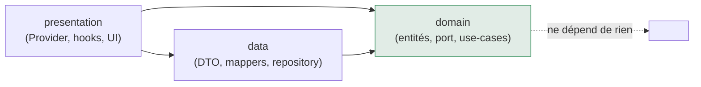
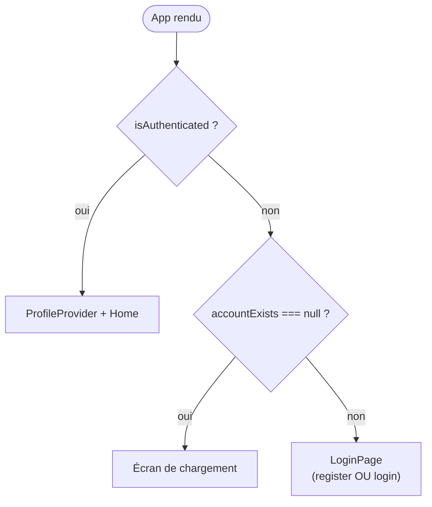

# 07 — Le frontend React couche par couche

## Ce que tu vas apprendre

- Comment la **même Clean Architecture** que côté Rust se rejoue côté React, mais en **feature-first** (`src/features/<feat>/{domain,data,presentation}`).
- Le rôle du dossier transverse `src/core/` (le pont IPC, les erreurs normalisées, la config, l'i18n) et la **règle d'or** : un seul fichier a le droit d'importer `@tauri-apps/api`.
- Le **domain** front : entités pures, le **port** `AuthRepository` (une interface TS), et les use-cases écrits comme des **factories** qui reçoivent le repository par injection.
- La couche **data** : DTO (la forme JSON renvoyée par Rust), mappers (DTO → entité) et `TauriAuthRepository` — l'**adaptateur** symétrique exact de l'infrastructure Rust.
- La couche **presentation** : `AuthProvider` = **composition root** de la feature, le token gardé en mémoire seule, le compte à rebours de session, et des composants UI 100 % passifs.
- Le vocabulaire commun aux deux côtés (port, use case, repository, DTO, composition root) avec un tableau récap.

> 🧭 **Prérequis** : avoir lu [03-clean-architecture.md](./03-clean-architecture.md) (la règle de dépendance et l'inversion par interfaces) et idéalement [04-backend-rust-couche-par-couche.md](./04-backend-rust-couche-par-couche.md) (pour voir la symétrie Rust ↔ React). Un coup d'œil à [06-le-pont-ipc.md](./06-le-pont-ipc.md) aide à comprendre `invoke`.

---

## 1. L'organisation : feature-first

Côté Rust, on a découpé le code par **couches techniques** (`domain/`, `application/`, `infrastructure/`, `presentation/`). Côté React, on inverse l'axe principal : on découpe d'abord par **fonctionnalité** (auth, profile, …), et **à l'intérieur de chaque feature** on retrouve les mêmes couches.

```
src/
├── core/                      # transverse, partagé par toutes les features
│   ├── ipc.ts                 # LE wrapper invoke (seul à importer @tauri-apps/api)
│   ├── errors.ts              # AppError / normalizeError / isAppError
│   ├── config.ts              # COMMANDS + constantes
│   └── i18n/                  # internationalisation (fr / en)
│
└── features/
    └── auth/
        ├── domain/            # entités, port (interface), use-cases purs
        ├── data/              # DTO, mappers, repository concret (Tauri)
        └── presentation/      # provider, context, hooks, composants UI
```

> **En React tu ferais** souvent un dossier par type technique (`components/`, `hooks/`, `services/`). **Ici** on regroupe tout ce qui concerne `auth` au même endroit, puis on applique les couches Clean dedans. Avantage : une feature est autonome, on peut la lire (ou la supprimer) sans chasser ses morceaux aux quatre coins du projet.

La règle de dépendance est **identique** à celle du backend : tout pointe vers l'intérieur. `presentation` connaît `data` et `domain` ; `data` connaît `domain` ; `domain` ne connaît **personne** (ni Tauri, ni React, ni `data`).



Le chemin `@/` est un **alias** vers `src/` (configuré dans Vite + TypeScript). Tous les imports que tu verras commencent par `@/…` au lieu de `../../../`.

### La règle d'or : un seul point d'entrée vers Tauri

C'est le pivot de toute l'architecture front. **Seul** [src/core/ipc.ts](../../src/core/ipc.ts) a le droit d'importer `@tauri-apps/api`. Cette règle est imposée mécaniquement par ESLint (`no-restricted-imports`) — si un composant essaie d'importer `invoke` directement, le lint échoue.

[src/core/ipc.ts](../../src/core/ipc.ts)

```ts
import { invoke as tauriInvoke } from "@tauri-apps/api/core";

import { normalizeError } from "@/core/errors";

/**
 * Typed wrapper around Tauri's `invoke` with error normalization.
 *
 * This is the ONLY module allowed to import `@tauri-apps/api`. Everything else
 * goes through a repository that calls this function.
 */
export async function invoke<T>(
  command: string,
  args?: Record<string, unknown>,
): Promise<T> {
  try {
    return await tauriInvoke<T>(command, args);
  } catch (raw) {
    throw normalizeError(raw);
  }
}
```

Pourquoi c'est si important pour un débutant Tauri ? Parce que `tauriInvoke` est la **seule** porte entre ton JavaScript (qui tourne dans une WebView) et ton code Rust (le « Core », voir [01-vue-densemble-et-tauri.md](./01-vue-densemble-et-tauri.md)). En confinant cet import à un fichier unique :

- on peut **typer** la réponse (`<T>`) et la centraliser ;
- on **normalise les erreurs** ici une fois pour toutes (le `catch` ci-dessus) ;
- le reste du code ne sait même pas que Tauri existe — il appelle juste une fonction `async`. On pourrait remplacer Tauri par autre chose en ne touchant qu'à ce fichier.

> **Analogie React** : c'est exactement le rôle d'un client API centralisé (un `apiClient` qui wrappe `fetch`). Tu n'appelles jamais `fetch` à la main dans un composant ; tu passes par le client. Ici `invoke` est ce client, et Tauri est le « réseau ».

---

## 2. `core/` — la boîte à outils transverse

### `errors.ts` — des erreurs typées et propres

Côté Rust, on a vu (ch. 06) que la frontière de présentation renvoie `AppError { code, message }` sur le canal `Err`. Côté front, on transforme ce JSON brut en une vraie classe d'erreur typée.

[src/core/errors.ts](../../src/core/errors.ts)

```ts
export type AppErrorCode =
  | "INVALID_CREDENTIALS"
  | "ACCOUNT_LOCKED"
  | "ACCOUNT_EXISTS"
  | "VALIDATION"
  | "SESSION_EXPIRED"
  | "NOT_FOUND"
  | "INTERNAL"
  | "UNKNOWN";

/** Normalized application error surfaced to the presentation layer. */
export class AppError extends Error {
  readonly code: AppErrorCode;

  constructor(code: AppErrorCode, message: string) {
    super(message);
    this.name = "AppError";
    this.code = code;
  }
}
```

Et la fonction qui fait le tri de tout ce qui peut être « jeté » par `invoke` :

```ts
/** Convert anything thrown by `invoke` into a typed {@link AppError}. */
export function normalizeError(raw: unknown): AppError {
  if (isAppError(raw)) return raw;

  if (raw && typeof raw === "object") {
    const e = raw as BackendError;
    const code: AppErrorCode = KNOWN_CODES.includes(e.code ?? "")
      ? (e.code as AppErrorCode)
      : "UNKNOWN";
    return new AppError(code, e.message ?? "Une erreur est survenue");
  }

  if (typeof raw === "string") {
    return new AppError("UNKNOWN", raw);
  }

  return new AppError("UNKNOWN", "Une erreur inconnue est survenue");
}
```

Ligne par ligne, pour un dev React :

- `raw: unknown` — en TypeScript strict, ce qui sort d'un `catch` est de type `unknown` (on ne sait rien). Il faut donc **prouver** sa forme avant de l'utiliser, d'où les `if`.
- `if (isAppError(raw)) return raw;` — si c'est déjà une `AppError`, on ne fait rien.
- `if (raw && typeof raw === "object")` — c'est le cas normal : Rust a sérialisé un objet `{ code, message }`. On vérifie que le `code` fait partie des codes connus (`KNOWN_CODES`), sinon on retombe sur `"UNKNOWN"`. **Important** : `INTERNAL` est un code volontairement vague — les détails SQL/crypto ne fuient jamais (voir ch. 05).
- Les deux derniers `if` couvrent les cas dégénérés (une chaîne, ou n'importe quoi d'autre).

`isAppError` est un **type guard** : il dit à TypeScript « si je renvoie `true`, alors `value` est une `AppError` ».

```ts
export function isAppError(value: unknown): value is AppError {
  return value instanceof AppError;
}
```

### `config.ts` — les noms de commandes au même endroit

[src/core/config.ts](../../src/core/config.ts)

```ts
/** Backend command names (snake_case, matching the Rust `#[tauri::command]`s). */
export const COMMANDS = {
  accountExists: "account_exists",
  register: "register",
  login: "login",
  checkSession: "check_session",
  logout: "logout",
  createProfile: "create_profile",
  // …
} as const;
```

`COMMANDS` est la **table de correspondance** entre un nom lisible côté TS (`accountExists`) et la chaîne exacte attendue par Tauri (`"account_exists"`, en `snake_case`, qui correspond au `#[tauri::command]` Rust enregistré dans `lib.rs`). Le `as const` fige les valeurs en littéraux : impossible de muter, et l'autocomplétion est exacte. On évite ainsi les fautes de frappe dans des chaînes magiques disséminées partout.

Ce fichier contient aussi deux constantes d'UI utilisées plus bas par le compte à rebours :

```ts
/** UI tick for the session countdown. */
export const SESSION_TICK_MS = 1_000;

/** Below this remaining time, the countdown switches to its warning style. */
export const COUNTDOWN_WARNING_MS = 60_000;
```

### `i18n/` — internationalisation (survol)

L'app est bilingue (fr / en) via **react-i18next**. L'init se fait une fois dans [src/core/i18n/index.ts](../../src/core/i18n/index.ts), importé tout en haut de `main.tsx`. Deux points à retenir :

- la langue par défaut est `fr`, avec un **détecteur** qui regarde d'abord le choix explicite stocké dans `localStorage`, puis la locale de l'OS exposée par la WebView Tauri (`navigator`) ;

[src/core/i18n/index.ts](../../src/core/i18n/index.ts)

```ts
detection: {
  order: ["localStorage", "navigator"],
  caches: ["localStorage"],
},
```

- les ressources (`fr`, `en`) sont **bundlées** (pas de fetch réseau), déclarées dans [src/core/i18n/resources.ts](../../src/core/i18n/resources.ts). Dans les composants, tu verras `const { t } = useTranslation()` puis `t("auth.loginTitle")`.

Tu n'as pas besoin d'en savoir plus pour ce chapitre : retiens juste que chaque texte affiché passe par `t("clé")`.

---

## 3. Le `domain` de la feature `auth` — du TypeScript pur

C'est le cœur, et c'est **100 % du TypeScript pur** : aucun import de React, aucun import de Tauri. C'est l'équivalent exact du `domain/` Rust.

### Les entités

Ce sont de simples `interface` TypeScript décrivant les concepts métier.

[src/features/auth/domain/entities/user.ts](../../src/features/auth/domain/entities/user.ts)

```ts
export interface User {
  id: string;
  username: string;
  createdAt: number;
  updatedAt: number;
}
```

[src/features/auth/domain/entities/auth-session.ts](../../src/features/auth/domain/entities/auth-session.ts)

```ts
export interface Credentials {
  username: string;
  password: string;
}

/** In-memory session returned by a successful login. Never persisted. */
export interface AuthSession {
  token: string;
  /** Absolute expiry, epoch milliseconds. */
  expiresAt: number;
  user: User;
}

export interface SessionStatus {
  valid: boolean;
  remainingMs: number;
}
```

Remarque le commentaire `Never persisted.` sur `AuthSession` : c'est la traduction côté front de la décision de sécurité du ch. 05 (session en mémoire seulement). `expiresAt` est une **date absolue** en millisecondes epoch, pas un compteur qui décrémente — on verra pourquoi avec le timer.

### Le port : `AuthRepository`

[src/features/auth/domain/repositories/auth-repository.ts](../../src/features/auth/domain/repositories/auth-repository.ts)

```ts
/** Contract the presentation layer depends on; implemented in the data layer. */
export interface AuthRepository {
  accountExists(): Promise<boolean>;
  register(credentials: Credentials): Promise<User>;
  login(credentials: Credentials): Promise<AuthSession>;
  checkSession(token: string): Promise<SessionStatus>;
  logout(token: string): Promise<void>;
}
```

C'est **exactement** le concept de **port** (trait) vu côté Rust, transposé en TypeScript.

> **Correspondance directe** : un `trait` Rust ≈ une `interface` TypeScript. Le `domain` ne dépend que de **cette interface**, pas de son implémentation concrète. C'est l'inversion de dépendance : le domaine dicte le contrat, et c'est la couche `data` (à l'extérieur) qui devra s'y plier. Du côté Rust, `AuthService` dépendait d'un `Arc<dyn UserRepository>` ; ici la presentation dépendra d'un objet qui respecte `AuthRepository`.

### Les use-cases : le pattern factory + injection

Chaque use-case est une petite **fonction-fabrique** (`makeXxxUseCase`) qui reçoit le repository et **retourne** la vraie fonction métier.

[src/features/auth/domain/use-cases/login.ts](../../src/features/auth/domain/use-cases/login.ts)

```ts
export type LoginUseCase = (credentials: Credentials) => Promise<AuthSession>;

export function makeLoginUseCase(repo: AuthRepository): LoginUseCase {
  return (credentials) => repo.login(credentials);
}
```

[src/features/auth/domain/use-cases/register.ts](../../src/features/auth/domain/use-cases/register.ts)

```ts
export type RegisterUseCase = (credentials: Credentials) => Promise<User>;

export function makeRegisterUseCase(repo: AuthRepository): RegisterUseCase {
  return (credentials) => repo.register(credentials);
}
```

[src/features/auth/domain/use-cases/account-exists.ts](../../src/features/auth/domain/use-cases/account-exists.ts)

```ts
export type AccountExistsUseCase = () => Promise<boolean>;

export function makeAccountExistsUseCase(
  repo: AuthRepository,
): AccountExistsUseCase {
  return () => repo.accountExists();
}
```

Comment lire ça quand on débute sur ce pattern :

1. `makeLoginUseCase(repo)` est appelé **une seule fois** au démarrage (dans le composition root, plus bas). On lui passe le repository.
2. Il renvoie une fonction `(credentials) => repo.login(credentials)`. Cette fonction « se souvient » du `repo` grâce à une **closure** (la fermeture capture la variable du contexte englobant).
3. Plus tard, l'UI appelle `loginUseCase(credentials)` **sans jamais voir le repository** : il est déjà capturé.

> **En React tu ferais** un service qu'on instancie avec ses dépendances, ou un hook custom. Ici c'est plus minimaliste : la dépendance (`repo`) est **injectée par paramètre**, et la closure remplace une classe. Le use-case ne connaît que l'interface `AuthRepository`, jamais `TauriAuthRepository`. C'est testable sans Tauri : il suffit de passer un faux `repo` (un objet qui implémente l'interface).

Ici les use-cases sont volontairement triviaux (ils délèguent direct au repo). C'est normal et sain : la logique métier lourde (crypto, sessions, anti-bruteforce) vit **côté Rust**. Le use-case front est l'endroit où ajouter une éventuelle orchestration côté UI (validation locale, enchaînement d'appels) le jour où on en a besoin, sans que l'UI ni le repository ne le sachent.

---

## 4. La couche `data` — l'adaptateur vers Tauri

C'est ici qu'on touche enfin à `invoke`. Cette couche est l'**exacte symétrie** de l'infrastructure Rust : là-bas un repository concret implémentait le trait avec libSQL ; ici un repository concret implémente l'interface avec l'IPC Tauri.

### Les DTO : la forme exacte du JSON renvoyé par Rust

Un **DTO** (Data Transfer Object) décrit la donnée **telle qu'elle traverse le fil**. Côté Rust, les structures de réponse sont sérialisées en `camelCase` (via `serde`, voir ch. 06), donc les DTO TS reflètent ce `camelCase`.

[src/features/auth/data/dto/user.dto.ts](../../src/features/auth/data/dto/user.dto.ts)

```ts
/** Raw user shape returned by the backend (camelCase). */
export interface UserDto {
  id: string;
  username: string;
  createdAt: number;
  updatedAt: number;
}
```

[src/features/auth/data/dto/auth.dto.ts](../../src/features/auth/data/dto/auth.dto.ts)

```ts
import type { UserDto } from "@/features/auth/data/dto/user.dto";

export interface LoginResponseDto {
  token: string;
  expiresAt: number;
  user: UserDto;
}

export interface SessionStatusDto {
  valid: boolean;
  remainingMs: number;
}
```

Ici le DTO et l'entité se ressemblent beaucoup (presque identiques). Pourquoi les séparer alors ? Parce que ce sont **deux préoccupations différentes** : le DTO est un détail de transport (il peut changer si l'API change), l'entité est le concept stable dont dépend ton domaine. La couche `data` est précisément là pour **absorber** les différences si elles apparaissent un jour (renommage, format de date, champ aplati…), sans contaminer le domaine.

### Les mappers : DTO → entité

[src/features/auth/data/mappers/user.mapper.ts](../../src/features/auth/data/mappers/user.mapper.ts)

```ts
export function toUser(dto: UserDto): User {
  return {
    id: dto.id,
    username: dto.username,
    createdAt: dto.createdAt,
    updatedAt: dto.updatedAt,
  };
}
```

[src/features/auth/data/mappers/auth.mapper.ts](../../src/features/auth/data/mappers/auth.mapper.ts)

```ts
export function toAuthSession(dto: LoginResponseDto): AuthSession {
  return {
    token: dto.token,
    expiresAt: dto.expiresAt,
    user: toUser(dto.user),
  };
}

export function toSessionStatus(dto: SessionStatusDto): SessionStatus {
  return {
    valid: dto.valid,
    remainingMs: dto.remainingMs,
  };
}
```

Un mapper est une fonction pure `DTO → entité`. Note que `toAuthSession` réutilise `toUser` pour le sous-objet : on compose les mappers comme des Lego. C'est le **seul** endroit qui connaît à la fois la forme du fil et la forme du domaine.

### Le repository concret : `TauriAuthRepository`

Voici l'adaptateur. Il **implémente** l'interface `AuthRepository`, et son boulot est toujours le même : appeler `invoke` avec le bon nom de commande, puis **mapper** le DTO en entité.

[src/features/auth/data/repositories/tauri-auth.repository.ts](../../src/features/auth/data/repositories/tauri-auth.repository.ts)

```ts
/** AuthRepository implementation backed by Tauri IPC commands. */
export class TauriAuthRepository implements AuthRepository {
  async accountExists(): Promise<boolean> {
    return invoke<boolean>(COMMANDS.accountExists);
  }

  async register({ username, password }: Credentials): Promise<User> {
    const dto = await invoke<UserDto>(COMMANDS.register, {
      username,
      password,
    });
    return toUser(dto);
  }

  async login({ username, password }: Credentials): Promise<AuthSession> {
    const dto = await invoke<LoginResponseDto>(COMMANDS.login, {
      username,
      password,
    });
    return toAuthSession(dto);
  }

  async checkSession(token: string): Promise<SessionStatus> {
    const dto = await invoke<SessionStatusDto>(COMMANDS.checkSession, {
      token,
    });
    return toSessionStatus(dto);
  }

  async logout(token: string): Promise<void> {
    await invoke<void>(COMMANDS.logout, { token });
  }
}
```

À décortiquer :

- `implements AuthRepository` — TypeScript **vérifie** que cette classe respecte le contrat du domaine. Si tu oubliais une méthode, ça ne compilerait pas. C'est l'équivalent de `impl UserRepository for SqliteUserRepository` côté Rust.
- chaque méthode est un patron en 2 temps : `const dto = await invoke<…>(COMMANDS.x, { … })` puis `return toXxx(dto)`. **Appeler → mapper.**
- le 2ᵉ argument de `invoke` (`{ username, password }`, `{ token }`) devient les **arguments de la commande Tauri** côté Rust. Les clés en `camelCase` ici correspondent aux paramètres `snake_case`/`camelCase` attendus par la commande (Tauri fait le pont, détaillé au ch. 06).
- `register` renvoie un `User` mais **pas** de session : c'est volontaire, créer le compte ne te connecte pas (on revient sur le login derrière).

> **La symétrie à retenir** :
>
> | Rust (infrastructure) | React (data) |
> | --- | --- |
> | `impl UserRepository for SqliteUserRepository` | `class TauriAuthRepository implements AuthRepository` |
> | parle à libSQL / crypto | parle à l'IPC Tauri via `invoke` |
> | mappe row SQL ↔ entité | mappe DTO ↔ entité |
>
> Des deux côtés, le repository est un **adaptateur** : il branche le monde extérieur (DB d'un côté, IPC de l'autre) sur le contrat abstrait du domaine.

---

## 5. La couche `presentation` — provider, hooks, UI

### `AuthProvider` = composition root de la feature

Tout converge ici. C'est l'endroit (et le seul) où on **instancie** le repository concret et où on **câble** les use-cases. C'est l'équivalent front de la fonction `build_state` de `lib.rs` côté Rust, mais à l'échelle d'une feature.

[src/features/auth/presentation/providers/auth-provider.tsx](../../src/features/auth/presentation/providers/auth-provider.tsx)

```ts
// Composition root for the auth feature: wire the repository to the use cases.
// (DI happens here at the edge, never inside the domain.)
const repo = new TauriAuthRepository();
const loginUseCase = makeLoginUseCase(repo);
const logoutUseCase = makeLogoutUseCase(repo);
const registerUseCase = makeRegisterUseCase(repo);
const accountExistsUseCase = makeAccountExistsUseCase(repo);
```

C'est **le seul fichier** qui mentionne `new TauriAuthRepository()`. Si demain on voulait une implémentation de test (un faux repo en mémoire), on ne changerait que cette ligne. Tout le reste — use-cases, composants — ignore d'où vient le repository. C'est l'injection de dépendances « au bord » (au composition root), jamais dans le domaine.

> **Correspondance** : `Arc<dyn UserRepository>` injecté dans `build_state` côté Rust ≈ `new TauriAuthRepository()` passé à `makeXxxUseCase(...)` ici. Les deux disent « je décide ici, une fois, quelle implémentation concrète remplit l'interface ».

#### L'état du provider

```ts
export function AuthProvider({ children }: { children: ReactNode }) {
  // In-memory ONLY; never written to storage, so an app restart forces re-login.
  const tokenRef = useRef<string | null>(null);
  const [expiresAt, setExpiresAt] = useState<number | null>(null);
  const [user, setUser] = useState<User | null>(null);
  const [status, setStatus] = useState<AuthStatus>("unauthenticated");
  const [accountExists, setAccountExists] = useState<boolean | null>(null);
  const [error, setError] = useState<string | null>(null);
  const [isSubmitting, setIsSubmitting] = useState(false);
```

Le point **critique de sécurité** : le token de session est dans un `useRef`, **pas** dans un `useState`.

> ⚠️ **Pourquoi `useRef` et pas `useState` pour le token ?** Un `useRef` est une simple boîte mutable en mémoire qui **ne déclenche pas de re-render** quand on la modifie. Le token ne doit jamais piloter l'affichage, ne jamais transiter dans le `value` du Context (donc aucun composant ne peut le lire), et bien sûr jamais être écrit dans `localStorage`. Combiné à la décision « session en mémoire seulement » du ch. 05, ça garantit qu'un redémarrage de l'app **force une nouvelle connexion** : la RAM est repartie de zéro.

`accountExists` peut valoir `null` : c'est l'état « je ne sais pas encore » pendant le chargement initial (on le voit dans `App.tsx`).

#### Effet de démarrage : « un compte existe-t-il ? »

```ts
// On startup, ask the backend whether an account already exists.
useEffect(() => {
  let cancelled = false;
  accountExistsUseCase()
    .then((exists) => {
      if (!cancelled) setAccountExists(exists);
    })
    .catch(() => {
      if (!cancelled) setAccountExists(false);
    });
  return () => {
    cancelled = true;
  };
}, []);
```

Au montage, on demande au backend s'il existe déjà un compte propriétaire. Le drapeau `cancelled` est le **garde anti-fuite** classique de React : si le composant est démonté avant que la promesse ne se résolve, le `cleanup` met `cancelled = true` et on n'appelle pas `setState` sur un composant disparu. Le résultat pilote ensuite l'affichage register vs login.

#### `login`, `register`, `logout`

```ts
const login = useCallback(async (credentials: Credentials) => {
  setIsSubmitting(true);
  setError(null);
  try {
    const session = await loginUseCase(credentials);
    tokenRef.current = session.token;
    setExpiresAt(session.expiresAt);
    setUser(session.user);
    setStatus("authenticated");
  } catch (e) {
    setError(isAppError(e) ? e.message : "Échec de la connexion");
  } finally {
    setIsSubmitting(false);
  }
}, []);
```

Le déroulé : on lève `isSubmitting` (pour désactiver le bouton), on appelle le **use-case** (jamais le repo directement), et en cas de succès on range le token **dans la ref**, et le reste (expiresAt, user, status) **dans le state** car ça, ça doit re-render. Le `catch` utilise le type guard `isAppError` pour afficher un message propre venu de la normalisation du ch. 2.

```ts
const register = useCallback(async (credentials: Credentials) => {
  setIsSubmitting(true);
  setError(null);
  try {
    await registerUseCase(credentials);
    // Account created — switch the gate to the login screen.
    setAccountExists(true);
  } catch (e) {
    setError(isAppError(e) ? e.message : "Échec de la création du compte");
  } finally {
    setIsSubmitting(false);
  }
}, []);
```

`register` ne connecte pas : il passe `accountExists` à `true`, ce qui bascule l'écran vers le formulaire de **login**. L'utilisateur saisit alors son mot de passe pour ouvrir la session (et le coffre).

```ts
const clearSession = useCallback(() => {
  const token = tokenRef.current;
  tokenRef.current = null;
  setExpiresAt(null);
  setUser(null);
  setStatus("unauthenticated");
  if (token) {
    // Best-effort server-side invalidation + vault lock.
    void logoutUseCase(token).catch(() => undefined);
  }
}, []);
```

`clearSession` efface **d'abord** l'état local (token, user, status) puis fait un appel `logout` au backend en *best-effort* (`void … .catch(() => undefined)` : on tente d'invalider la session côté Rust et de verrouiller le coffre, mais même si ça échoue, l'UI est déjà déconnectée). Le `logout` exposé à l'UI ne fait que déléguer à `clearSession`.

#### Le `value` du Context : ce qu'on expose (et ce qu'on cache)

```ts
const value = useMemo<AuthContextValue>(
  () => ({
    status,
    isAuthenticated: status === "authenticated",
    user,
    remainingMs,
    accountExists,
    error,
    isSubmitting,
    login,
    register,
    logout,
    clearError,
  }),
  [/* deps… */],
);

return <AuthContext.Provider value={value}>{children}</AuthContext.Provider>;
```

Remarque ce qui **n'est pas** dans `value` : le `token`. Le contexte expose `isAuthenticated`, `user`, `remainingMs`, des actions… mais **jamais** le secret. C'est documenté noir sur blanc dans le contexte.

[src/features/auth/presentation/context/auth-context.ts](../../src/features/auth/presentation/context/auth-context.ts)

```ts
// The session token is intentionally NOT exposed here — it stays inside the
// provider so no component can read or leak it.
export const AuthContext = createContext<AuthContextValue | null>(null);
```

### Le hook `useAuth` — l'accès contrôlé au contexte

[src/features/auth/presentation/hooks/use-auth.ts](../../src/features/auth/presentation/hooks/use-auth.ts)

```ts
export function useAuth(): AuthContextValue {
  const ctx = useContext(AuthContext);
  if (!ctx) {
    throw new Error("useAuth must be used within <AuthProvider>");
  }
  return ctx;
}
```

Pattern React classique : le hook garantit que le contexte est non-`null` (donc qu'on est bien à l'intérieur du `AuthProvider`) et renvoie une valeur typée. Les composants n'utilisent **que** `useAuth()`, jamais `useContext(AuthContext)` à la main.

### `useSessionTimer` — le compte à rebours et l'auto-logout

[src/features/auth/presentation/hooks/use-session-timer.ts](../../src/features/auth/presentation/hooks/use-session-timer.ts)

```ts
/**
 * Returns the milliseconds remaining until `expiresAt`, ticking every second.
 * Calls `onExpire` once the deadline passes. Pass `expiresAt = null` when
 * unauthenticated (the timer is inert).
 *
 * Driven by the absolute `expiresAt` (not a decrementing counter) so OS sleep
 * or clock changes can never grant extra session time.
 */
export function useSessionTimer(
  expiresAt: number | null,
  onExpire: () => void,
): number {
  const [remainingMs, setRemainingMs] = useState(() =>
    expiresAt ? Math.max(0, expiresAt - Date.now()) : 0,
  );

  useEffect(() => {
    if (expiresAt == null) {
      setRemainingMs(0);
      return;
    }

    const tick = () => {
      const left = expiresAt - Date.now();
      if (left <= 0) {
        setRemainingMs(0);
        onExpire();
      } else {
        setRemainingMs(left);
      }
    };

    tick(); // immediate check (covers wake-from-sleep / remount past deadline)
    const id = window.setInterval(tick, SESSION_TICK_MS);
    return () => window.clearInterval(id);
  }, [expiresAt, onExpire]);

  return remainingMs;
}
```

Le détail qui compte pour la sécurité :

> ⚠️ Le temps restant est **toujours recalculé** comme `expiresAt - Date.now()`, à partir de l'**échéance absolue**, jamais en décrémentant un compteur. Conséquence : si la machine se met en veille puis se réveille après l'échéance, le tout premier `tick()` (appelé immédiatement, avant même le `setInterval`) constate `left <= 0` et déclenche `onExpire`. Impossible de « gagner » du temps de session avec une mise en veille ou un changement d'horloge.

Dans le provider, ce hook est branché ainsi : `const remainingMs = useSessionTimer(expiresAt, clearSession);`. Donc à expiration, c'est `clearSession` qui est appelé → déconnexion automatique propre, coffre reverrouillé.

### Les composants : de l'UI pure

Les composants ne font **aucun** appel IPC et ne contiennent **aucune** logique métier. Ils consomment `useAuth()` et affichent. C'est la frontière fine du front, équivalente aux commandes `#[tauri::command]` côté Rust (qui sont des frontières fines vers l'application).

**`LoginPage`** choisit register ou login selon `accountExists` :

[src/features/auth/presentation/components/login-page.tsx](../../src/features/auth/presentation/components/login-page.tsx)

```ts
export function LoginPage() {
  const { login, register, accountExists, error, isSubmitting, clearError } =
    useAuth();
  const { t } = useTranslation();
  const isRegister = accountExists === false;

  const [username, setUsername] = useState("");
  const [password, setPassword] = useState("");

  const onSubmit = (e: FormEvent) => {
    e.preventDefault();
    const credentials = { username, password };
    if (isRegister) {
      void register(credentials);
    } else {
      void login(credentials);
    }
  };
  // …formulaire shadcn (Card, Input, Button) + t("auth.*")…
}
```

Le seul état local du composant, ce sont les champs contrôlés (`username`, `password`) — purement de l'UI. Le `void` devant `register(...)` / `login(...)` dit explicitement à TypeScript « je sais que ça renvoie une promesse et je ne l'attends pas ici » (l'état de chargement passe par `isSubmitting` du contexte).

**`SessionCountdown`** lit juste `remainingMs` et le formate :

[src/features/auth/presentation/components/session-countdown.tsx](../../src/features/auth/presentation/components/session-countdown.tsx)

```ts
export function SessionCountdown() {
  const { remainingMs } = useAuth();
  const { t } = useTranslation();
  const isWarning = remainingMs <= COUNTDOWN_WARNING_MS;

  return (
    <span
      className={cn(
        "text-sm tabular-nums",
        isWarning ? "font-semibold text-destructive" : "text-muted-foreground",
      )}
      title={t("session.tooltip")}
    >
      {t("session.label", { time: formatRemaining(remainingMs) })}
    </span>
  );
}
```

En dessous d'une minute (`COUNTDOWN_WARNING_MS`), l'affichage passe en style « alerte ». Pure cosmétique, zéro logique métier.

**`Home`** est l'écran connecté ; il combine `useAuth()` (pour `user`, `logout`) et `useProfile()` (la feature voisine).

[src/features/auth/presentation/components/home.tsx](../../src/features/auth/presentation/components/home.tsx)

```ts
export function Home() {
  const { user, logout } = useAuth();
  const { profiles, activeProfile, isLoading } = useProfile();
  // …header avec <SessionCountdown /> et <ProfileBadge onLogout={() => void logout()} />…
}
```

---

## 6. Le « gate » : `App.tsx` et `main.tsx`

`main.tsx` monte le `AuthProvider` **au-dessus** de tout. C'est lui qui rend l'état d'auth disponible à toute l'app.

[src/main.tsx](../../src/main.tsx)

```ts
ReactDOM.createRoot(document.getElementById("root") as HTMLElement).render(
  <React.StrictMode>
    <AuthProvider>
      <App />
    </AuthProvider>
  </React.StrictMode>,
);
```

Et `App.tsx` est le **portier** (auth gate) : il choisit quoi afficher selon l'état d'auth.

[src/App.tsx](../../src/App.tsx)

```ts
export default function App() {
  const { isAuthenticated, accountExists, logout } = useAuth();
  const { t } = useTranslation();

  if (isAuthenticated) {
    return (
      <ProfileProvider onSessionExpired={logout}>
        <Home />
      </ProfileProvider>
    );
  }

  if (accountExists === null) {
    return (
      <main className="flex min-h-screen items-center justify-center p-6">
        <p className="text-muted-foreground">{t("common.loading")}</p>
      </main>
    );
  }

  return <LoginPage />;
}
```

Trois branches, dans l'ordre :

1. **connecté** → on monte le `ProfileProvider` (composition root de la feature `profile`) puis `Home`. Le `onSessionExpired={logout}` permet à la feature profile de réagir si la session tombe.
2. **`accountExists === null`** → on ne sait pas encore (l'effet de démarrage n'a pas répondu) → écran de chargement.
3. **sinon** → `LoginPage`, qui décidera elle-même register vs login selon `accountExists`.



> La feature **profile** suit **exactement le même schéma** (`domain/data/presentation`, un `ProfileProvider` composition root, un repository `TauriProfileRepository`, un hook `useProfile`). On la détaille de bout en bout au [chapitre 09](./09-repliquer-une-feature.md) — une fois `auth` compris, `profile` n'a plus aucun secret.

---

## 7. Récap : le même vocabulaire des deux côtés

C'est le vrai message de ce chapitre. Une fois que tu vois cette table, tu lis le front et le back avec **un seul modèle mental** :

| Concept | Côté Rust (backend) | Côté React (frontend) |
| --- | --- | --- |
| **Entité** | `struct` du `domain` | `interface` du `domain` (`User`, `AuthSession`) |
| **Port** (contrat abstrait) | `trait` (ex. `UserRepository`) | `interface` (ex. `AuthRepository`) |
| **Use case** | fonction/méthode de l'`application` | factory `makeXxxUseCase(repo)` du `domain` |
| **Repository** (adaptateur) | `impl … for SqliteRepository` (libSQL) | `class TauriAuthRepository implements …` (IPC) |
| **DTO** | `struct` sérialisée par `serde` | `interface` `XxxDto` (forme du fil) |
| **Mapper** | conversion row/struct ↔ entité | fonctions `toUser`, `toAuthSession` |
| **Composition root** (DI) | `build_state` dans `lib.rs` | le `AuthProvider` de la feature |
| **Frontière fine** | `#[tauri::command]` | les composants + `core/ipc.ts` |
| **Erreur normalisée** | `AppError { code, message }` | classe `AppError` + `normalizeError` |

Les analogies Rust pour un dev React, vues dans ce chapitre :

- `trait` ≈ `interface` TypeScript ;
- `Arc<dyn Trait>` injecté ≈ `new TauriAuthRepository()` câblé au composition root ;
- `impl Trait for Struct` ≈ `class … implements Interface` ;
- la **règle de dépendance** est la même : le `domain` ne dépend de rien, tout pointe vers l'intérieur.

---

## Étape suivante

Tu as maintenant les deux moitiés du puzzle : le backend Rust (ch. 04) et le frontend React (ce chapitre). Il est temps de **les voir collaborer en direct** : on va tracer un `register` puis un `login` complets, du clic dans `LoginPage` jusqu'à la DB Rust et retour, en passant par `invoke`, `serde`, les commandes Tauri et les mappers.

➡️ [08-flux-complet-de-bout-en-bout.md](./08-flux-complet-de-bout-en-bout.md)
