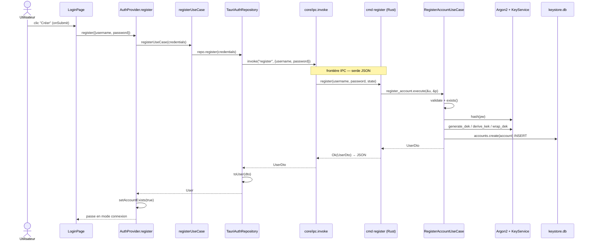
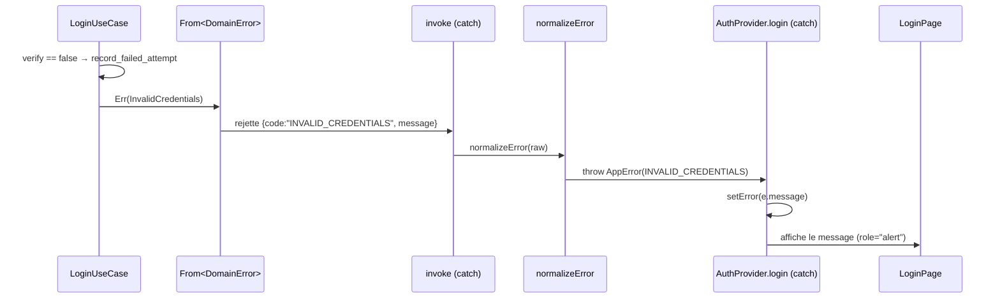

# 08 — Flux complet de bout en bout

## Ce que tu vas apprendre

- Suivre le **voyage exact d'une donnée** depuis un clic dans React jusqu'à la base SQLite chiffrée, et le retour.
- La trace numérotée et complète de l'**inscription** (`register`, premier lancement).
- La trace numérotée et complète de la **connexion** (`login`), de la dérivation des clés à l'ouverture du coffre.
- Le **chemin d'erreur** (mauvais mot de passe) et le cas de la **session expirée**.
- Comment le **test d'intégration** Rust sert de preuve exécutable que tout ce flux fonctionne (et que le coffre est bien illisible sans clé).

> 🧭 **Prérequis** : ce chapitre est une synthèse. Il recolle tous les morceaux vus avant. Lis d'abord [le backend couche par couche](./04-backend-rust-couche-par-couche.md), [la sécurité et le chiffrement](./05-securite-et-chiffrement.md), [le pont IPC](./06-le-pont-ipc.md) et [le frontend couche par couche](./07-frontend-react-couche-par-couche.md). Ici on ne réexplique pas chaque concept, on montre l'enchaînement.

---

## Pourquoi ce chapitre

Jusqu'ici tu as vu chaque couche **isolément** : le domaine, l'application, l'infrastructure, l'IPC, les features React. Le problème classique du débutant, c'est qu'il comprend chaque pièce mais n'arrive pas à se représenter le **tout**. Ce chapitre te donne la **carte mentale** : une seule action utilisateur, et on la suit étape par étape, en nommant à chaque fois **le fichier et la fonction** concernés.

On va tracer deux scénarios réels :

- **Trace A — Inscription** : le tout premier lancement, l'utilisateur crée son compte.
- **Trace B — Connexion** : l'utilisateur revient et déverrouille son coffre.

Une convention pour toute la suite : chaque étape est numérotée et pointe vers `fichier → fonction`. Suis les liens si tu veux rouvrir le code.

---

## Rappel : la frontière (où "saute" la donnée)

Il y a **un seul endroit** où le monde JavaScript et le monde Rust se parlent : l'appel `invoke`. Tout ce qui est avant est du React/TypeScript dans la WebView ; tout ce qui est après est du Rust natif.

> En React, tu fais souvent `fetch('/api/login')` vers un serveur HTTP. Ici c'est la même idée, sauf que le "serveur" est ton propre binaire Rust qui tourne dans le même process, et le transport n'est pas HTTP mais l'IPC de Tauri. `invoke('login', {...})` ≈ `fetch`, et une commande Rust `#[tauri::command]` ≈ une route d'API.

La seule porte autorisée est [src/core/ipc.ts](../../src/core/ipc.ts) :

```ts
export async function invoke<T>(
  command: string,
  args?: Record<string, unknown>,
): Promise<T> {
  try {
    return await tauriInvoke<T>(command, args);
  } catch (raw) {
    throw normalizeError(raw);
  }
}
```

Retiens trois choses :

- C'est le **seul** module qui a le droit d'importer `@tauri-apps/api` (règle ESLint vue au chapitre 07). Tout le reste passe par un repository.
- L'aller (`args`) et le retour (`T`) sont des objets JS sérialisés en JSON puis désérialisés par **serde** côté Rust (et inversement).
- En cas d'erreur, le `catch` transforme l'objet brut rejeté par Tauri en `AppError` typée via `normalizeError`. Garde ça en tête, on s'en sert dans le chemin d'erreur plus bas.

---

## TRACE A — Inscription (`register`, premier lancement)

**Contexte** : l'app vient de démarrer pour la première fois. Le `AuthProvider` a déjà demandé au backend s'il existe un compte (étape 0 ci-dessous) ; la réponse est `false`, donc `LoginPage` s'affiche en **mode inscription**.

### Étape 0 — Au démarrage : "existe-t-il déjà un compte ?"

[src/features/auth/presentation/providers/auth-provider.tsx](../../src/features/auth/presentation/providers/auth-provider.tsx) → `useEffect`

```tsx
useEffect(() => {
  let cancelled = false;
  accountExistsUseCase()
    .then((exists) => {
      if (!cancelled) setAccountExists(exists);
    })
    .catch(() => {
      if (!cancelled) setAccountExists(false);
    });
  return () => {
    cancelled = true;
  };
}, []);
```

Ce `useEffect` se lance une fois au montage. Il appelle la commande `account_exists`. Tant que la réponse n'est pas arrivée, `accountExists` vaut `null` et `App.tsx` affiche un écran "chargement". Quand elle arrive `false`, on bascule en mode inscription.

> Le drapeau `cancelled` est le pattern React classique pour éviter de poser un state sur un composant démonté (si l'utilisateur ferme avant la réponse).

### Le voyage, étape par étape

1. **L'utilisateur tape son identifiant/mot de passe et clique "Créer"** — [src/features/auth/presentation/components/login-page.tsx](../../src/features/auth/presentation/components/login-page.tsx) → `onSubmit`. Comme `accountExists === false`, `isRegister` est `true`, donc :

```tsx
const onSubmit = (e: FormEvent) => {
  e.preventDefault();
  const credentials = { username, password };
  if (isRegister) {
    void register(credentials);
  } else {
    void login(credentials);
  }
};
```

2. **Le hook expose `register`** — [src/features/auth/presentation/hooks/use-auth.ts](../../src/features/auth/presentation/hooks/use-auth.ts) → `useAuth()`. Ce hook lit simplement le `AuthContext` ; le vrai `register` vient du provider.

3. **Le provider orchestre l'appel** — [src/features/auth/presentation/providers/auth-provider.tsx](../../src/features/auth/presentation/providers/auth-provider.tsx) → `register`. Il met `isSubmitting` à `true`, vide l'erreur, appelle le use-case, et **bascule le portail** si ça réussit :

```tsx
const register = useCallback(async (credentials: Credentials) => {
  setIsSubmitting(true);
  setError(null);
  try {
    await registerUseCase(credentials);
    // Account created — switch the gate to the login screen.
    setAccountExists(true);
  } catch (e) {
    setError(isAppError(e) ? e.message : "Échec de la création du compte");
  } finally {
    setIsSubmitting(false);
  }
}, []);
```

> Note bien : après une inscription réussie on **ne connecte pas** automatiquement l'utilisateur. On passe `accountExists` à `true`, ce qui fait réafficher `LoginPage` mais cette fois en **mode connexion**. L'utilisateur doit donc saisir à nouveau son mot de passe pour ouvrir le coffre. C'est volontaire : le coffre ne s'ouvre qu'au login.

4. **Le use-case (domaine front) délègue au repository** — [src/features/auth/domain/use-cases/register.ts](../../src/features/auth/domain/use-cases/register.ts) → `makeRegisterUseCase`. Il est volontairement trivial : le domaine ne connaît pas Tauri, il ne connaît qu'une interface `AuthRepository`.

```ts
export function makeRegisterUseCase(repo: AuthRepository): RegisterUseCase {
  return (credentials) => repo.register(credentials);
}
```

> `repo` est injecté au "composition root" de la feature (en haut du provider : `const repo = new TauriAuthRepository()`). C'est l'inversion de dépendance vue au chapitre 03 : le use-case dépend de l'**interface**, pas de l'implémentation Tauri.

5. **Le repository appelle l'IPC** — [src/features/auth/data/repositories/tauri-auth.repository.ts](../../src/features/auth/data/repositories/tauri-auth.repository.ts) → `register`. C'est ici qu'on traverse vers `invoke` et qu'on **traduit** le DTO de retour en entité du domaine :

```ts
async register({ username, password }: Credentials): Promise<User> {
  const dto = await invoke<UserDto>(COMMANDS.register, {
    username,
    password,
  });
  return toUser(dto);
}
```

`COMMANDS.register` vaut `"register"` — [src/core/config.ts](../../src/core/config.ts) centralise tous les noms de commandes pour qu'ils restent synchronisés avec les `#[tauri::command]` Rust.

6. **La frontière IPC** — [src/core/ipc.ts](../../src/core/ipc.ts) → `invoke`. Les arguments `{ username, password }` sont sérialisés en JSON, traversent le pont, et serde les désérialise côté Rust dans les paramètres `username: String, password: String`.

7. **La commande Rust reçoit l'appel** — [src-tauri/src/presentation/commands/auth.rs](../../src-tauri/src/presentation/commands/auth.rs) → `register`. C'est une frontière **fine** : elle ne fait que déléguer au use-case applicatif et convertir l'erreur.

```rust
#[tauri::command]
pub async fn register(
    username: String,
    password: String,
    state: State<'_, AppState>,
) -> Result<UserDto, AppError> {
    Ok(state.register_account.execute(&username, &password).await?)
}
```

> Décodage pour un dev React :
> - `#[tauri::command]` ≈ un décorateur qui enregistre la fonction comme route IPC.
> - `State<'_, AppState>` ≈ une dépendance injectée : Tauri te donne accès à l'état partagé construit au démarrage (le `build_state` du chapitre 04).
> - `Result<UserDto, AppError>` ≈ "soit je renvoie un UserDto (résolution de la Promise JS), soit une AppError (rejet de la Promise)".
> - Le `?` après `.await` ≈ un `await` qui propagerait automatiquement le throw : si le use-case renvoie une erreur, on sort tout de suite, et le `From<DomainError>` convertit `DomainError` en `AppError`.

8. **Le use-case applicatif fait le vrai travail** — [src-tauri/src/application/use_cases/register_account.rs](../../src-tauri/src/application/use_cases/register_account.rs) → `RegisterAccountUseCase::execute`. C'est le cœur métier. Décortiquons-le.

```rust
pub async fn execute(&self, username: &str, password: &str) -> Result<UserDto, DomainError> {
    let username = username.trim();
    validate_username(username)?;
    validate_password(password)?;

    // Single-owner device: refuse a second account.
    if self.accounts.exists().await? {
        return Err(DomainError::AccountAlreadyExists);
    }

    // Password lives in a buffer that is zeroized on every exit path.
    let pw = Zeroizing::new(password.as_bytes().to_vec());

    let password_hash = self.hasher.hash(pw.as_slice())?;

    // Generate the DEK, derive the password-KEK, wrap the DEK.
    let dek = self.keys.generate_dek()?;
    let kek_salt = self.keys.generate_salt()?;
    let kek = self.keys.derive_kek(pw.as_slice(), &kek_salt)?;
    let wrapped = self.keys.wrap_dek(dek.as_slice(), kek.as_slice())?;
    // ... construit l'Account puis self.accounts.create(&account).await?
```

Ligne par ligne :

- `8.1` **Validation** : `validate_username` / `validate_password` (3-64 et 8-1024 caractères). En cas d'échec → `DomainError::Validation`.
- `8.2` **Unicité** : `self.accounts.exists()` interroge le keystore. C'est un appareil **mono-propriétaire** : si un compte existe déjà → `DomainError::AccountAlreadyExists`.
- `8.3` **Buffer effaçable** : `Zeroizing::new(...)` met le mot de passe dans une zone mémoire qui sera **écrasée à zéro** dès qu'on en sort (chapitre 05). On ne se promène jamais avec le mot de passe en clair sans filet.
- `8.4` **Hash du mot de passe** : `self.hasher.hash(...)` → Argon2id, produit une chaîne PHC. C'est ce hash qui sera stocké, jamais le mot de passe.
- `8.5` **Envelope encryption** : on génère un **DEK** aléatoire (la clé qui chiffre le coffre), un **sel** de 16 octets, on **dérive le KEK** depuis le mot de passe + sel (Argon2id), puis on **wrappe le DEK** (chiffrement XChaCha20-Poly1305 du DEK par le KEK). Le DEK en clair ne sera jamais stocké : seule sa version wrappée part sur disque.
- `8.6` **Persistance** : on construit un `Account` (id UUID v7, hash, matériel de clé, compteurs à zéro) et on appelle `self.accounts.create(&account)`.

9. **Le hash Argon2id** — [src-tauri/src/infrastructure/crypto/argon2_hasher.rs](../../src-tauri/src/infrastructure/crypto/argon2_hasher.rs) → `Argon2PasswordHasher::hash`. Génère un sel aléatoire de 16 octets et renvoie une chaîne PHC (`$argon2id$...`).

10. **La génération et le wrap des clés** — [src-tauri/src/infrastructure/crypto/key_service.rs](../../src-tauri/src/infrastructure/crypto/key_service.rs) → `generate_dek`, `generate_salt`, `derive_kek`, `wrap_dek`. Le `derive_kek` lance Argon2id avec une sortie de 32 octets (= longueur du KEK) ; `wrap_dek` chiffre le DEK avec XChaCha20-Poly1305 et un nonce aléatoire de 24 octets.

11. **L'INSERT dans le keystore (en clair)** — [src-tauri/src/infrastructure/persistence/account_repository.rs](../../src-tauri/src/infrastructure/persistence/account_repository.rs) → `LibsqlAccountRepository::create`. On écrit dans la table `account` du **keystore.db** : `id, username, password_hash, wrapped_dek, kek_salt, dek_nonce, ...`.

> ⚠️ Le keystore est **en clair** mais ne contient **aucun secret exploitable** : ni mot de passe (juste son hash Argon2id), ni DEK (juste sa version wrappée, inutilisable sans le mot de passe). Le coffre `vault.db`, lui, est chiffré et n'est même pas encore créé à ce stade : il ne le sera qu'au premier `login`, quand le DEK sera déballé.

12. **Retour : Account → UserDto** — `register_account.rs` finit par `Ok(UserDto::from(account.to_user()))`. Le `UserDto` ne contient **que** `id`, `username`, `createdAt`, `updatedAt` — **jamais** le hash ni le matériel de clé. C'est la règle d'or : les secrets ne franchissent jamais la frontière vers le front.

13. **Sérialisation JSON et remontée** — serde sérialise le `UserDto` en camelCase, le pont IPC le repasse à la WebView, et la Promise de `invoke` se résout côté JS.

14. **Mapper DTO → entité** — [src/features/auth/data/mappers/user.mapper.ts](../../src/features/auth/data/mappers/user.mapper.ts) → `toUser`. Le `UserDto` brut devient une entité `User` propre du domaine front.

15. **Le portail bascule** — retour dans `AuthProvider.register` : `setAccountExists(true)`. `App.tsx` réévalue, et comme on n'est pas authentifié, il affiche `LoginPage` **en mode connexion**. L'inscription est terminée.

### Diagramme de séquence — Inscription



---

## TRACE B — Connexion (`login`)

**Contexte** : un compte existe (`accountExists === true`), `LoginPage` est en mode connexion. C'est ici que le coffre s'ouvre vraiment et qu'une session démarre.

### Le voyage, étape par étape

1. **Clic "Se connecter"** — [src/features/auth/presentation/components/login-page.tsx](../../src/features/auth/presentation/components/login-page.tsx) → `onSubmit`. Cette fois `isRegister` est `false`, donc on appelle `void login(credentials)`.

2. **Le provider orchestre** — [src/features/auth/presentation/providers/auth-provider.tsx](../../src/features/auth/presentation/providers/auth-provider.tsx) → `login`. C'est lui qui **stocke la session** une fois reçue :

```tsx
const login = useCallback(async (credentials: Credentials) => {
  setIsSubmitting(true);
  setError(null);
  try {
    const session = await loginUseCase(credentials);
    tokenRef.current = session.token;
    setExpiresAt(session.expiresAt);
    setUser(session.user);
    setStatus("authenticated");
  } catch (e) {
    setError(isAppError(e) ? e.message : "Échec de la connexion");
  } finally {
    setIsSubmitting(false);
  }
}, []);
```

> Détail de sécurité capital : le **token est rangé dans un `useRef`** (`tokenRef.current`), pas dans un `useState`. Un `useRef` est une simple boîte en mémoire qui ne déclenche pas de re-render et **ne fuite pas** dans le rendu/les props. Et surtout : il n'est **jamais** écrit dans le `localStorage` ni ailleurs. Au redémarrage de l'app, tout est perdu → l'utilisateur doit se reconnecter (TTL absolu, session en mémoire seulement, chapitre 05).

3. **Use-case front** — [src/features/auth/domain/use-cases/login.ts](../../src/features/auth/domain/use-cases/login.ts) → `makeLoginUseCase`. Délègue à `repo.login(credentials)`.

4. **Repository → IPC + mapper** — [src/features/auth/data/repositories/tauri-auth.repository.ts](../../src/features/auth/data/repositories/tauri-auth.repository.ts) → `login`. Il appelle `invoke<LoginResponseDto>(COMMANDS.login, ...)` puis `toAuthSession(dto)`.

```ts
async login({ username, password }: Credentials): Promise<AuthSession> {
  const dto = await invoke<LoginResponseDto>(COMMANDS.login, {
    username,
    password,
  });
  return toAuthSession(dto);
}
```

5. **Frontière IPC** — [src/core/ipc.ts](../../src/core/ipc.ts) → `invoke`. Sérialisation des arguments, traversée du pont.

6. **Commande Rust** — [src-tauri/src/presentation/commands/auth.rs](../../src-tauri/src/presentation/commands/auth.rs) → `login`. Frontière fine, délègue à `state.login.execute(...)`.

```rust
#[tauri::command]
pub async fn login(
    username: String,
    password: String,
    state: State<'_, AppState>,
) -> Result<LoginResultDto, AppError> {
    Ok(state.login.execute(&username, &password).await?)
}
```

7. **Le use-case applicatif** — [src-tauri/src/application/use_cases/login.rs](../../src-tauri/src/application/use_cases/login.rs) → `LoginUseCase::execute`. C'est la séquence la plus importante de tout le projet. Suis-la dans l'ordre :

```rust
let Some(account) = self.accounts.find_by_username(username).await? else {
    // Equalize timing against username enumeration (hash, discard).
    let _ = self.hasher.hash(pw.as_slice());
    return Err(DomainError::InvalidCredentials);
};

// Locked out?
if let Some(locked_until) = account.locked_until {
    if locked_until > now {
        return Err(DomainError::AccountLocked {
            retry_after_ms: locked_until - now,
        });
    }
}

// Verify the password.
if !self.hasher.verify(pw.as_slice(), &account.password_hash)? {
    let attempts = account.failed_attempts + 1;
    let locked_until = if attempts >= self.policy.max_attempts {
        Some(now + self.policy.lockout_ms)
    } else {
        None
    };
    self.accounts
        .record_failed_attempt(&account.id, attempts, locked_until, now)
        .await?;
    return Err(DomainError::InvalidCredentials);
}

// Success: derive the KEK, unwrap the DEK, unlock the vault.
let kek = self.keys.derive_kek(pw.as_slice(), &account.key_material.kek_salt)?;
let wrapped = WrappedKey { ciphertext: ..., nonce: ... };
let dek = self.keys.unwrap_dek(&wrapped, kek.as_slice())?;
self.vault.open(dek.as_slice()).await?;

// Clear lockout counters and open the session.
self.accounts.reset_failed_attempts(&account.id, now).await?;
let token = self.tokens.generate()?;
let expires_at = now + self.policy.session_ttl_ms;
self.sessions.insert(Session { token: token.clone(), expires_at });
```

Étape par étape :

- `7.1` **`find_by_username`** — [account_repository.rs](../../src-tauri/src/infrastructure/persistence/account_repository.rs) → `find_by_username`. Lit le compte dans le keystore.
- `7.2` **Anti-énumération** — si le username n'existe pas, on **hache quand même** un mot de passe puis on **jette** le résultat (`let _ = ...`), pour que la réponse prenne le même temps qu'avec un username valide. Puis `InvalidCredentials`. Un attaquant ne peut donc pas deviner les usernames existants en chronométrant.
- `7.3` **Verrou actif ?** — si `locked_until` est dans le futur → `AccountLocked { retry_after_ms }`. (Anti-bruteforce.)
- `7.4` **Vérif du mot de passe** — `self.hasher.verify(...)` ([argon2_hasher.rs](../../src-tauri/src/infrastructure/crypto/argon2_hasher.rs) → `verify`). Si **faux** : on incrémente le compteur d'échecs ; si on atteint `max_attempts`, on pose un `locked_until` ; on persiste via `record_failed_attempt` ; et on renvoie `InvalidCredentials`. (C'est le chemin d'erreur, détaillé plus bas.)
- `7.5` **Dérivation + déballage** — si **vrai** : `derive_kek` recalcule le KEK depuis le mot de passe + le sel stocké, puis `unwrap_dek` ([key_service.rs](../../src-tauri/src/infrastructure/crypto/key_service.rs) → `unwrap_dek`) **déchiffre le DEK**. Si le mot de passe était bon, le DEK ressort intact ; sinon le déchiffrement AEAD échoue (le tag d'authentification ne colle pas).
- `7.6` **Ouverture du coffre** — `self.vault.open(dek)` ([vault.rs](../../src-tauri/src/infrastructure/persistence/vault.rs) → `open`). Ouvre `vault.db` chiffré avec le DEK comme clé AES-256-CBC (chiffrement au repos de libSQL), lance les migrations, et garde la connexion vivante en mémoire (`Mutex<Option<OpenVault>>`). Tant que le coffre est ouvert, les repositories de profils peuvent l'utiliser.
- `7.7` **Réinitialisation des compteurs** — `reset_failed_attempts` remet `failed_attempts = 0` et `locked_until = NULL` (la connexion a réussi).
- `7.8` **Génération du token + session** — `tokens.generate()` crée un token opaque ; `expires_at = now + session_ttl_ms` (15 min) ; `sessions.insert(...)` range la session **en mémoire** (jamais sur disque).
- `7.9` **Construction du DTO** — `LoginResultDto { token, expires_at, user }`.

8. **Le DTO de retour** — [src-tauri/src/application/dto/login_result_dto.rs](../../src-tauri/src/application/dto/login_result_dto.rs).

```rust
#[derive(Debug, Clone, Serialize)]
#[serde(rename_all = "camelCase")]
pub struct LoginResultDto {
    pub token: String,
    pub expires_at: i64,
    pub user: UserDto,
}
```

> `#[serde(rename_all = "camelCase")]` est la "couture" entre les deux mondes : `expires_at` (snake_case Rust) devient `expiresAt` (camelCase JS) au passage de la frontière. C'est exactement la forme attendue par `LoginResponseDto` côté front.

9. **Remontée et mapper** — le JSON revient, et [src/features/auth/data/mappers/auth.mapper.ts](../../src/features/auth/data/mappers/auth.mapper.ts) → `toAuthSession` transforme le DTO en entité `AuthSession` :

```ts
export function toAuthSession(dto: LoginResponseDto): AuthSession {
  return {
    token: dto.token,
    expiresAt: dto.expiresAt,
    user: toUser(dto.user),
  };
}
```

10. **Stockage en mémoire + statut** — retour dans `AuthProvider.login` : `tokenRef.current = session.token`, `setExpiresAt`, `setUser`, `setStatus("authenticated")`.

11. **Le minuteur de session démarre** — [src/features/auth/presentation/hooks/use-session-timer.ts](../../src/features/auth/presentation/hooks/use-session-timer.ts) → `useSessionTimer`. Le provider l'appelle avec `useSessionTimer(expiresAt, clearSession)`. Comme `expiresAt` n'est plus `null`, il déclenche un `setInterval` qui recalcule le temps restant chaque seconde à partir de l'**échéance absolue** (donc une mise en veille de l'OS ne donne jamais de temps gratuit).

12. **Le portail rend l'app** — [src/App.tsx](../../src/App.tsx). Comme `isAuthenticated` est `true`, il monte `ProfileProvider` (la feature profil) qui enveloppe `Home`. L'utilisateur est dans l'app.

```tsx
if (isAuthenticated) {
  return (
    <ProfileProvider onSessionExpired={logout}>
      <Home />
    </ProfileProvider>
  );
}
```

### Diagramme de séquence — Connexion

```mermaid
sequenceDiagram
    actor U as Utilisateur
    participant LP as LoginPage
    participant H as useAuth
    participant AP as AuthProvider.login
    participant UC as loginUseCase
    participant Repo as TauriAuthRepository
    participant IPC as core/ipc.invoke
    participant Cmd as cmd login (Rust)
    participant App as LoginUseCase.execute
    participant Crypto as KeyService / Argon2
    participant DB as keystore.db + vault.db

    U->>LP: clic "Se connecter"
    LP->>H: useAuth().login
    H->>AP: login({username, password})
    AP->>UC: loginUseCase(credentials)
    UC->>Repo: repo.login(credentials)
    Repo->>IPC: invoke("login", {username, password})
    Note over IPC,Cmd: frontière IPC — serde JSON
    IPC->>Cmd: login(username, password, state)
    Cmd->>App: state.login.execute(&u, &p)
    App->>DB: find_by_username
    App->>Crypto: verify(password, hash)
    App->>Crypto: derive_kek + unwrap_dek
    App->>DB: vault.open(dek) — ouvre vault.db chiffré
    App->>DB: reset_failed_attempts
    App->>App: token.generate + sessions.insert (mémoire)
    App-->>Cmd: LoginResultDto{token, expiresAt, user}
    Cmd-->>IPC: Ok(...) → JSON camelCase
    IPC-->>Repo: LoginResponseDto
    Repo->>Repo: toAuthSession(dto)
    Repo-->>AP: AuthSession
    AP->>AP: tokenRef = token; setUser; status="authenticated"
    AP->>AP: useSessionTimer démarre
    AP-->>LP: App rend ProfileProvider + Home
```

---

## Chemin d'erreur — mauvais mot de passe

Reprenons la trace B à l'étape `7.4`, mais cette fois `verify` renvoie `false`.

1. **`verify` renvoie `false`** — [argon2_hasher.rs](../../src-tauri/src/infrastructure/crypto/argon2_hasher.rs) → `verify`. Argon2 mappe `PhError::Password` sur `Ok(false)` (mot de passe faux mais hash valide).
2. **Enregistrement de l'échec** — [login.rs](../../src-tauri/src/application/use_cases/login.rs) → `execute` : on calcule `attempts = failed_attempts + 1`, et si `attempts >= max_attempts` on pose `locked_until = now + lockout_ms`. Puis `record_failed_attempt(...)` persiste ça dans le keystore.
3. **Erreur de domaine** — `return Err(DomainError::InvalidCredentials)`. (Si le compte vient juste de franchir le seuil, le **prochain** login renverra `AccountLocked`.)
4. **Mapping vers AppError** — [src-tauri/src/presentation/commands/error.rs](../../src-tauri/src/presentation/commands/error.rs) → `From<DomainError>`. `InvalidCredentials` devient `AppError { code: "INVALID_CREDENTIALS", message: "Identifiants invalides" }`.

```rust
DomainError::InvalidCredentials => {
    AppError::new("INVALID_CREDENTIALS", "Identifiants invalides")
}
```

> ⚠️ Remarque les détails internes écrasés : `Storage`, `Hashing`, `Crypto`, `Token` deviennent tous `AppError::new("INTERNAL", "Erreur interne")`. Aucune fuite de message SQL ou crypto vers le front.

5. **La commande renvoie `Err`** — comme `Result<_, AppError>` est sérialisable, Tauri **rejette** la Promise côté JS avec cet objet `{ code, message }`.
6. **`invoke` normalise** — [src/core/ipc.ts](../../src/core/ipc.ts) → `invoke` attrape le rejet et appelle `normalizeError`.
7. **`normalizeError` reconstruit une `AppError` typée** — [src/core/errors.ts](../../src/core/errors.ts) → `normalizeError`. Comme `"INVALID_CREDENTIALS"` est un code connu, on obtient `new AppError("INVALID_CREDENTIALS", "Identifiants invalides")`.
8. **Le provider affiche le message** — [auth-provider.tsx](../../src/features/auth/presentation/providers/auth-provider.tsx) → le `catch` de `login` : `setError(isAppError(e) ? e.message : "Échec de la connexion")`.
9. **L'UI montre l'erreur** — [login-page.tsx](../../src/features/auth/presentation/components/login-page.tsx) affiche `<p role="alert">{error}</p>`. Dès que l'utilisateur retape un caractère, `clearError()` efface le message.



---

## Cas de la session expirée

Quand le TTL absolu de 15 min est atteint (ou que l'utilisateur clique "déconnexion"), voici l'enchaînement :

1. **Le minuteur passe l'échéance** — [use-session-timer.ts](../../src/features/auth/presentation/hooks/use-session-timer.ts) → `tick`. Quand `expiresAt - Date.now() <= 0`, il appelle `onExpire()`.
2. **`onExpire` = `clearSession`** — [auth-provider.tsx](../../src/features/auth/presentation/providers/auth-provider.tsx) → `clearSession`. Il efface tout l'état local et tente une invalidation côté serveur :

```tsx
const clearSession = useCallback(() => {
  const token = tokenRef.current;
  tokenRef.current = null;
  setExpiresAt(null);
  setUser(null);
  setStatus("unauthenticated");
  if (token) {
    // Best-effort server-side invalidation + vault lock.
    void logoutUseCase(token).catch(() => undefined);
  }
}, []);
```

3. **`logout` côté Rust ferme le coffre** — [auth.rs](../../src-tauri/src/presentation/commands/auth.rs) → `logout` appelle le use-case qui retire la session du `SessionStore` **et** appelle `vault.close()` ([vault.rs](../../src-tauri/src/infrastructure/persistence/vault.rs) → `close`), qui remet l'état du coffre à `None`. La connexion chiffrée est **droppée**, donc le DEK en mémoire disparaît.
4. **Le portail revient au login** — `status === "unauthenticated"` → `App.tsx` réaffiche `LoginPage`. Comme la session vit uniquement en mémoire, toute opération sur les profils est désormais refusée tant qu'on ne s'est pas reconnecté.

> ⚠️ "Best-effort" : même si le `logout` IPC échoue, le front a déjà oublié le token et l'état est verrouillé côté UI. La sécurité ne dépend pas de la réussite de cet appel.

---

## La preuve exécutable : le test d'intégration

Tout ce que tu viens de lire est vérifié automatiquement par un test qui câble les **vrais** use-cases (Argon2id + envelope encryption + libSQL réel) sur des bases temporaires — [src-tauri/src/integration_tests.rs](../../src-tauri/src/integration_tests.rs) → `full_auth_flow_and_encryption`.

Ce qu'il prouve, dans l'ordre :

1. **Premier lancement** : `account_exists` renvoie `false`.
2. **Inscription** : `register_account.execute("alice", "password123")` réussit, et ensuite `account_exists` renvoie `true`.
3. **Mono-propriétaire** : une seconde inscription (`"bob"`) échoue avec `AccountAlreadyExists`.
4. **Mauvais mot de passe** : `login` avec `"wrong-password"` renvoie `InvalidCredentials`.
5. **Connexion correcte** : `login` avec le bon mot de passe renvoie un token non vide et le bon user → le coffre est ouvert.
6. **Cycle de session** : `check_session(token)` est `valid`, puis après `logout` il devient invalide.
7. **Le coffre est réellement chiffré** — c'est l'assertion la plus parlante :

```rust
let plain = open_plain_db(&vault_path).await.unwrap();
let conn = plain.connect().unwrap();
let readable = match conn.query("SELECT name FROM sqlite_master", ()).await {
    Ok(mut rows) => rows.next().await.is_ok(),
    Err(_) => false,
};
assert!(!readable, "vault must be unreadable without the key");
```

On ouvre `vault.db` **sans** la clé et on tente de lire son schéma : c'est **illisible**. C'est la garantie "chiffré au repos" : sans le mot de passe (donc sans le KEK, donc sans le DEK déballé), le fichier sur disque ne dit rien.

8. **Anti-bruteforce** : après `max_attempts` échecs, même le **bon** mot de passe est rejeté avec `AccountLocked`.

> Lance-le toi-même depuis `src-tauri/` : `cargo test full_auth_flow_and_encryption`. C'est la meilleure façon de "voir" tout le flux backend tourner sans cliquer dans l'UI.

---

## La carte mentale, en une phrase

Le front ne fait jamais de crypto ni de SQL : il **demande** (`invoke`) et **affiche**. Tout le secret (hash, KEK, DEK, session) vit côté Rust, dans une seule chaîne `commande → use-case → infrastructure`, et seuls des **DTO sans secret** repassent la frontière. Les deux côtés partagent la même forme (Clean Architecture), si bien qu'ajouter une feature, c'est rejouer exactement ce voyage — ce qu'on fait au chapitre suivant.

---

## Étape suivante

Maintenant que tu as la carte complète, on passe à la pratique : [09 — Répliquer une feature](./09-repliquer-une-feature.md) te donne la recette pas-à-pas pour ajouter une fonctionnalité de zéro, des deux côtés, en suivant exactement les couches et le voyage décrits ici.
