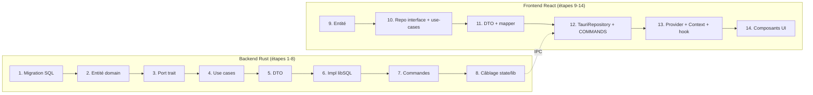

# 09 — Répliquer une feature de zéro (la recette)

## Ce que tu vas apprendre

- Une **checklist ordonnée** pour ajouter une feature complète des deux côtés, du SQL chiffré jusqu'au composant React.
- Comment la feature **`profile`** (CRUD complet dans le coffre chiffré, rattaché au compte) sert de **modèle copiable**.
- Quels fichiers **créer** et quels fichiers **éditer** (le câblage : migrations, `AppState`, `build_state`, `generate_handler!`, `COMMANDS`).
- Pourquoi le repository d'infrastructure lit la **connexion vive** du coffre déverrouillé.
- Un mini-exercice guidé : esquisser l'entité **`Presence`** (date, mode de déplacement, `profile_id`) en réutilisant exactement ce pattern.

> 🧭 **Prérequis** : avoir lu [03-clean-architecture.md](./03-clean-architecture.md) (règle de dépendance, ports, composition root), [04-backend-rust-couche-par-couche.md](./04-backend-rust-couche-par-couche.md) (les 4 couches Rust), [06-le-pont-ipc.md](./06-le-pont-ipc.md) (le pont `invoke` ↔ `#[tauri::command]`) et [07-frontend-react-couche-par-couche.md](./07-frontend-react-couche-par-couche.md) (les 3 couches React).

---

Ce chapitre n'introduit aucun concept nouveau. C'est une **recette de cuisine** : tu suis la liste dans l'ordre, et à chaque étape tu copies le morceau correspondant de la feature `profile`. À la fin, ta nouvelle feature est branchée et fonctionne.

L'ordre suit la **règle de dépendance** (de l'intérieur vers l'extérieur). On part du domaine (le cœur, qui ne connaît rien), puis on remonte vers l'infrastructure et la présentation. On fait d'abord tout le **backend Rust**, puis tout le **frontend React**, et on finit par le **câblage** et la **validation**.



---

## Partie A — Backend Rust

### Étape 1 — La migration SQL (dans le COFFRE chiffré)

Les données métier confidentielles vivent dans le **coffre** (`vault.db`), chiffré au repos. Une table métier se crée donc dans `src-tauri/migrations/vault/`, jamais dans le keystore (qui, lui, reste en clair pour les seules infos d'authentification).

Voici le modèle, la migration qui crée la table `profile` :

[src-tauri/migrations/vault/0002_add_profiles.sql](../../src-tauri/migrations/vault/0002_add_profiles.sql)

```sql
-- Presence profiles (in the ENCRYPTED vault). One owner account may hold several
-- profiles; the active one is tracked in `vault_meta` under `active_profile_id`.
CREATE TABLE IF NOT EXISTS profile (
    id          TEXT PRIMARY KEY,          -- UUID v7
    first_name  TEXT NOT NULL,
    last_name   TEXT NOT NULL,
    enterprise  TEXT NOT NULL,
    poste       TEXT,                       -- optional
    created_at  INTEGER NOT NULL,           -- epoch ms
    updated_at  INTEGER NOT NULL            -- epoch ms
);

CREATE INDEX IF NOT EXISTS idx_profile_created_at ON profile(created_at);
```

Points de convention à reproduire :

- **`id TEXT PRIMARY KEY`** : on stocke un UUID v7 sous forme de chaîne (généré côté Rust avec `Uuid::now_v7()`).
- **`created_at` / `updated_at` en `INTEGER`** : ce sont des timestamps epoch en **millisecondes** (`i64` côté Rust), pas des dates SQL. La cohérence est importante : tout l'app raisonne en `i64`.
- **`CREATE TABLE IF NOT EXISTS`** : idempotent, par sécurité.
- Le champ optionnel (`poste`) n'a **pas** `NOT NULL` → il devient `Option<String>` côté Rust et `string | null` côté TS.

#### Le versionnage des migrations

Une migration n'est qu'une struct `{ version, sql }`. Le fichier est **embarqué dans le binaire** à la compilation via `include_str!` (la macro Rust qui lit un fichier texte et l'insère comme chaîne `&'static str` dans le binaire — donc aucune dépendance à un fichier sur disque au runtime).

Pour ajouter ta table, tu crées un fichier `000X_<nom>.sql` puis tu **ajoutes une entrée** dans la liste `VAULT_MIGRATIONS`, avec un numéro de version **strictement supérieur** au dernier :

[src-tauri/src/infrastructure/persistence/migrations.rs](../../src-tauri/src/infrastructure/persistence/migrations.rs)

```rust
pub const VAULT_MIGRATIONS: &[Migration] = &[
    Migration {
        version: 1,
        sql: include_str!("../../../migrations/vault/0001_init.sql"),
    },
    Migration {
        version: 2,
        sql: include_str!("../../../migrations/vault/0002_add_profiles.sql"),
    },
];
```

Comment elles s'exécutent : la fonction `run` tient une table `_migrations` qui mémorise la version max déjà appliquée, puis applique seulement les migrations dont `version > current`.

```rust
for m in migrations {
    if m.version > current {
        conn.execute_batch(m.sql).await.map_err(map_storage)?;
        conn.execute(
            "INSERT INTO _migrations (version, applied_at) \
             VALUES (?1, CAST(strftime('%s','now') AS INTEGER) * 1000)",
            libsql::params![m.version],
        )
        .await
        .map_err(map_storage)?;
    }
}
```

> ⚠️ Cette fonction `run` est appelée **sur la connexion du coffre, après son déverrouillage** (au login). Une migration du coffre ne s'exécute donc qu'une fois le DEK déchiffré et la base ouverte. C'est normal : on ne peut pas écrire dans une base chiffrée tant qu'on n'a pas la clé. (Le `?` après `await` est l'équivalent d'un `await` qui propagerait le `throw` : si la requête échoue, on quitte la fonction en renvoyant l'erreur.)

> **Règle d'or du versionnage** : ne **jamais** modifier un fichier de migration déjà livré. Les bases existantes l'ont déjà appliqué et ne le rejoueront pas. Pour changer le schéma, on ajoute **toujours** une nouvelle migration `000X+1`.

---

### Étape 2 — L'entité du domaine

Une entité du domaine est une **struct pure** : pas de `serde`, pas de SQL, pas de Tauri. Juste les données métier et leurs types. (Une struct Rust ≈ une `interface`/`type` TS, mais c'est aussi un vrai objet de données.)

[src-tauri/src/domain/entities/profile.rs](../../src-tauri/src/domain/entities/profile.rs)

```rust
/// A presence profile owned by the device account. One account may hold several
/// profiles; profiles live in the encrypted vault.
#[derive(Debug, Clone)]
pub struct Profile {
    pub id: String,
    pub first_name: String,
    pub last_name: String,
    pub enterprise: String,
    pub poste: Option<String>,
    pub created_at: i64,
    pub updated_at: i64,
}
```

- `#[derive(Debug, Clone)]` génère automatiquement l'affichage de debug et la copie profonde (`.clone()`). Pas de `Serialize` ici : le domaine **ne sait pas** qu'il existe un JSON ou un front. La sérialisation, c'est le job du DTO (étape 5).
- `Option<String>` = le champ peut être absent (≈ `string | null`).
- À placer dans `src-tauri/src/domain/entities/`, puis déclarer le module dans le `mod.rs` du dossier.

---

### Étape 3 — Le port (trait du domaine)

Le port est le **contrat de persistance**, défini dans le domaine. C'est l'inversion de dépendance : le domaine dit « j'ai besoin qu'on sache faire ça », sans savoir **comment** (libSQL, mémoire, peu importe).

> Un **`trait` Rust ≈ une `interface` TypeScript**. `#[async_trait]` est juste une astuce pour autoriser des méthodes `async` dans un trait (Rust ne le permet pas nativement dans ce contexte). `Send + Sync` signifie « cet objet peut traverser les threads en sécurité » — obligatoire parce que Tauri exécute les commandes sur plusieurs threads.

[src-tauri/src/domain/repositories/profile_repository.rs](../../src-tauri/src/domain/repositories/profile_repository.rs)

```rust
#[async_trait]
pub trait ProfileRepository: Send + Sync {
    async fn create(&self, profile: &Profile) -> Result<(), DomainError>;
    async fn list(&self) -> Result<Vec<Profile>, DomainError>;
    async fn find_by_id(&self, id: &str) -> Result<Option<Profile>, DomainError>;
    async fn update(&self, profile: &Profile) -> Result<(), DomainError>;
    async fn delete(&self, id: &str) -> Result<(), DomainError>;
    /// Id of the currently active profile, if one is set.
    async fn active_id(&self) -> Result<Option<String>, DomainError>;
    /// Set (or clear, with `None`) the active profile id.
    async fn set_active(&self, id: Option<&str>) -> Result<(), DomainError>;
}
```

Toutes les méthodes renvoient `Result<_, DomainError>` (≈ « soit ok, soit err », au lieu de `throw`). À placer dans `src-tauri/src/domain/repositories/`.

> Les deux méthodes `active_id` / `set_active` sont **spécifiques à profile** (notion de « profil actif »). Ta feature aura peut-être d'autres besoins métier ; le principe reste : c'est le domaine qui décide du contrat.

---

### Étape 4 — Les use cases (couche application)

Un use case = **une struct par action**, qui orchestre la logique métier (validation, règles), et reçoit ses dépendances **par le port** sous forme de `Arc<dyn Trait>`.

> `Arc<dyn ProfileRepository>` ≈ **une dépendance injectée typée par une interface**. `Arc` (Atomically Reference Counted) = un pointeur partagé thread-safe — comme une référence partagée qu'on peut cloner sans copier l'objet sous-jacent. Le use case ne connaît qu'une **interface**, jamais l'implémentation libSQL.

Le plus riche, la création (avec validation et règle « le premier profil devient actif ») :

[src-tauri/src/application/use_cases/create_profile.rs](../../src-tauri/src/application/use_cases/create_profile.rs)

```rust
pub struct CreateProfileUseCase {
    profiles: Arc<dyn ProfileRepository>,
    clock: Arc<dyn Clock>,
}

impl CreateProfileUseCase {
    pub fn new(profiles: Arc<dyn ProfileRepository>, clock: Arc<dyn Clock>) -> Self {
        Self { profiles, clock }
    }

    pub async fn execute(
        &self,
        first_name: &str,
        last_name: &str,
        enterprise: &str,
        poste: Option<&str>,
    ) -> Result<ProfileDto, DomainError> {
        let first_name = first_name.trim();
        // ... validation ...
        validate_required("firstName", first_name)?;

        let now = self.clock.now_ms();
        let profile = Profile {
            id: Uuid::now_v7().to_string(),
            first_name: first_name.to_string(),
            // ...
            created_at: now,
            updated_at: now,
        };

        self.profiles.create(&profile).await?;
        // The first profile becomes the active one.
        if self.profiles.active_id().await?.is_none() {
            self.profiles.set_active(Some(&profile.id)).await?;
        }

        Ok(ProfileDto::from(profile))
    }
}
```

À retenir pour copier le pattern :

- **L'heure vient d'un port `Clock`**, pas de `SystemTime` directement. Le domaine reste testable (on injecte une horloge fixe en test). Même principe que pour le repository : on injecte une interface.
- **La validation vit dans le use case** (`validate_required` / `normalize_optional`). Ces helpers sont marqués `pub(crate)` (visibles dans tout le crate) pour être réutilisés par `update_profile` — pas besoin de les recopier.
- Le use case **retourne déjà un `ProfileDto`** (pas l'entité brute) via `ProfileDto::from(profile)`. C'est la frontière de l'application.

Les autres use cases suivent exactement la même forme. Lecture pure (`list`) :

[src-tauri/src/application/use_cases/list_profiles.rs](../../src-tauri/src/application/use_cases/list_profiles.rs)

```rust
pub async fn execute(&self) -> Result<ProfilesDto, DomainError> {
    let profiles = self
        .profiles
        .list()
        .await?
        .into_iter()
        .map(ProfileDto::from)
        .collect();
    let active_profile_id = self.profiles.active_id().await?;
    Ok(ProfilesDto { profiles, active_profile_id })
}
```

Logique métier dans la suppression (réassigner le profil actif si on supprime l'actif) :

[src-tauri/src/application/use_cases/delete_profile.rs](../../src-tauri/src/application/use_cases/delete_profile.rs)

```rust
pub async fn execute(&self, id: &str) -> Result<(), DomainError> {
    let was_active = self.profiles.active_id().await?.as_deref() == Some(id);
    self.profiles.delete(id).await?;

    if was_active {
        let next = self.profiles.list().await?.first().map(|p| p.id.clone());
        self.profiles.set_active(next.as_deref()).await?;
    }
    Ok(())
}
```

Et `update_profile` (récupère, modifie, sauve — en **préservant `created_at`**) et `set_active_profile` (valide l'existence avant d'activer) suivent le même squelette : `struct` + `new(...)` + `async fn execute(...)`. Crée un fichier par action dans `src-tauri/src/application/use_cases/`.

---

### Étape 5 — Le DTO (frontière de l'application)

Le DTO est la **forme de l'entité envoyée au front**. C'est lui qui porte `serde` et la conversion en JSON `camelCase`.

[src-tauri/src/application/dto/profile_dto.rs](../../src-tauri/src/application/dto/profile_dto.rs)

```rust
#[derive(Debug, Clone, Serialize)]
#[serde(rename_all = "camelCase")]
pub struct ProfileDto {
    pub id: String,
    pub first_name: String,
    pub last_name: String,
    pub enterprise: String,
    pub poste: Option<String>,
    pub created_at: i64,
    pub updated_at: i64,
}

impl From<Profile> for ProfileDto {
    fn from(p: Profile) -> Self {
        Self {
            id: p.id,
            first_name: p.first_name,
            // ... champ par champ ...
            created_at: p.created_at,
            updated_at: p.updated_at,
        }
    }
}
```

- `#[serde(rename_all = "camelCase")]` : Rust nomme en `snake_case` (`first_name`), mais le JSON sort en `camelCase` (`firstName`). C'est **le contrat avec le front** — ton DTO TS (étape 11) devra correspondre exactement.
- `impl From<Profile> for ProfileDto` : ça crée `ProfileDto::from(profile)`. La conversion entité → DTO vit ici, dans la couche application, pas dans le domaine.
- `ProfilesDto` agrège la liste + l'id actif : c'est la forme renvoyée par `list_profiles`. Une feature peut avoir plusieurs DTO (un « singulier » et un « agrégat »).

---

### Étape 6 — L'implémentation d'infrastructure (libSQL)

C'est ici qu'on **implémente le port** avec libSQL. Le point clé spécifique au coffre chiffré : le repository **résout la connexion vive à chaque appel** via le `LibsqlVaultManager`.

[src-tauri/src/infrastructure/persistence/profile_repository.rs](../../src-tauri/src/infrastructure/persistence/profile_repository.rs)

```rust
/// Profile repository backed by the (unlocked) encrypted vault connection.
/// Resolves the live connection on every call so a locked vault yields
/// `DomainError::Unauthorized` rather than a stale handle.
pub struct LibsqlProfileRepository {
    vault: Arc<LibsqlVaultManager>,
}

impl LibsqlProfileRepository {
    pub fn new(vault: Arc<LibsqlVaultManager>) -> Self {
        Self { vault }
    }

    fn conn(&self) -> Result<Connection, DomainError> {
        self.vault.connection().ok_or(DomainError::Unauthorized)
    }
}
```

> **Pourquoi `conn()` à chaque appel ?** Le coffre n'est ouvert qu'après login et il se **referme** à l'expiration de session (15 min) ou au logout. Si on gardait une connexion en cache, on travaillerait sur un handle mort. Ici, `vault.connection()` renvoie `Option<Connection>` : `Some(...)` si le coffre est déverrouillé, `None` sinon. Le `.ok_or(DomainError::Unauthorized)` transforme le `None` en erreur métier propre (« non autorisé »), qui remontera au front comme `SESSION_EXPIRED`. **Toute** ta feature métier doit lire la connexion comme ça.

L'implémentation du trait, méthode par méthode (requêtes paramétrées, jamais de concaténation de valeurs) :

```rust
#[async_trait]
impl ProfileRepository for LibsqlProfileRepository {
    async fn create(&self, profile: &Profile) -> Result<(), DomainError> {
        self.conn()?
            .execute(
                "INSERT INTO profile \
                 (id, first_name, last_name, enterprise, poste, created_at, updated_at) \
                 VALUES (?1, ?2, ?3, ?4, ?5, ?6, ?7)",
                params![
                    profile.id.clone(),
                    profile.first_name.clone(),
                    // ...
                    profile.created_at,
                    profile.updated_at,
                ],
            )
            .await
            .map_err(map_storage)?;
        Ok(())
    }
    // list / find_by_id / update / delete / active_id / set_active ...
}
```

- **`params![...]` avec `?1, ?2, ...`** : requêtes paramétrées, c'est la protection anti-injection SQL. Ne jamais formater des **valeurs** dans la chaîne.
- **`.map_err(map_storage)?`** : on convertit l'erreur libSQL brute en `DomainError`. `map_storage` écrase les détails techniques (qui ne doivent jamais fuir) — voir le chapitre sécurité.
- Le helper `row_to_profile(row)` lit chaque colonne par index (`row.get(0)`, etc.) et reconstruit l'entité. L'ordre doit correspondre à `SELECT_COLUMNS`.
- `active_id` / `set_active` utilisent la table `vault_meta` (un simple `key`/`value`) avec un `ON CONFLICT ... DO UPDATE` (upsert). Pratique pour stocker une métadonnée du coffre sans table dédiée.

À placer dans `src-tauri/src/infrastructure/persistence/`.

---

### Étape 7 — Les commandes (couche présentation / frontière IPC)

Les commandes Tauri sont **fines** : elles ne font que lire les paramètres, appeler le use case via `state`, et renvoyer le DTO. Aucune logique métier ici.

[src-tauri/src/presentation/commands/profile.rs](../../src-tauri/src/presentation/commands/profile.rs)

```rust
/// Create a presence profile (requires an unlocked vault).
#[tauri::command]
pub async fn create_profile(
    first_name: String,
    last_name: String,
    enterprise: String,
    poste: Option<String>,
    state: State<'_, AppState>,
) -> Result<ProfileDto, AppError> {
    Ok(state
        .create_profile
        .execute(&first_name, &last_name, &enterprise, poste.as_deref())
        .await?)
}

/// List every profile plus the active profile id.
#[tauri::command]
pub async fn list_profiles(state: State<'_, AppState>) -> Result<ProfilesDto, AppError> {
    Ok(state.list_profiles.execute().await?)
}
```

- **`#[tauri::command]`** transforme la fonction en handler IPC appelable par `invoke` côté front. Le **nom de la fonction** = le **nom de la commande** côté JS (`create_profile`).
- **`state: State<'_, AppState>`** : Tauri injecte automatiquement l'état managé. C'est par là qu'on atteint les use cases. (≈ un contexte d'injection global, lecture seule.)
- Le retour est `Result<…, AppError>`, **pas** `DomainError`. La conversion `DomainError → AppError { code, message }` se fait via le `?` (un `impl From` existe), et c'est elle qui **écrase les détails sensibles** en `"INTERNAL"`. Le front ne voit que `{ code, message }`.
- Les noms de paramètres (`first_name`) arrivent en `camelCase` depuis JS (`firstName`) grâce à serde ; Tauri gère ce mapping.

À placer dans `src-tauri/src/presentation/commands/`.

---

### Étape 8 — Le CÂBLAGE (composition root)

Maintenant on **branche** tout. Trois endroits à éditer (rien à créer) :

**8a. Déclarer les use cases dans `AppState`** :

[src-tauri/src/presentation/state.rs](../../src-tauri/src/presentation/state.rs)

```rust
pub struct AppState {
    // ... auth use cases ...
    pub create_profile: CreateProfileUseCase,
    pub list_profiles: ListProfilesUseCase,
    pub update_profile: UpdateProfileUseCase,
    pub delete_profile: DeleteProfileUseCase,
    pub set_active_profile: SetActiveProfileUseCase,
    // ...
}
```

**8b. Construire les implémentations et injecter dans `build_state`** :

[src-tauri/src/lib.rs](../../src-tauri/src/lib.rs)

```rust
// Keep a concrete handle so the profile repository can read the live vault
// connection, while the auth use cases depend on the `VaultManager` port.
let vault_impl = Arc::new(LibsqlVaultManager::new(config.vault_path.clone()));
let vault: Arc<dyn VaultManager> = vault_impl.clone();
let profiles: Arc<dyn ProfileRepository> =
    Arc::new(LibsqlProfileRepository::new(vault_impl.clone()));
let clock: Arc<dyn Clock> = Arc::new(SystemClock);

Ok(AppState {
    // ...
    create_profile: CreateProfileUseCase::new(profiles.clone(), clock.clone()),
    list_profiles: ListProfilesUseCase::new(profiles.clone()),
    update_profile: UpdateProfileUseCase::new(profiles.clone(), clock.clone()),
    delete_profile: DeleteProfileUseCase::new(profiles.clone()),
    set_active_profile: SetActiveProfileUseCase::new(profiles.clone()),
    keystore_db,
})
```

> Subtilité importante à reproduire : on garde **`vault_impl` concret** (`Arc<LibsqlVaultManager>`) pour le repository, parce qu'il a besoin de la méthode `connection()` propre à l'implémentation. Pendant ce temps, `vault: Arc<dyn VaultManager>` (le port abstrait) sert aux use cases d'auth. On a un seul `LibsqlVaultManager` partagé via deux références `Arc`. Ta nouvelle feature, si elle est dans le coffre, prendra elle aussi `vault_impl.clone()`.

**8c. Enregistrer les commandes dans `generate_handler!`** :

```rust
.invoke_handler(tauri::generate_handler![
    auth::account_exists,
    auth::register,
    auth::login,
    auth::check_session,
    auth::logout,
    profile::create_profile,
    profile::list_profiles,
    profile::update_profile,
    profile::delete_profile,
    profile::set_active_profile
])
```

> ⚠️ **Oublier `generate_handler!` est l'erreur n°1.** Tout compile, mais l'`invoke` côté front échoue au runtime (« command not found »). N'oublie pas non plus l'`use` du module en haut de `lib.rs` (`use crate::presentation::commands::{auth, profile};`) et les `mod` dans chaque `mod.rs` traversé.

À ce stade, le backend est complet et appelable. Compile et teste avant de passer au front (voir étape Validation).

---

## Partie B — Frontend React

Côté React, on reproduit les **trois couches** (`domain` / `data` / `presentation`) dans `src/features/<feat>/`. Le sens de dépendance est le même qu'en Rust : la présentation dépend du domaine, la data implémente le domaine, le domaine ne dépend de rien.

### Étape 9 — L'entité du domaine (TS)

Mêmes champs que le DTO Rust, en `camelCase`. On définit aussi les **inputs** (formes envoyées au backend).

[src/features/profile/domain/entities/profile.ts](../../src/features/profile/domain/entities/profile.ts)

```typescript
export interface Profile {
  id: string;
  firstName: string;
  lastName: string;
  enterprise: string;
  poste: string | null;
  createdAt: number;
  updatedAt: number;
}

/** Fields supplied when creating a profile (`createdAt`/`updatedAt` are backend-managed). */
export interface CreateProfileInput {
  firstName: string;
  lastName: string;
  enterprise: string;
  poste?: string | null;
}

/** A create payload plus the id of the profile being edited. */
export interface UpdateProfileInput extends CreateProfileInput {
  id: string;
}

/** The full profile set plus the active profile id (for the header switcher). */
export interface ProfileList {
  profiles: Profile[];
  activeProfileId: string | null;
}
```

`createdAt`/`updatedAt` sont des `number` (epoch ms) — ils miroir des `i64` Rust. L'entité du domaine TS ne sait rien de Tauri.

---

### Étape 10 — Le port (interface repository) + les use-cases factories

L'**interface** miroir du trait Rust :

[src/features/profile/domain/repositories/profile-repository.ts](../../src/features/profile/domain/repositories/profile-repository.ts)

```typescript
/** Contract the presentation layer depends on; implemented in the data layer. */
export interface ProfileRepository {
  list(): Promise<ProfileList>;
  create(input: CreateProfileInput): Promise<Profile>;
  update(input: UpdateProfileInput): Promise<Profile>;
  remove(id: string): Promise<void>;
  setActive(id: string): Promise<void>;
}
```

Les **use-cases** sont ici de simples **factories** : une fonction `make…UseCase(repo)` qui renvoie une fonction prête à appeler. C'est l'équivalent léger du use case Rust (la logique métier lourde vit côté Rust ; côté front, le use case ne fait souvent que déléguer au repo).

[src/features/profile/domain/use-cases/create-profile.ts](../../src/features/profile/domain/use-cases/create-profile.ts)

```typescript
export type CreateProfileUseCase = (
  input: CreateProfileInput,
) => Promise<Profile>;

export function makeCreateProfileUseCase(
  repo: ProfileRepository,
): CreateProfileUseCase {
  return (input) => repo.create(input);
}
```

[src/features/profile/domain/use-cases/list-profiles.ts](../../src/features/profile/domain/use-cases/list-profiles.ts)

```typescript
export type ListProfilesUseCase = () => Promise<ProfileList>;

export function makeListProfilesUseCase(
  repo: ProfileRepository,
): ListProfilesUseCase {
  return () => repo.list();
}
```

Crée un fichier par use-case (`create`, `list`, `update`, `delete`, `set-active`) dans `domain/use-cases/`.

---

### Étape 11 — Le DTO + le mapper

Le DTO TS doit **correspondre exactement** au JSON sorti du DTO Rust (donc `camelCase`).

[src/features/profile/data/dto/profile.dto.ts](../../src/features/profile/data/dto/profile.dto.ts)

```typescript
/** Wire shape returned by the Rust commands (serialized camelCase). */
export interface ProfileDto {
  id: string;
  firstName: string;
  lastName: string;
  enterprise: string;
  poste: string | null;
  createdAt: number;
  updatedAt: number;
}

export interface ProfilesDto {
  profiles: ProfileDto[];
  activeProfileId: string | null;
}
```

Le **mapper** convertit DTO → entité (ici quasi 1:1, mais c'est le point unique où l'on normaliserait si les formes divergeaient) :

[src/features/profile/data/mappers/profile.mapper.ts](../../src/features/profile/data/mappers/profile.mapper.ts)

```typescript
export function toProfile(dto: ProfileDto): Profile {
  return {
    id: dto.id,
    firstName: dto.firstName,
    lastName: dto.lastName,
    enterprise: dto.enterprise,
    poste: dto.poste ?? null,
    createdAt: dto.createdAt,
    updatedAt: dto.updatedAt,
  };
}
```

> Pourquoi un DTO **et** une entité, presque identiques ? Pour découpler le **contrat IPC** (qui peut changer) de l'**entité métier** que consomme ton UI. Le mapper est le seul endroit à toucher si le wire format évolue.

---

### Étape 12 — Le repository Tauri (data) + enregistrer les COMMANDS

L'implémentation concrète du port : elle appelle `invoke` puis passe par le mapper.

> **Règle ESLint stricte** : seul `src/core/ipc.ts` a le droit d'importer `@tauri-apps/api`. Partout ailleurs (y compris ici) on importe `invoke` depuis `@/core/ipc`. C'est la frontière IPC unique côté front.

[src/features/profile/data/repositories/tauri-profile.repository.ts](../../src/features/profile/data/repositories/tauri-profile.repository.ts)

```typescript
import { COMMANDS } from "@/core/config";
import { invoke } from "@/core/ipc";
// ...

/** ProfileRepository implementation backed by Tauri IPC commands. */
export class TauriProfileRepository implements ProfileRepository {
  async list(): Promise<ProfileList> {
    const dto = await invoke<ProfilesDto>(COMMANDS.listProfiles);
    return {
      profiles: dto.profiles.map(toProfile),
      activeProfileId: dto.activeProfileId,
    };
  }

  async create(input: CreateProfileInput): Promise<Profile> {
    const dto = await invoke<ProfileDto>(COMMANDS.createProfile, {
      firstName: input.firstName,
      lastName: input.lastName,
      enterprise: input.enterprise,
      poste: input.poste ?? null,
    });
    return toProfile(dto);
  }

  async remove(id: string): Promise<void> {
    await invoke<void>(COMMANDS.deleteProfile, { id });
  }
  // update / setActive ...
}
```

- `invoke<ProfilesDto>(...)` : le générique type le retour. Les **clés du payload** (`firstName`, `id`, …) doivent matcher les **paramètres** de la commande Rust (serde fait `camelCase ↔ snake_case`).
- On ne renvoie **jamais** un DTO à la présentation : toujours mapper d'abord.

Puis on **centralise les noms de commandes** dans `COMMANDS` (les valeurs = noms `snake_case` des `#[tauri::command]`) :

[src/core/config.ts](../../src/core/config.ts)

```typescript
/** Backend command names (snake_case, matching the Rust `#[tauri::command]`s). */
export const COMMANDS = {
  accountExists: "account_exists",
  register: "register",
  login: "login",
  checkSession: "check_session",
  logout: "logout",
  createProfile: "create_profile",
  listProfiles: "list_profiles",
  updateProfile: "update_profile",
  deleteProfile: "delete_profile",
  setActiveProfile: "set_active_profile",
} as const;
```

> ⚠️ La valeur de chaque entrée doit être **exactement** le nom de la fonction Rust. Une faute de frappe ici = `invoke` qui échoue au runtime.

---

### Étape 13 — Le Provider (composition root de la feature) + Context + hook

Le **Provider** est le **composition root** de la feature côté React : c'est là qu'on instancie le repository concret et qu'on câble les use-cases. Il expose ensuite tout via un Context, et gère l'état (`isLoading`, `error`, etc.).

[src/features/profile/presentation/providers/profile-provider.tsx](../../src/features/profile/presentation/providers/profile-provider.tsx)

```tsx
// Composition root for the profile feature: wire the repository to the use cases.
const repo = new TauriProfileRepository();
const listProfilesUseCase = makeListProfilesUseCase(repo);
const createProfileUseCase = makeCreateProfileUseCase(repo);
const updateProfileUseCase = makeUpdateProfileUseCase(repo);
const deleteProfileUseCase = makeDeleteProfileUseCase(repo);
const setActiveProfileUseCase = makeSetActiveProfileUseCase(repo);
```

C'est l'équivalent React du `build_state` de Rust : on choisit l'implémentation concrète (`TauriProfileRepository`) une seule fois, et le reste de la feature ne connaît que les use-cases. À l'intérieur du composant, le state + les handlers (qui appellent les use-cases, rafraîchissent, gèrent l'erreur) :

```tsx
const createProfile = useCallback(
  async (input: CreateProfileInput): Promise<boolean> => {
    setIsSubmitting(true);
    setError(null);
    try {
      await createProfileUseCase(input);
      await refresh();
      return true;
    } catch (e) {
      handleError(e);
      return false;
    } finally {
      setIsSubmitting(false);
    }
  },
  [refresh, handleError],
);
```

Noter `handleError` : un vault verrouillé remonte comme `SESSION_EXPIRED` ; le provider appelle alors `onSessionExpired?.()` (injecté par le composition root global `App`, pour que la feature reste indépendante de l'auth).

Le **Context** (la forme exposée) :

[src/features/profile/presentation/context/profile-context.ts](../../src/features/profile/presentation/context/profile-context.ts)

```typescript
export interface ProfileContextValue {
  profiles: Profile[];
  activeProfile: Profile | null;
  isLoading: boolean;
  isSubmitting: boolean;
  error: string | null;
  createProfile: (input: CreateProfileInput) => Promise<boolean>;
  updateProfile: (input: UpdateProfileInput) => Promise<boolean>;
  deleteProfile: (id: string) => Promise<void>;
  setActiveProfile: (id: string) => Promise<void>;
  clearError: () => void;
}

export const ProfileContext = createContext<ProfileContextValue | null>(null);
```

Le **hook** d'accès (avec garde « hors provider ») :

[src/features/profile/presentation/hooks/use-profile.ts](../../src/features/profile/presentation/hooks/use-profile.ts)

```typescript
export function useProfile(): ProfileContextValue {
  const ctx = useContext(ProfileContext);
  if (!ctx) {
    throw new Error("useProfile must be used within <ProfileProvider>");
  }
  return ctx;
}
```

---

### Étape 14 — Les composants UI

Les composants ne consomment que le **hook** — jamais le repository, jamais `invoke`. Ils restent « bêtes » côté données : ils affichent l'état et déclenchent les actions.

[src/features/profile/presentation/components/profile-form-dialog.tsx](../../src/features/profile/presentation/components/profile-form-dialog.tsx)

```tsx
export function ProfileFormDialog({ open, onOpenChange, profile }: ProfileFormDialogProps) {
  const { t } = useTranslation();
  const { createProfile, updateProfile, isSubmitting, error, clearError } =
    useProfile();
  const isEdit = Boolean(profile);

  // ... état local des champs ...

  const onSubmit = async (e: FormEvent) => {
    e.preventDefault();
    const fields = {
      firstName,
      lastName,
      enterprise,
      poste: poste.trim() ? poste : null,
    };
    const ok =
      isEdit && profile
        ? await updateProfile({ id: profile.id, ...fields })
        : await createProfile(fields);
    if (ok) onOpenChange(false);
  };
  // ... JSX (Dialog, Input, Button shadcn) + i18n via t(...) ...
}
```

- Le composant tire `createProfile`/`updateProfile`/`isSubmitting`/`error` du hook `useProfile()`.
- Les libellés passent par **i18n** (`t("profile.firstName")`) : pense à ajouter tes clés de traduction.
- Le booléen de retour (`ok`) sert à fermer le dialog seulement en cas de succès.

Enfin, monte le `ProfileProvider` autour de l'arbre de la feature (dans `App`), et c'est complet de bout en bout.

---

## Tableau récap — fichiers à créer / éditer pour une feature `<feat>`

### Backend Rust

| # | Fichier | Action | Rôle |
|---|---------|--------|------|
| 1 | `src-tauri/migrations/vault/000X_add_<feat>.sql` | **créer** | Table(s) dans le coffre chiffré |
| 1 | `src-tauri/src/infrastructure/persistence/migrations.rs` | **éditer** | Ajouter l'entrée `Migration { version, sql }` |
| 2 | `src-tauri/src/domain/entities/<feat>.rs` (+ `mod.rs`) | **créer** | Struct pure |
| 3 | `src-tauri/src/domain/repositories/<feat>_repository.rs` (+ `mod.rs`) | **créer** | Trait (port) `#[async_trait]` |
| 4 | `src-tauri/src/application/use_cases/<action>.rs` (+ `mod.rs`) | **créer** | Un use case par action |
| 5 | `src-tauri/src/application/dto/<feat>_dto.rs` (+ `mod.rs`) | **créer** | DTO `Serialize` camelCase + `From<Entité>` |
| 6 | `src-tauri/src/infrastructure/persistence/<feat>_repository.rs` (+ `mod.rs`) | **créer** | Impl libSQL (lit `vault.connection()`) |
| 7 | `src-tauri/src/presentation/commands/<feat>.rs` (+ `mod.rs`) | **créer** | `#[tauri::command]` fines |
| 8a | `src-tauri/src/presentation/state.rs` | **éditer** | Ajouter les use cases à `AppState` |
| 8b | `src-tauri/src/lib.rs` | **éditer** | Construire/injecter dans `build_state` + `use` |
| 8c | `src-tauri/src/lib.rs` | **éditer** | Enregistrer dans `generate_handler!` |

### Frontend React (`src/features/<feat>/`)

| # | Fichier | Action | Rôle |
|---|---------|--------|------|
| 9 | `domain/entities/<feat>.ts` | **créer** | Entité + `CreateInput`/`UpdateInput`/`List` |
| 10 | `domain/repositories/<feat>-repository.ts` | **créer** | Interface (port) |
| 10 | `domain/use-cases/<action>.ts` | **créer** | Factories `make…UseCase(repo)` |
| 11 | `data/dto/<feat>.dto.ts` | **créer** | DTO camelCase (miroir du DTO Rust) |
| 11 | `data/mappers/<feat>.mapper.ts` | **créer** | `toEntity(dto)` |
| 12 | `data/repositories/tauri-<feat>.repository.ts` | **créer** | Impl `invoke` + mapper |
| 12 | `src/core/config.ts` | **éditer** | Ajouter les entrées dans `COMMANDS` |
| 13 | `presentation/context/<feat>-context.ts` | **créer** | `ContextValue` + `createContext` |
| 13 | `presentation/providers/<feat>-provider.tsx` | **créer** | Composition root + état |
| 13 | `presentation/hooks/use-<feat>.ts` | **créer** | Hook d'accès au context |
| 14 | `presentation/components/*.tsx` | **créer** | UI qui consomme le hook |
| 14 | `src/App.tsx` (ou parent) | **éditer** | Monter le `<FeatProvider>` |

---

## Mini-exercice guidé — l'entité `Presence`

Objectif : une entité `Presence` (une journée de présence : `date`, `mode` de déplacement, `profileId`). Réutilise **exactement** le pattern ci-dessus. Voici le squelette et les points clés (à toi d'écrire le code).

**1. Migration** `0003_add_presence.sql` (dans `migrations/vault/`, puis l'ajouter en `version: 3` dans `migrations.rs`) :

```sql
CREATE TABLE IF NOT EXISTS presence (
    id          TEXT PRIMARY KEY,           -- UUID v7
    profile_id  TEXT NOT NULL,              -- rattache la présence à un profil
    day         INTEGER NOT NULL,           -- epoch ms (jour concerné)
    mode        TEXT NOT NULL,              -- 'office' | 'remote' | 'car' | 'bike' ...
    created_at  INTEGER NOT NULL,
    updated_at  INTEGER NOT NULL,
    FOREIGN KEY (profile_id) REFERENCES profile(id) ON DELETE CASCADE
);
CREATE INDEX IF NOT EXISTS idx_presence_profile_day ON presence(profile_id, day);
```

- Le `FOREIGN KEY ... ON DELETE CASCADE` lie la présence au profil (supprimer un profil purge ses présences).

**2. Entité** `domain/entities/presence.rs` :

```rust
#[derive(Debug, Clone)]
pub struct Presence {
    pub id: String,
    pub profile_id: String,
    pub day: i64,
    pub mode: String, // ou un enum TravelMode si tu veux typer fort
    pub created_at: i64,
    pub updated_at: i64,
}
```

> Astuce métier : `mode` pourrait devenir un `enum TravelMode { Office, Remote, Car, Bike, ... }` dans le domaine, avec conversion en/depuis `&str` au moment du SQL. C'est précisément le genre de règle qui appartient au **domaine**. Le calcul d'émissions CO2 par mode serait un **service du domaine** ou un use case dédié.

**3. Port** `domain/repositories/presence_repository.rs` : trait `#[async_trait]` avec `create`, `list_by_profile(profile_id)`, `update`, `delete`, `find_by_id`. Pas de notion d'« actif » ici (c'était spécifique à profile) — adapte au métier.

**4. Use cases** : `record_presence` (avec validation du `mode`, génération UUID v7, `clock.now_ms()`), `list_presences_for_profile`, `update_presence`, `delete_presence`. Chacun = struct + `new(Arc<dyn PresenceRepository>, ...)` + `async fn execute`.

**5. DTO** `application/dto/presence_dto.rs` : `PresenceDto` (`Serialize`, `rename_all = "camelCase"`) + `impl From<Presence>`. Le `profile_id` sort en `profileId`.

**6. Impl** `infrastructure/persistence/presence_repository.rs` : `LibsqlPresenceRepository { vault: Arc<LibsqlVaultManager> }`, `fn conn(&self)` identique (lit la connexion vive), requêtes `params![...]`. Comme `profile`, c'est dans le **coffre chiffré**.

**7. Commandes** `presentation/commands/presence.rs` : `record_presence`, `list_presences`, `update_presence`, `delete_presence` (fines, déléguant à `state.*`, retour `Result<…, AppError>`).

**8. Câblage** : ajouter les use cases à `AppState`, les construire dans `build_state` (`let presences: Arc<dyn PresenceRepository> = Arc::new(LibsqlPresenceRepository::new(vault_impl.clone()));`), enregistrer les 4 commandes dans `generate_handler!`.

**9-14. React** : `features/presence/` avec entité `Presence` (camelCase, `profileId`, `day`, `mode`), interface `PresenceRepository`, use-cases factories, DTO + mapper, `TauriPresenceRepository` (+ entrées dans `COMMANDS` : `recordPresence: "record_presence"`, etc.), `PresenceProvider`/context/`usePresence`, et les composants (un calendrier ou une liste de jours avec sélecteur de mode). La feature `presence` consommera sûrement `activeProfile` exposé par la feature `profile`.

> Tu n'as rien inventé : c'est le **même squelette** que `profile`, recopié et renommé. C'est le but de cette architecture — la friction d'ajout d'une feature est faible et mécanique.

---

## Rappel — validation avant commit

Avant de committer une feature, fais passer les deux chaînes. Côté Rust (depuis `src-tauri/`) :

```bash
cargo fmt
cargo clippy --all-targets -- -D warnings
cargo test
```

Côté front (depuis la racine, gestionnaire **pnpm**) :

```bash
pnpm typecheck
pnpm lint
pnpm test
```

- `cargo fmt` (format) et `cargo clippy` (linter Rust, `-D warnings` = traite les avertissements comme des erreurs) attrapent les oublis de style et les pièges courants.
- `pnpm lint` fera notamment respecter la règle `no-restricted-imports` (un import de `@tauri-apps/api` hors de `core/ipc.ts` plante le lint).
- `pnpm typecheck` vérifie la cohérence des types — c'est ta meilleure garantie que DTO TS et payloads `invoke` correspondent au contrat Rust.

---

## Étape suivante

Tu as fait le tour complet du tutoriel. Pour relire le plan d'ensemble ou repartir d'un chapitre précis, retourne au sommaire : [00-sommaire.md](./00-sommaire.md).
